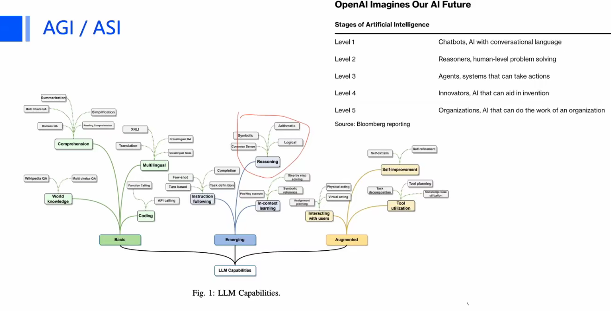
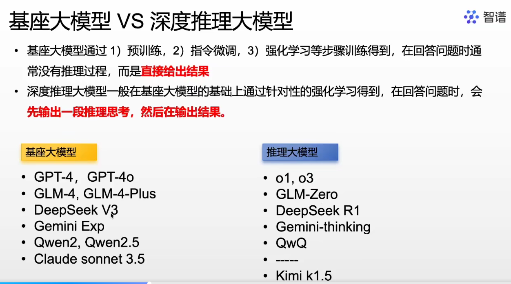

# 目标：
- 环境搭建
- **微调数据集常见形式**（列举5个常见数据集的情况），以及如何构建
- LLM如何微调（**使用 Unsloth案例**、huggingface案例）
- 如何构建Agent（Coze Dify ）
- 如何构建RAG 以及存在哪些问题（召回率不高，匹配精度不准），如何优化（切块的问题，向量化的问题）（AnythingLLM RagFlow）
- 如何构建和使用MCP  （**MCP 配合MongoDB实现类似RAG的效果**） （VScode cline）
- 构建自己的微调数据集，实现问答系统
- 技术栈：
  - 模型微调：Unsloth （LLM / VLM）
  - 模型部署：Ollama  vLLM  xInference  llama.cpp
  - RAG服务：RagFlow
  - 构建工作流：Dify  Coze  n8n(灵活度高)
  - 模型能力拓展：MCP
- 课程：
  - 李宏毅  `https://speech.ee.ntu.edu.tw/~hylee/ml/2025-spring.php`
  - datawhale  `https://github.com/datawhalechina/self-llm`
  - transformer `https://www.youtube.com/watch?v=KJtZARuO3JY`
  - mcp `https://www.youtube.com/watch?v=Ek8JHgZtmcI&t=264s`
  - n8n `https://www.youtube.com/watch?v=nwYHurRo4e0`

- 关键点
  - 数据
    - 数据格式
    - 数据清洗
    - 针对特定问题所需要的数据量
  - 模型
    - 模型选型
    - 超参数配置
    - 微调框架
    - 模型导出格式
  - 部署
    - 框架选择
    - 参数配置
  
1. 刷完李宏毅课程
2. 整理unsloth微调过程
3. 微调后的模型使用 ollama vllm xinference llamacpp 部署，对比性能
4. 整理数据组织形式
5. 尝试RagFlow

- 是不是可以使用大模型，配合知识库，产生高质量的回答，再组成数据集，去微调小模型？？
- 视觉大模型怎么微调，数据怎么组织？
- 对比测试 Qwen 2.5-VL 与 PP-tablemagic 对比两种算法对表格的识别效果
- 是不是可以用 tablemagic 先预标一批数据，然后去微调 Qwen2.5-VL？？
- QWen2.5-VL  解析账单图片 记录金额和类别

- 

- 
- 
- 
- 
# 源（模型+数据）

## HuggingFace
  - `huggingface.com`
  - `hf-mirror.com`
### 获取数据
- `pip install datasets`
  ```python
  from datasets import load_dataset
  ds = load_dataset("Conard/fortune-telling")  # 从平台下载
  type(ds)  # datasets.dataset_dict.DatasetDict
  type(ds['train'])  # datasets.arrow_dataset.Dataset
  print(df.column_name)  # 查看数据的组织结构 {'train': ['Question', 'Response', 'Complex_CoT']}
  print(ds['train'][3])  # 查看第三笔资料的详情
  print(ds['train'][3]['Question'])  # 查看问题
  ds_part = ds['train'].select(range(100))  # 取出前100笔资料，组成小数据集

  ds2 = load_from_disk("path/to/data")  # 从本地目录加载数据
  ```
### 获取模型
- `pip install hugginface_hub[hf_transfer]`
- 命令行工具：`huggingface-cli download Qwen/Qwen --local-dir ./models/Qwen`
- python脚本：
  ```python
  from transformers import AutoTokenizer, AutoModelForCausalLM

  tokenizer = AutoTokenizer.from_pretrained("Qwen/Qwen2.5-1.5B-Instruct")
  model = AutoModelForCausalLM.from_pretrained("Qwen/Qwen2.5-1.5B-Instruct")
  ```

- `tokenizer.apply_chat_template()`
- `tokenizer()`
- `tokenizer.decode()`
- `model.generate()`


### 测试推理
- 过程：
  1. 获取 model + tokenizer
  2. 将 Prompt 组装成 messages [{'role':'system', 'content':'system setting'}, {'role':'user', 'content':prompt_msg}]
  3. apply_chat_template 添加对话模板，加特殊字符
  4. 将文本转 token_ids  (可以与上一步合并)
  5. 传入模型，获取模型输出的 token_ids
  6. 将token_ids 转回为 文本
   
```python
prompt="新房装修,大门对着电梯好不好?要如何化解?"
messages=[
    {'role':'system', 'content':"你是AI风水大师，针对用户的问题，给出你的指导建议，注意多使用一些玄学文字"},
    {'role':'user', 'content': prompt}
]
print("org:", messages)
prompt_with_template = tokenizer.apply_chat_template(
  messages,
  # tokenize=False,  # 默认为True，即加template与转token_ids 一并处理，如果设为False，则仅加template，后续调用 tokenizer 方法转token_ids
  add_generation_prompt=True,
  return_tensors='pt',  
  return_dict=True
)
print("apply chat template:", prompt_with_template)
# input_ids = tokenizer(prompt_with_template, return_tensors='pt')  # 如何apply_chat_template tokenize=False时 需要调用该方法

output_ids = model.generate(**input_ids, max_new_tokens=1024)
# print(f"input_ids len: {len(input_ids['input_ids'][0])}\noutput_ids len:{len(output_ids[0])}")
output_ids = output_ids[0][len(input_ids['input_ids'][0]):]  # 模型输出中带了输入信息，在此截断
outputs = tokenizer.decode(output_ids, skip_special_tokens=True)
print(outputs)
```

## ModelScope
  - [modelscope.cn](https://www.modelscope.cn/)
  - `pip install modelscope[framework]`
### 获取数据
```python
from modelscope.msdatasets import MsDataset
ds =  MsDataset.load('gongjy/minimind_dataset', subset_name='default', split='train')
```

### 获取模型
- 命令行工具：`modelscope download --model 'Qwen/Qwen2-7b' --local_dir 'path/to/dir'`
- python代码：
  ```python
  from modelscope.hub.snapshot_download import snapshot_download
  model_dir = snapshot_download('Qwen/QwQ-32B-GGUF',allow_patterns='qwq-32b-q4_k_m.gguf',local_dir='path/to/local/dir')
  ``` 
  字段名|	必填	|类型	|描述
  ---|---|---|---
  model_id|	是	|str	|模型ID
  revision|	否	|str	|模型的Git版本，分支名或tag
  cache_dir|	否	|str,Path	|指定模型本次下载缓存目录，给定后下载的具体模型文件将会被存储在cache_dir/model_id/THE_MODEL_FILES
  allow_patterns|	否	|str,List	|指定要下载的文件模式，如文件名或文件扩展名
  ignore_patterns|	否	|str,List	|指定要忽略下载的文件模式，如文件名或文件扩展名
  local_dir	|否	|str	|指定模型的下载存放目录，给定后本次下载的模型文件将会被存储在local_dir/THE_MODEL_FILES

  如果cache_dir和local_dir参数同时被指定，local_dir优先级高，cache_dir将被忽略；更多参数使用说明可以参见开源代码的接口文档。如需指定下载或过滤下载某种/某类文件模式，可以使用 allow_patterns或ignore_patterns参数


### 测试推理
- `return_tensors` 参数解释
  - `pt` Pytorch Tensor
  - `tf` TensorFLow Tensor
  - `np` Numpy ndarray
  - 根据目标推理框架，显示设置该参数，以增强代码的稳定性和可维护性

```python
from modelscope import AutoModelForCausalLM, AutoTokenizer

model_name = "Qwen/Qwen2.5-0.5B-Instruct"

model = AutoModelForCausalLM.from_pretrained(
    model_name,
    torch_dtype="auto",
    device_map="auto"
)
tokenizer = AutoTokenizer.from_pretrained(model_name)

prompt = "Give me a short introduction to large language model."
messages = [
    {"role": "system", "content": "You are Qwen, created by Alibaba Cloud. You are a helpful assistant."},
    {"role": "user", "content": prompt}
]
text = tokenizer.apply_chat_template(
    messages,
    tokenize=False,
    add_generation_prompt=True
)
model_inputs = tokenizer([text], return_tensors="pt").to(model.device)

generated_ids = model.generate(
    **model_inputs,
    max_new_tokens=512
)
generated_ids = [
    output_ids[len(input_ids):] for input_ids, output_ids in zip(model_inputs.input_ids, generated_ids)
]

response = tokenizer.batch_decode(generated_ids, skip_special_tokens=True)[0]
```

# 数据集

- [instruction fine-tuning 数据集优化论文](https://arxiv.org/pdf/2402.04833)
- Curriculum Learning 渐进式训练策略，让模型先训练简单数据集，再训练复杂数据集，逐渐提升难度
## 常见数据集1 
- 数量：
- 数据格式：
- 调用方法：

## 常见数据集2 - 推理模型数据集
- 数量：
- 数据格式：
- 调用方法：

# 预训练大模型

## 常需配置的超参数
- 在确定下一个词时，有两种方式，1. 贪心式（返回概率最高的词） 2. 采样式（根据候选词的概率，随机采样）
- Temperature
  - $temperature\geq0$
  - 
- Top-k
  - 决定候选词的个数
  - 
- Top-p
  - 根据概率值限制候选词个数
  - 
- max_length
  - 限制模型的最大输出长度
  - 如果发现模型输出的内容像是截断了，语义不完整，可能就是该参数设置过小


## DeepSeek

- 大模型的能力分级
  - 
- 机器学习、深度学习、大模型基础模型、推理模型
  - 
- 基座大模型与推理大模型
  - 
- 稠密大模型与MoE大模型
  - 
- 参数量与显存需求
  - 
- 蒸馏
  - 

## Qwen  千问

## Llama 


- `!wget https://huggingface.co/bartowski/Meta-Llama-3.1-8B-Instruct-GGUF/resolve/main/Meta-Llama-3.1-8B-Instruct-Q8_0.gguf`
- 

## InternLM  书生


# 微调
- [多GPU训练资源使用-李宏毅助教课程](https://www.youtube.com/watch?v=mpuRca2UZtI)
- 微调的目的：
  1. 专业领域适配：在特定领域有更精准的知识和表达能力，通过有针对性的微调可以显著提升模型的专业术语理解和专业问题解答能力；
  2. 定制化行为和风格：调整输出风格；
  3. 提高特定任务性能：例如文本分类、情感分析、摘要生成等
  4. 减少幻觉和不确定性；

- **全量训练** 8B 模型需要 8*V100（32G）

## 微调方法

- LLaMA2 微调数据量 27540笔数据  
- LIMA Less Is More for Alignment 也有人精标1000+笔数据进行微调

### LoRA
- PEFT Parameter-Efficient Fine-Tuning PEFT
- 主要参数： $\alpha$ + $r$
- 参数更新过程： $W_{new} = W_{original}+(\alpha/r)*(A\times B)$
  - $W [n\times m]$  $A [n\times r]$ $B[r\times m]$
  - $r$ Rank 小矩阵的秩  r较小时 参数少，训练快，但容易欠拟合
  - $\alpha$  权重  控制参数更新幅度，$\alpha$较小时，更新幅度小，对原模型影响小
  - 通常两个参数设置相同值，例如 $r=8; \alpha=8$
- 通过添加两个低秩矩阵来微调模型，而不需要调整整个模型的参数
- 只作用于线性映射的部分，例如Q K V 矩阵，不能作用于 激活层和层归一化；
- 对比：
  - 原始模型：输入x → [巨型矩阵W] → 输出y
  - LoRA微调：输入x → [W]（固定） + [A→B]（可训练的小矩阵） → 输出y+Δy                    
- 训练过程中：在原始模型基础上（冻结原模型参数），并行计算两个小矩阵（适配器），仅更新这个两个小矩阵；
- 推理过程：训练结束后，可直接将两个小矩阵的乘法加入到原模型参数中，避免额外的延时；


### Instruct Fine Tuning

### GRPO

## 微调框架

### Unsloth
- [微调案例](https://colab.research.google.com/github/unslothai/notebooks/blob/main/nb/Qwen2.5_(7B)-Alpaca.ipynb#scrollTo=95_Nn-89DhsL)
- 怎么配置损失函数？？？？
- 环境搭建： Linux
  ```bash
  pip install --no-deps bitsandbytes accelerate xformers==0.0.29 peft trl triton
  pip install --no-deps cut_cross_entropy
  pip install sentencepiece protobuf datasets huggingface_hub hf_transfer
  pip install unsloth==2025.2.15 unsloth_zoo==2025.2.7
  pip install transformers==4.49.0
  ```
- 主要特性：
  - LoRA
  - QLoRA
  - Flash Attention
  - 梯度检查点


### HuggingFace Framework


# 推理框架

## xInference


## Ollama

### 环境搭建

- ollama 服务下载
  - [官网](https://ollama.com/)
  - 下载安装
  - 测试：`ollama help`
  - `ollama run llama3.1:8b` 下载并运行相应的大模型服务
  - `ollama list`  查看本地已有的大模型
  - `/bye`  退出交互环境

- 常用命令
  - `ollama list`  列出本地所有模型
  - `ollama run NAME`  运行指定的模型
  - `ollama ps`  查看运行中的模型
  - `ollama pull`  从注册表中拉取模型
  - `ollama rm`  删除模型
  - `/bye`  退出

- 环境变量配置：
  - `OLLAMA_MODELS`  修改模型保存位置  改为`e:\ollama\models`
  - `OLLAMA_HOST`  ollama服务监听的网络地址，如果想允许其他电脑访问ollama（如局域网中其他电脑）建议设置成 0.0.0.0  （默认 127.0.0.1）
  - `OLLAMA_PORT`  监听的端口  （默认 11434）
  - 配置完成后重启ollama
  - 查看端口占用情况： `netstat -aon|findstr 11434`
  - 查看占用端口的进程情况： `tasklist|findstr PID_`
- requirements
  - `pip install ollama langchain_core langchain_ollama langchain_community langchain_chroma`


### 对话

```python
import ollama
from ollama import Client
from openai import OpenAI

if __name__ == "__main__":
    
    llm = OpenAI(
        base_url="http://localhost:11434/v1",
        api_key="sk-1234567890",
    )
    response = llm.chat.completions.create(
        model="llama3.2:3b",
        messages=[
            {"role": "user", "content": "Hello, what is your name!"},
        ])
    
    print(response.choices[0].message.content)
    
    exit(0)
    
    client = Client(host="http://localhost:11434")
    response = client.chat(model="llama3.2:3b",
                           messages=[
                               {"role": "user", "content": "Hello, world!"},
                           ])
    print(response["message"]["content"])
    
    exit(0)

    result = ollama.generate(model="llama3.2:3b",
                    prompt="Hello, world!",)
    print(result["response"])
    
    response = ollama.chat(model="llama3.2:3b",
                           messages=[
                               {"role": "user", "content": "Hello, world!"},
                           ])
    print(response["message"]["content"])
    
```

## vLLM
- `https://qwen.readthedocs.io/en/latest/deployment/vllm.html`

## Lamacpp


# 应用

## Langchain

```python
from langchain_core.prompts import ChatPromptTemplate
from langchain_ollama import ChatOllama
from langchain_core.output_parsers import StrOutputParser

chat_template = ChatPromptTemplate.from_messages(
    [
        ("system", "You are a helpful assistant that gives a one-line definition of the word entered by user"),
        ("human", "{user_input}"),
    ]
)

message = chat_template.format_messages(user_input="happy")
print(message)

llm = ChatOllama(model="llama3.2:3b", temperature=0.9)
ai_msg = llm.invoke(message)
print(ai_msg)

chain = chat_template | llm | StrOutputParser()
print(chain.invoke({"user_input": "happy"}))
```


## RAG

### RagFlow

```python
from langchain_community.document_loaders import TextLoader
from langchain_text_splitters import RecursiveCharacterTextSplitter
from langchain.embeddings import OllamaEmbeddings
from langchain_chroma import Chroma
from langchain_ollama import ChatOllama
from langchain_core.prompts import ChatPromptTemplate
from langchain_core.output_parsers import StrOutputParser
from langchain_core.runnables import RunnablePassthrough

file = "./data/paddlex_pipeline_guide.md"
raw_documents = TextLoader(file, encoding="utf-8").load()
# print(raw_documents)

text_splitter = RecursiveCharacterTextSplitter(
    chunk_size=300, chunk_overlap=20)
documents = text_splitter.split_documents(raw_documents)
print(f"document len:{len(documents)}") 
print(documents[0])

oembed = OllamaEmbeddings(base_url="http://localhost:11434", model="nomic-embed-text")
db = Chroma.from_documents(
    documents, oembed, persist_directory="./chroma_db"
    )

query = "what is PaddleX Pipeline?"
docs = db.similarity_search(query)
print(f"get {len(docs)} docs")
# print(docs[0].page_content)


template = """
Answer the question based only on the following context:
{context}
Question: {question}
"""
prompt = ChatPromptTemplate.from_template(template)

model = ChatOllama(model="llama3.2:3b", temperature=0.9)
retriver = db.as_retriever()

def format_docs(docs):
    return "\n\n".join(doc.page_content for doc in docs)

chain = (
    {"context": retriver | format_docs, "question": RunnablePassthrough()}
    | prompt
    | model
    | StrOutputParser()
)
print("==="*5)
print(chain.invoke("how can I use paddlex?"))


```

## MCP
- Model Context Protocol  模型上下文协议
- 是一种开放协议，类似HTTP，用于连接AI模型和外部工具、数据源；
  
### MCP原理
- 采用 客户端-服务端架构，
  - Host应用如 Claude Desktop
  - Client 管理连接
  - Server 提供工具和数据
  
- 核心功能模块
  - 资源：动态获取外部数据（数据库、API、知识库等）；
  - 工具：执行操作（计算、网页浏览、代码运行等）；
  - 提示（prompts）：管理可复用的上下文模板，确保任务连贯性；
  
- 系统组成：
  - Host 主机：用户交互的终端应用（如：ClaudeDesktop， IDE）
  - Client 客户端：管理MCP服务器的连接；
  - Server 服务端：提供标准化功能的轻量级程序（如文件系统访问、浏览器自动化）；

### 如何使用
- MCP 市场
- 如何调用别人的MCP服务

### 如何开发
- 安装SDK  有Python/C#/Java等版本的
  - `uv install mcp[cli]`
- 开发具体工具
  ```python
  from mcp.server.fastmcp import FastMCP

  mcp = FastMCP()

  @mcp.tool()
  def say_hello():
    """
    打个招呼
    """
    return "Hello MCP"
  ```

- 测试功能是否正常
  - `mcp dev path/to/tool.py` 会在本地启动测试服务，在网页中可以进行功能测试
  - 先点击Connect，然后在Tools页面可以查看自己定义的工具选项
  - 修改脚本代码后，需要重新启动server后，才能在测试页面看到更新

## Agent
- 基于大模型，通过配置 `system prompt` 构建完成不同任务的 Agent
- 例如：
  ```json
  messages = [
    {"role": "system", "content": f"{self.role_description}"},  # Hint: you may want the agents to speak Traditional Chinese only.
    {"role": "user", "content": f"{self.task_description}\n{message}"}, # Hint: you may want the agents to clearly distinguish the task descriptions and the user messages. A proper seperation text rather than a simple line break is recommended.
  ] 
  ```

## 搭建服务

### Dify

### Coze


# 模型大小与运行显存估算

- 参数存储公式：显存需求 = 参数量 × 每个参数字节数 × 安全系数（通常取1.2）
  - FP32：每个参数占4字节
  - FP16/BF16：每个参数占2字节
  - INT8：每个参数占1字节
  - INT4：每个参数占0.5字节

- 实际推荐值：考虑框架开销（如CUDA上下文、激活值等），实际显存需求约为理论值的2-3倍：

- 以 7b 模型为例
  
|精度|理论值|推荐值|
|---|---|---|
FP32|33.6 ( 7x1.2x4 ) GB| 
FP16|16.8 ( 7x1.2x2 ) GB|	
INT8|8.4 ( 7x1.2 ) GB| 
INT4|4.2 ( 7x1.2x0.5 ) GB| 


1. 构建数据集   
2. 微调与模型导出  Unsloth   --> gguf
3. 模型高效推理   vLLM  lamcpp  ollama

### Unsloth

- :raising_hand: [官方案例](https://docs.unsloth.ai/get-started/unsloth-notebooks)

#### 案例
1. 库安装：
  - `pip install --upgrade --no-cache-dir --no-deps git+https://github.com/unslothai/unsloth.git`
  - `pip install unsloth`
  - `pip install bitsandbytes unsloth_zoo`
  - `pip install vllm`  不支持windows  加速推理

2. 预训练模型选择

3. 数据集构建

4. 训练过程
5. 模型导出
6. 模型推理

#### 运行情况
- TODO 试试 r1 7b 或者 1.5b
- 模型："DeepSeek-R1-Distill-Llama-8B"
- 量化：load_in_4bit  4bit量化
- 数据集："Conard/fortune-telling"
- 训练过程：
  - 显存：7.8G
  - RAM：6.1G
- 模型导出：
  - 显存增加到 14.3G
  - RAM增加到 8.7G
  - 导出的模型：
    - "unsloth.Q8_0.gguf" 文件大小 8G   8bit量化
    - "unsloth.F16.gguf"  文件大小 15G  FP16量化
    - "unsloth.Q4_K_M.gguf" 文件大小 4.6G 4bit量化 转换过程中是先转FP16后再转4bit
- 使用的损失函数： Cross-Entropy Loss (评估预测下一个词的概率分布与实际下一个词的概率分布之间的差距)
  - 0.1 ~ 1 表明模型可以很好的预测到下一个词汇，例如很简单的数据集（儿童书籍），可以达到0.5左右
  - 2 ~ 4 表明模型表现还可以，但是任然有可提升空间，如果数据集比较复杂，常分布在这个范围
  - 5 ~ 6 表面模型很难预测到下一个正确的词，模型表现很差


-------------------------
Okay, let's break down how to fine-tune a Vision Large Language Model (VL-LLM) like Qwen2-VL. Fine-tuning involves adapting a pre-trained model to a specific downstream task or dataset. Qwen2-VL combines a powerful language model (Qwen2) with a vision encoder, allowing it to process both text and images.

Here's a step-by-step guide:

**1. Understand Qwen2-VL's Architecture and Requirements:**

*   **Multimodal Input:** Qwen2-VL takes both image data and text prompts as input.
*   **Pre-training:** It has been pre-trained on a vast amount of image-text pairs and language data. Fine-tuning leverages this pre-existing knowledge.
*   **Task:** Define *exactly* what task you want the fine-tuned model to perform (e.g., Visual Question Answering (VQA), Image Captioning on specific domains, Visual Instruction Following, etc.).
*   **Hardware:** VL-LLMs, especially larger versions of Qwen2-VL, are computationally intensive. You'll need powerful GPUs with significant VRAM (e.g., 24GB, 48GB, or even 80GB+ per GPU). Multi-GPU setups are often necessary for efficient training.

**2. Prepare Your Dataset:**

*   **Format:** This is crucial. VL-LLMs typically expect data in a conversational or turn-based format, often represented as JSON objects or similar structures. The format must align with how Qwen2-VL was trained or expects input during inference. A common format might look like:
    ```json
    [
      {
        "image": "path/to/image1.jpg",
        "conversations": [
          {"from": "human", "value": "Describe this image."},
          {"from": "gpt", "value": "A serene landscape with mountains, a lake, and trees under a cloudy sky."}
        ]
      },
      {
        "image": "path/to/image2.png",
        "conversations": [
          {"from": "human", "value": "What is the main object in the picture?"},
          {"from": "gpt", "value": "The main object is a red car."},
          {"from": "human", "value": "What color is it?"},
          {"from": "gpt", "value": "It's red."}
        ]
      },
      // ... more examples
    ]
    ```
    *   **Key Elements:** Each entry needs an image path/reference and a sequence of conversation turns.
    *   **Model-Specific Format:** **Crucially, check the official Qwen2-VL documentation or Hugging Face examples for the *exact* data format it expects.** Sometimes there are specific tags or structures required.
*   **Content:**
    *   Images: High-quality images relevant to your task.
    *   Text: Corresponding instructions, questions, answers, or descriptions that align with your defined task.
*   **Quantity:** You'll need a sufficient amount of data. The exact quantity depends on the task complexity and how different it is from the pre-training data, but aim for at least thousands of high-quality examples for decent results.
*   **Splits:** Divide your data into Training, Validation (for tuning hyperparameters and monitoring progress), and Test sets (for final evaluation).

**3. Set Up Your Environment:**

*   **Python:** Use a compatible Python version (e.g., 3.9+).
*   **Libraries:**
    *   `torch` (PyTorch)
    *   `transformers` (Hugging Face)
    *   `accelerate` (Hugging Face, for distributed training)
    *   `bitsandbytes` (for quantization, if using QLoRA)
    *   `peft` (Parameter-Efficient Fine-Tuning, if using LoRA/QLoRA)
    *   `datasets` (Hugging Face, for easier data loading/handling)
    *   `sentencepiece` (or other tokenizer dependencies)
    *   `Pillow` (or `opencv-python`) for image handling.
    *   Specific Qwen2-VL dependencies (check the model card on Hugging Face).
*   **Installation:** Use `pip install ...` commands. For example:
    ```bash
    pip install torch transformers accelerate bitsandbytes peft datasets sentencepiece Pillow
    ```
    *   *(Note: For specific GPU configurations, you might need to install PyTorch with CUDA support manually.)*

**4. Choose a Fine-Tuning Method:**

*   **Full Fine-Tuning:** Updates all parameters of the model (both vision and language parts).
    *   *Pros:* Potentially highest performance if you have enough data and computational resources.
    *   *Cons:* Extremely resource-intensive (high VRAM, long training time), risk of catastrophic forgetting (losing general capabilities), requires large datasets.
*   **Parameter-Efficient Fine-Tuning (PEFT):** Updates only a small subset of parameters or adds small, trainable adapter layers. This is highly recommended for VL-LLMs due to their size.
    *   **LoRA (Low-Rank Adaptation):** A popular PEFT method. It adds low-rank matrices to specific layers (often attention layers) of the model. Only these new matrices are trained.
        *   *Pros:* Much lower VRAM usage, faster training, less prone to catastrophic forgetting, can achieve performance close to full fine-tuning.
        *   *Cons:* Might not *always* reach the absolute maximum performance of full fine-tuning for all tasks.
    *   **QLoRA:** Quantized LoRA. Combines LoRA with quantization (e.g., loading the base model in 4-bit precision). Reduces VRAM requirements even further, making it possible to fine-tune very large models on consumer GPUs.

**5. Write the Fine-Tuning Script (using Hugging Face `transformers`):**

*   **Load Model and Processor:**
    ```python
    from transformers import AutoModelForCausalLM, AutoTokenizer, AutoProcessor, TrainingArguments, Trainer
    from peft import LoraConfig, get_peft_model, prepare_model_for_kbit_training
    import torch

    model_id = "Qwen/Qwen1.5-VL-Chat-7B" # Or Qwen/Qwen2-VL-xxx if available
    model = AutoModelForCausalLM.from_pretrained(
        model_id,
        torch_dtype=torch.bfloat16, # Or torch.float16 if bfloat16 isn't supported
        device_map="auto", # Loads model across available devices
        # For QLoRA:
        # load_in_4bit=True,
        # quantization_config=BitsAndBytesConfig(
        #     load_in_4bit=True,
        #     bnb_4bit_quant_type="nf4",
        #     bnb_4bit_compute_dtype=torch.bfloat16,
        #     bnb_4bit_use_double_quant=True,
        # )
    )
    # If using QLoRA, prepare the model
    # if hasattr(model, 'config') and getattr(model.config, 'quantization_config', None) is not None:
    #     model = prepare_model_for_kbit_training(model)

    processor = AutoProcessor.from_pretrained(model_id)
    ```
*   **Load and Prepare Dataset:**
    ```python
    from datasets import load_dataset

    # Load your dataset (e.g., from JSON files)
    # dataset = load_dataset('json', data_files={'train': 'train_data.json', 'validation': 'val_data.json'})
    # Or load from Hugging Face Hub
    # dataset = load_dataset("your_dataset_name")

    # Define a function to process each example using the processor
    def preprocess_data(examples):
        # Adjust this based on your specific data format and task
        # This is a simplified example assuming a structure like above
        prompts = []
        images = []
        for i in range(len(examples['conversations'])):
            # Example: Take the last conversation turn as the label
            # The prompt includes the image and previous turns
            # Need to handle image input carefully - usually processor handles this
            image_path = examples['image'][i] # Assuming 'image' is the key for image path
            # Need to load image and pass it to processor
            # NOTE: The processor typically takes image paths or PIL Images
            # Actual implementation depends on how you load/handle images in your dataset
            # The processor usually handles tokenization and image preparation
            
            # Example processing (Conceptual - check Qwen-VL docs for exact format)
            # Format the conversation into a single string or list of messages
            conversation_text = ""
            for turn in examples['conversations'][i]:
                conversation_text += f"{turn['from']}: {turn['value']}\n"

            # processor needs image and text
            # This part is highly model-specific. Check Qwen-VL's processor usage.
            # Usually involves encoding the image and tokenizing the text.
            # The processor should return input_ids, attention_mask, pixel_values, etc.
            # Example (Conceptual):
            # encoded_input = processor(text=conversation_text, images=image_path, return_tensors="pt")
            # return encoded_input # Needs adjustment for dataset mapping

        # Actual dataset preparation logic would involve loading images,
        # formatting text prompts, and using the processor
        pass # Implement actual processing here

    # Process the dataset
    # processed_dataset = dataset.map(preprocess_data, batched=True)
    ```
    *   **Data Collator:** You might need a custom data collator to handle padding and batching correctly, especially with multimodal inputs.

*   **Configure PEFT (if using):**
    ```python
    # If using LoRA/QLoRA
    peft_config = LoraConfig(
        r=16, # Rank of the update matrices. Adjust based on performance/VRAM.
        lora_alpha=32, # Scaling factor for LoRA updates.
        target_modules=["q_proj", "v_proj"], # Layers to apply LoRA to (check Qwen2-VL specific layer names if needed)
        lora_dropout=0.05,
        bias="none",
        task_type="CAUSAL_LM",
    )
    model = get_peft_model(model, peft_config)
    model.print_trainable_parameters() # Shows how many parameters are being trained
    ```
*   **Training Arguments:**
    ```python
    training_args = TrainingArguments(
        output_dir="./qwen2_vl_finetuned",
        per_device_train_batch_size=4, # Adjust based on VRAM
        gradient_accumulation_steps=4, # Increase if batch size is small
        learning_rate=2e-5, # Adjust based on task and model size, often smaller for VL-LLMs
        num_train_epochs=3, # Adjust as needed
        logging_dir='./logs',
        logging_steps=10,
        save_steps=500, # Save checkpoints periodically
        save_total_limit=3,
        evaluation_strategy="steps", # Or "epoch"
        eval_steps=500, # Evaluate periodically
        warmup_steps=50,
        lr_scheduler_type="cosine", # Or "linear"
        report_to="tensorboard", # Or "wandb" (Weights & Biases)
        # Add other arguments as needed (e.g., fp16=True, bf16=True, gradient_checkpointing=True)
        # For QLoRA:
        # fp16=False, # Often required with QLoRA if using nf4/double_quant
        # bf16=True, # Use if hardware supports bfloat16
    )
    ```
*   **Initialize Trainer:**
    ```python
    trainer = Trainer(
        model=model,
        args=training_args,
        train_dataset=processed_dataset["train"],
        eval_dataset=processed_dataset["validation"],
        # data_collator=your_data_collator_if_needed,
        # tokenizer=tokenizer # Pass tokenizer if processor doesn't handle it all
    )
    ```
*   **Start Training:**
    ```python
    trainer.train()
    ```

**6. Evaluation:**

*   After training, evaluate the model on your held-out test set using appropriate metrics for your task (e.g., BLEU, ROUGE, METEOR for captioning; Accuracy, F1 for VQA).
*   Qualitative analysis: Manually inspect the model's outputs on various test examples.

**7. Saving and Loading the Fine-Tuned Model:**

*   **Saving:**
    ```python
    # If using PEFT (recommended):
    trainer.save_model("./qwen2_vl_finetuned_adapters")
    # Save the processor too
    processor.save_pretrained("./qwen2_vl_finetuned_adapters")

    # If full fine-tuning:
    # trainer.save_model("./qwen2_vl_finetuned_full")
    # processor.save_pretrained("./qwen2_vl_finetuned_full")
    ```
*   **Loading (for inference):**
    ```python
    from transformers import AutoModelForCausalLM, AutoProcessor
    from peft import PeftModel

    model_id = "Qwen/Qwen1.5-VL-Chat-7B" # Base model ID
    adapter_path = "./qwen2_vl_finetuned_adapters" # Path to your saved adapters

    # Load the base model (optionally with quantization if used during training)
    model = AutoModelForCausalLM.from_pretrained(
        model_id,
        torch_dtype=torch.bfloat16,
        device_map="auto",
        # load_in_4bit=True, # If using QLoRA
        # quantization_config=... # If using QLoRA
    )

    # Load the PEFT adapters
    model = PeftModel.from_pretrained(model, adapter_path)
    model = model.merge_and_unload() # Optional: Merge adapters into the base model for simpler deployment

    processor = AutoProcessor.from_pretrained(adapter_path) # Load processor saved during fine-tuning
    ```

**Key Considerations:**

*   **Check Official Documentation:** Always refer to the official Hugging Face documentation for Qwen2-VL and any specific instructions from the model creators regarding data formatting, fine-tuning procedures, and required libraries.
*   **Learning Rate:** This is critical. Start with a small learning rate (e.g., `1e-5` or `2e-5`) and potentially adjust based on training stability.
*   **Batch Size & Gradient Accumulation:** Limited by VRAM. Use gradient accumulation steps to simulate a larger effective batch size.
*   **Overfitting:** Monitor validation loss/metrics. Stop training if the validation performance starts to degrade.
*   **Computational Cost:** Be prepared for significant GPU time and memory usage, even with PEFT methods like LoRA/QLoRA.
*   **Data Quality:** The quality and relevance of your fine-tuning data heavily influence the final model's performance.

By following these steps and consulting the specific documentation for Qwen2-VL, you can fine-tune the model for your specific vision-language task.


-----------------------

- GRPO

Okay, let's break down "GRPO" in the context of Large Language Models (LLMs).

While "GRPO" most commonly stands for **"Goods Receipt Purchase Order"** in the context of enterprise resource planning (ERP) systems like SAP, this is generally **not** what it refers to when discussing the core technology or training of LLMs themselves.

If you encountered "GRPO" specifically within an LLM discussion, it most likely refers to:

**GRPO: Group Ratio Policy Optimization**

1.  **What it is:** GRPO is a relatively recent algorithm or technique used in the field of **preference alignment** for LLMs. It falls under the umbrella of **Reinforcement Learning from Human Feedback (RLHF)** or, more specifically, **Preference Optimization** methods.

2.  **Purpose:** The goal of techniques like GRPO is to fine-tune a pre-trained LLM to better align its outputs with human preferences. Instead of just predicting the next word, the model learns to generate responses that humans would judge as being more helpful, harmless, honest, or generally better according to specific criteria.

3.  **How it Relates to Other Methods:** GRPO is often discussed as an alternative or refinement to other popular preference optimization methods, such as:
    *   **PPO (Proximal Policy Optimization):** A common RL algorithm used in the original RLHF pipeline, often involving training a separate reward model.
    *   **DPO (Direct Preference Optimization):** A newer method that bypasses the need for an explicit reward model and directly optimizes the LLM based on preference pairs (e.g., "Response A is better than Response B").

4.  **Mechanism (Simplified):** Like DPO, GRPO likely works by directly using preference data (pairs of good/bad responses). It optimizes the LLM's policy (its strategy for generating text) by adjusting the probabilities of generating preferred responses versus dispreferred responses. The "Ratio" part likely refers to optimizing an objective function based on the *ratio* of probabilities assigned to the preferred versus dispreferred completion by the policy being trained, often compared to a reference policy (the model before alignment). The "Group" aspect might refer to how it processes batches of preference data or theoretical properties related to grouping samples.

**In summary:**

In an LLM context, **GRPO most likely stands for Group Ratio Policy Optimization**, an algorithm for aligning LLMs with human preferences using reinforcement learning / preference optimization techniques, often positioned as an alternative or improvement over methods like PPO or DPO.

If the context *was* about using an LLM *within* an ERP system or *discussing* business processes, then the "Goods Receipt Purchase Order" meaning could be relevant, but it's less likely if the discussion is about the LLM's training or alignment algorithms.


# LHY - HW

- [NTU 李宏毅 ML2025](https://speech.ee.ntu.edu.tw/~hylee/ml/2025-spring.php)


## ML2025 - HW01 - 简单问答Agent

### 目标：
- 理解数据集
- 理解llama模型调用的方式
- 理解Agent定义方式
- 理解Prompt优化
- 理解 google search 工具定义与使用
- 在linux服务器上复现以上过程

### 环境搭建
- `!python3 -m pip install --no-cache-dir llama-cpp-python==0.3.4 --extra-index-url https://abetlen.github.io/llama-cpp-python/whl/cu122`
- `!python3 -m pip install googlesearch-python bs4 charset-normalizer requests-html lxml_html_clean`

### 数据集
- 问题 + “，” + 答案   `第一代 iPhone 是由哪位蘋果 CEO 發表？,Steve Jobs、史提夫賈伯斯`
- 下载数据集： 
  - `wget https://www.csie.ntu.edu.tw/~ulin/public.txt`
  - `wget https://www.csie.ntu.edu.tw/~ulin/private.txt`

### Llama 模型调用
- 下载模型: `wget https://huggingface.co/bartowski/Meta-Llama-3.1-8B-Instruct-GGUF/resolve/main/Meta-Llama-3.1-8B-Instruct-Q8_0.gguf`
- 使用Qwen模型： `wget https://huggingface.co/bartowski/Qwen2.5.1-Coder-7B-Instruct-GGUF/resolve/main/Qwen2.5.1-Coder-7B-Instruct-Q8_0.gguf?download=true`  可以正常运行
- 使用GLM模型： `wget https://huggingface.co/bartowski/THUDM_GLM-Z1-9B-0414-GGUF/resolve/main/THUDM_GLM-Z1-9B-0414-Q8_0.gguf`   会报错！！不支持该模型结构 glm4

- 模型调用：
  ```python
  from llama_cpp import Llama

  # Load the model onto GPU
  llama3 = Llama(
      "./Meta-Llama-3.1-8B-Instruct-Q8_0.gguf",
      verbose=False,
      n_gpu_layers=-1,
      n_ctx=16384,    # This argument is how many tokens the model can take. The longer the better, but it will consume more memory. 16384 is a proper value for a GPU with 16GB VRAM.
  )

  def generate_response(_model: Llama, _messages: str) -> str:
    '''
    This function will inference the model with given messages.
    '''
    _output = _model.create_chat_completion(
        _messages,
        stop=["<|eot_id|>", "<|end_of_text|>"],  # 遇到这些符号则停止继续生成
        max_tokens=512,    # This argument is how many tokens the model can generate.
        temperature=0,      # This argument is the randomness of the model. 0 means no randomness. You will get the same result with the same input every time. You can try to set it to different values.
        repeat_penalty=2.0,  # 重复token的惩罚
    )["choices"][0]["message"]["content"]
    return _output

  ################################################################
  # You can try out different questions here.
  test_question='請問誰是 Taylor Swift？'

  messages = [
      {"role": "system", "content": "你是 LLaMA-3.1-8B，是用來回答問題的 AI。使用中文時只會使用繁體中文來回問題。"},    # System prompt
      {"role": "user", "content": test_question}, # User prompt
  ]

  print(generate_response(llama3, messages))
  ```

### Google Search 工具使用

- 工具定义
  ```python
  from typing import List
  from googlesearch import search as _search
  from bs4 import BeautifulSoup
  from charset_normalizer import detect
  import asyncio
  from requests_html import AsyncHTMLSession
  import urllib3
  urllib3.disable_warnings()

  async def worker(s:AsyncHTMLSession, url:str):
      try:
          header_response = await asyncio.wait_for(s.head(url, verify=False), timeout=10)
          if 'text/html' not in header_response.headers.get('Content-Type', ''):
              return None
          r = await asyncio.wait_for(s.get(url, verify=False), timeout=10)
          return r.text
      except:
          return None

  async def get_htmls(urls):
      session = AsyncHTMLSession()
      tasks = (worker(session, url) for url in urls)
      return await asyncio.gather(*tasks)

  async def search(keyword: str, n_results: int=3) -> List[str]:
      '''
      This function will search the keyword and return the text content in the first n_results web pages.
      Warning: You may suffer from HTTP 429 errors if you search too many times in a period of time. This is unavoidable and you should take your own risk if you want to try search more results at once.
      The rate limit is not explicitly announced by Google, hence there's not much we can do except for changing the IP or wait until Google unban you (we don't know how long the penalty will last either).
      '''
      keyword = keyword[:100]
      # First, search the keyword and get the results. Also, get 2 times more results in case some of them are invalid.
      results = list(_search(keyword, n_results * 2, lang="zh", unique=True))
      # Then, get the HTML from the results. Also, the helper function will filter out the non-HTML urls.
      results = await get_htmls(results)
      # Filter out the None values.
      results = [x for x in results if x is not None]
      # Parse the HTML.
      results = [BeautifulSoup(x, 'html.parser') for x in results]
      # Get the text from the HTML and remove the spaces. Also, filter out the non-utf-8 encoding.
      results = [''.join(x.get_text().split()) for x in results if detect(x.encode()).get('encoding') == 'utf-8']
      # Return the first n results.
      return results[:n_results]
  ```

### Agent定义

- Agent 定义
  ```python
  class LLMAgent():
    def __init__(self, role_description: str, task_description: str, llm:str="bartowski/Meta-Llama-3.1-8B-Instruct-GGUF"):
        self.role_description = role_description   # Role means who this agent should act like. e.g. the history expert, the manager......
        self.task_description = task_description    # Task description instructs what task should this agent solve.
        self.llm = llm  # LLM indicates which LLM backend this agent is using.
    def inference(self, message:str) -> str:
        if self.llm == 'bartowski/Meta-Llama-3.1-8B-Instruct-GGUF': # If using the default one.
            # TODO: Design the system prompt and user prompt here.
            # Format the messsages first.
            messages = [
                {"role": "system", "content": f"{self.role_description}"},  # Hint: you may want the agents to speak Traditional Chinese only.
                {"role": "user", "content": f"{self.task_description}\n{message}"}, # Hint: you may want the agents to clearly distinguish the task descriptions and the user messages. A proper seperation text rather than a simple line break is recommended.
            ]
            return generate_response(llama3, messages)
        else:
            # TODO: If you want to use LLMs other than the given one, please implement the inference part on your own.
            return ""
  
  ###############################################################
  # This agent may help you filter out the irrelevant parts in question descriptions.
  question_extraction_agent = LLMAgent(
      role_description="你是核心问题提取助手，从以下描述文本中，提取核心的问题",
      task_description="请提取核心问题：",
  )

  # This agent may help you extract the keywords in a question so that the search tool can find more accurate results.
  keyword_extraction_agent = LLMAgent(
      role_description="你是关键词提取助手，分析以下描述中的核心问题，并根据核心问题提取关键词",
      task_description="请提取关键词：",
  )

  # This agent is the core component that answers the question.
  qa_agent = LLMAgent(
      role_description="你是 LLaMA-3.1-8B，是用來回答問題的 AI。使用中文時只會使用中文來回問題。",
      task_description="請回答以下問題：",
  )
  ```

### 工作流编排
  ```python
  # 1. 提取关键词  2. 基于关键词搜索  3. 基于搜索结果+核心问题 回答问题
  async def pipeline3(question: str) -> str:
      # TODO: Implement your pipeline.
      # Currently, it only feeds the question directly to the LLM.
      # You may want to get the final results through multiple inferences.
      # Just a quick reminder, make sure your input length is within the limit of the model context window (16384 tokens), you may want to truncate some excessive texts.
      ques = question_extraction_agent.inference(question)
      kws = keyword_extraction_agent.inference(question).replace("\n", " ")
      print(f">> search_term: {kws}")
      infos = await search(f"{kws}", n_results=3)
      print(f">> search_num: {len(infos)}")
      infos = "\n".join(infos)[:16000]
      print(f">> extract_ques: {ques}\n")
      final_ques = f"<search_infos>{infos}</search_infos>\n<question>:{ques}</question>"
      return qa_agent.inference(final_ques)
  
  answer = await pipeline(question)
  ```

## ML2025 - HW03 - 深入理解LLM


## ML2025 - HW04 - 预测下一个tokn

## ML2025 - HW05 - 微调LLM

## GANAI2024 - HW05 - 微调LLM


