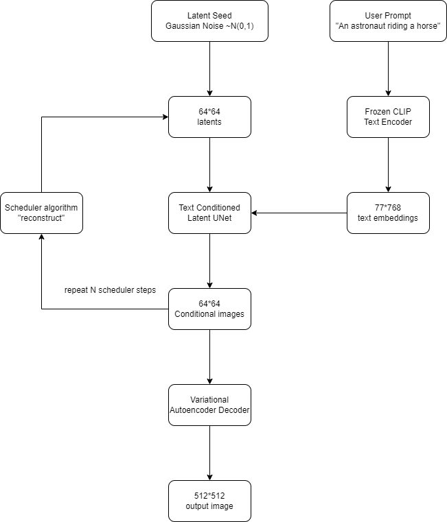

# StableDiffusion

- Diffusion Model 是去减少随机高斯噪声

- 应用举例
  - Text-guided image-to-image:根据图像生成图像
  - Inpainting: 使用mask，对图像局部进行修改
  - Super-Resolution: 超分
  - OutPainting : 扩展图像

- Stable Diffusion 更快，因为是先压缩到Latent空间，参数量更少，速度更快；
- Diffusion Models Markov Chains 

- Stable Diffusion 的三大组成：
  - AutoEncoder(VAE)
  - U-Net
  - Text-Encoder


- 环境搭建
```bash
conda create -n diffusion_env python==3.10 -y
conda activate diffusion_env
pip install torch==2.1.0+cu121 torchvision==0.16.0+cu121 torchaudio==2.1.0 torchtext==0.16.0+cpu torchdata==0.7.0 --index-url https://download.pytorch.org/whl/cu121
pip install diffusers
pip install accelerate transformers ftfy bitsandbytes gradio natsort safetensors xformers
```

- Text2Image推理过程


- 生成一张图像

```python
import torch #PyTorch
from diffusers import StableDiffusionPipeline

pipe = StableDiffusionPipeline.from_pretrained("CompVis/stable-diffusion-v1-4", torch_dtype=torch.float16)
pipe = pipe.to('cuda')
pipe.enable_attention_slicing()
pipe.enable_xformers_memory_efficient_attention()

prompt = 'an apple'
img = pipe(prompt).images[0]
type(img)  // PIL Image
img.save("test.jpg")
```


## DDPM
- Denoising Diffusion Probabilistic Models


## AnomalyDiffusion

### 使用
- Anomaly generation
- Mask generation
- 基于生成的数据训练检测模型

### IC-LPIPS

### 算法思想

