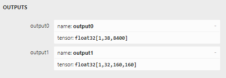

# 语义分割

# 实例分割
## YOLOv8
### 模型结构
### 模型输出
- 有两个输出节点
  - 
  - 检测框
    - [1,38,8400]
    - `8400` 检测到的对象个数
    - `38 = 4 + cls_conf + 32 mask_weights`
  - mask
    - [1,32,160,160]
    - 32 个mask
    - 怎么计算最终mask？？
    - 多个类别的马赛克？？
### 损失计算

### cpp部署