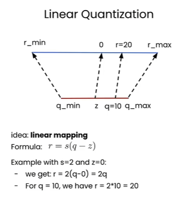
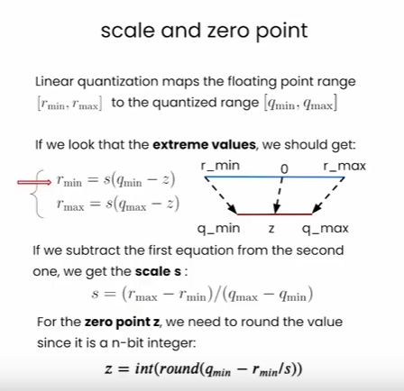
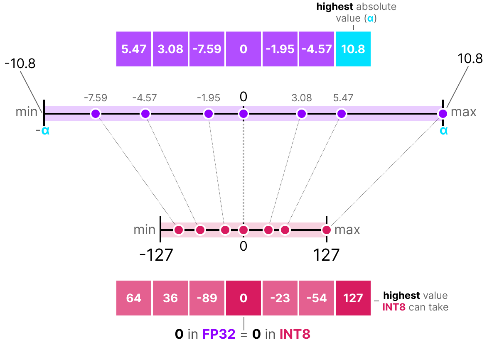
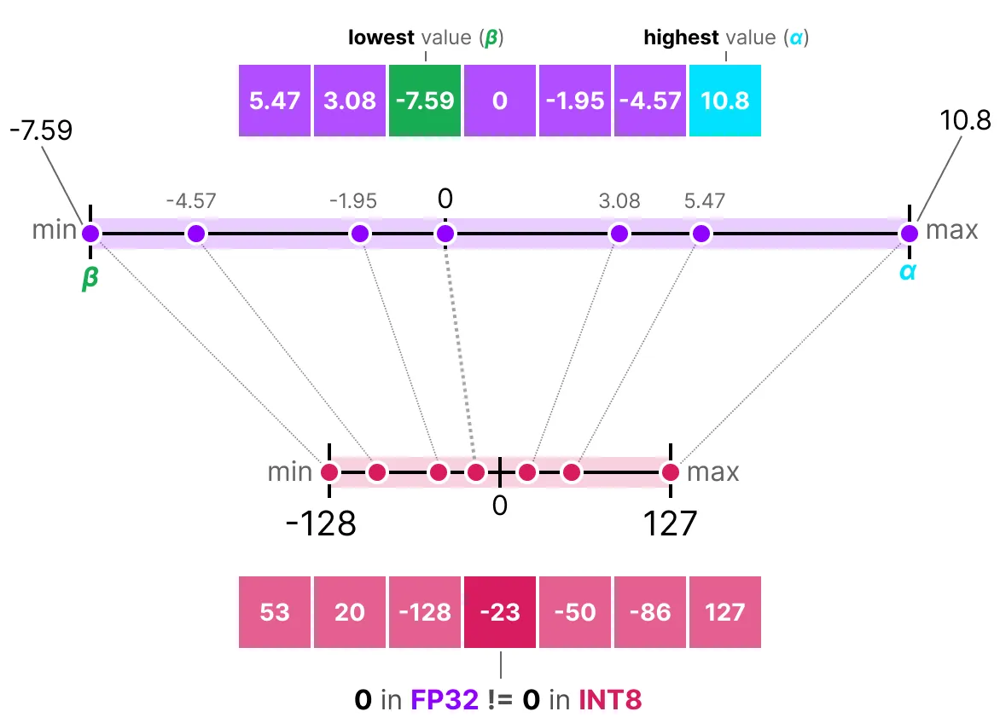
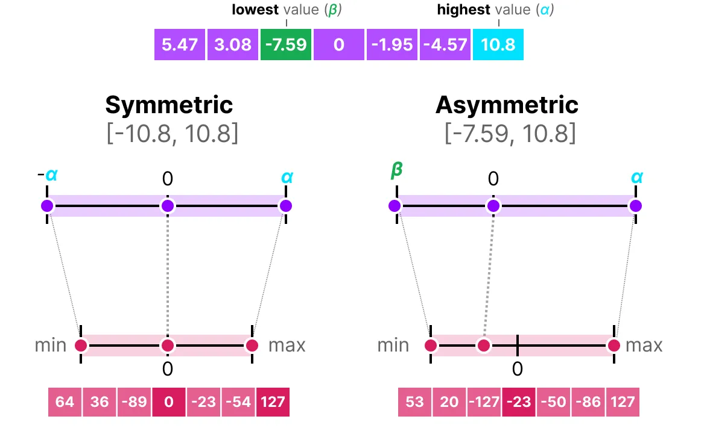
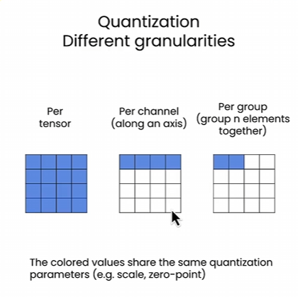
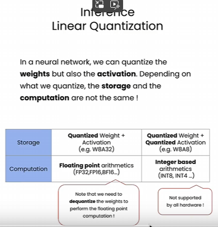

# 量化

- 量化：Quantization 将参数以更低的精度保存；
- `torch.float32` -> `torch.int8 [-128, 127]`
- 线性量化： 使用线性函数将原始的`FP32`数据转换为`INT8`
- 
- 需要定义两个参数
  - `s: Scale in FP32` 与原始Tensor的数据类型相同
  - `z: Zero Point INT8` 与量化后的Tensor数据类型相同
  - 重点是，怎么取这两个值，如果这个值设的不好，会产生很大的量化误差（即反量化后，所得的矩阵与原始矩阵有很大偏差）
  - 
```python
import torch 

# 自定义线性量化方程
def linear_q_with_scale_and_zero_point(
    tensor, scale, zero_point, dtype=torch.int8
    ):
    scaled_and_shifted_tensor = tensor/scale+zero_point
    rounded_tensor = torch.round(scaled_and_shifted_tensor)
    q_min = torch.iinfo(dtype).min
    q_max = torch.iinfo(dtype).max
    # 确保缩放后，所有的值都在 q_min  q_max 范围内
    q_tensor = rounded_tensor.clamp(q_min, q_max).to(dtype)  # torch.clamp(v, min, max)取 v, min, max 三者之间的中间值
    return q_tensor  

def dequantization(
    quant_tensor, scale, zero_point, dtype=torch.float32
    ):
    return scale*(quant_tensor.to(dtype) - zero_point)

# 获取最佳的 scale 和 zero_point 参数
def get_q_scale_and_zero_point(r_tensor, dtype=torch.int8):
    # rmax, rmin, qmax, qmin
    q_min, q_max = torch.iinfo(dtype).min, torch.iinfo(dtype).max
    r_min, r_max = r_tensor.min().item(), r_tensor.max().item()

    # s and r
    scale = (r_max - r_min) / (q_max-q_min)
    zero_point = q_min - r_min/scale

    # clip the zero_point to fall in [qmin, qmax]
    zero_point = torch.clamp(torch.tensor(zero_point), 
                             torch.tensor(q_min), torch.tensor(q_max))
    # 注意取round 否则直接转int会截掉小数位 导致很大误差
    zero_point = int(round(zero_point.item())) 
    # if zero_point<q_min:
    #     return scale, q_min
    # elif zero_point>q_max:
    #     return scale, q_max
    # else:
    #     return scale, int(round(zero_point))
    return scale, zero_point

```

- 零点 $z$
- 比例因子 $s$

## 对称与非对称量化
### 对称量化


- 映射公式： 
  > $s=(2^{b-1}-1)/\alpha$   
  > - b 是指量化时，使用的bit数，例如int8 b=8
  > - $\alpha$ 是指原始数据绝对值的最大值；
  >
  > $X_{quant}=round(s \times X)$
  >

### 非对称量化

- 并不以零点为对称中心；
- 将浮点数范围的最小值和最大值分别映射到量化范围的极值
- 量化公式：
  > $s=(128- (-127))(\alpha - \beta)$    缩放因子
  > - $\alpha$ 原始数据中的最大值
  > - $\beta$ 原始数据中的最小值 
  >
  > $z=round(-s\times \beta)-2^{b-1}$    零点偏移 原始数据中的0 量化后会变成 z
  >
  > $X_{quantized}=round(s \times X + z)$  量化值

- 解量化公式：
  > $X_{dequantized}=(X_{quant}-z)/s$
  >
  >
  >



### 离群值影响

- 离群值：如果原始数据中有离群值，


## 量化的对象
1. 模型权重：数量最多，推理时已确定，常使用INT8量化
2. 模型偏置：数量较少，推理时已确定，常使用INT16量化
3. 激活值：数量较少，受输入数据影响动态变化容易有异常值，

## 校准
- 选择最佳的映射范围，以实现既能覆盖最大数据量，又能最小化量化误差的最优区间；


- 不对称量化 Asymmetric：将 `[rmin, rmax]` 映射到 `[qmin, qmax]` 就像上述过程
- 对称量化 Symmetric：将`[-rmax, rmax]` 映射到 `[-qmax, qmax]`，其中 `rmax = max(|r_tensor|)`
  - 在对称量化中，不需要设定 `zero_point` 参数，因为是对称映射的，`zero_point`就是从0映射到0，无需额外设定；
  - `q = int(round(r/s))`
  - `s = rmax/qmax`
- 因为模型中的权重通常都有做归一化，数值都是小于1的小数，经过量化和反量化后，总体偏差非常小！这也说明模型权重越小越好
- 对称量化与非对称量化对比：
  - 非对称量化可以使用整个量化数值区间，对称量化对整个数值区间利用率不高，例如经过ReLU激活后，数值全为正数，就浪费了一半的空间；
  - 对称量化更简单，不需要额外记录`zero_point`参数；
  - 实际使用中，如果是`INT8`量化，可以使用对称量化；如果是`INT2  INT3  INT4`量化，常使用非对称量化；

## 对不同粒度进行量化

- Per Tensor：对一整个Tensor使用一组`scale zero_point`参数

- Per Channel：对Tensor的不同轴使用不同的参数
  ```python
    # Per Channel Quantization
    def linear_q_symmetric_per_channel(r_tensor, dim, dtype=torch.int8):
        output_dim = r_tensor.shape[dim]
        scale = torch.zeros(output_dim)  # 用于存各个channel的scale参数
        for index in range(output_dim):
            sub_tensor = r_tensor.select(dim, index)
            scale[index] = get_q_scale_symmetric(sub_tensor, dtype=dtype)

        scale_shape = [1]*r_tensor.dim()
        scale_shape[dim] = -1
        scale = scale.view(scale_shape)
        quantized_tensor = linear_q_with_scale_and_zero_point(r_tensor, scale, 0, dtype=dtype)
        return quantized_tensor, scale
  ```
- Per Group：对Tensor不同区域使用不同的参数
  ```python
  def linear_q_symmetric_per_group(r_tensor, group_size, dtype=torch.int8):
    r_shape = r_tensor.shape
    assert r_shape[1] % group_size == 0
    r_tensor = r_tensor.view(-1, group_size)
    quantized_tensor, scale = linear_q_symmetric_per_channel(r_tensor, 0, dtype=dtype)
    quantized_tensor = quantized_tensor.view(r_shape)
    return quantized_tensor, scale
  ```

- 通常越小粒度的量化，量化误差越小；单要记录的参数也越多

## 权重量化+激活函数量化


- W8A32: 模型权重做INT8量化，激活函数不做量化
  - 需要先将权重反量化为FP32，然后计算激活函数


## TensorRT 量化
- fp32 -> fp16  从全精度到半精度
  - `trtexec --onnx=model.onnx --saveEngine=model.engine --fp16`  
  - 不指定 fp16 时导出的是 fp32
- PTQ 训练后量化
  - 简单，需要校验数据集（500张）
  - 使用python脚本量化
- QAT 量化感知训练


## 训练后量化 PTQ
- Post-Training Quantization
- 对训练后的模型进行量化，无需重新训练，不改变模型结构，直接压缩参数体积；（适用于快速部署）
- 数学本质：将浮点参数映射到低bit整数；
- 分为动态量化和静态量化：
  - 动态量化：
    - **每次推理实时计算缩放因子和零点偏移量**，精度好但速度慢；
    - 针对每个隐藏层独立计算比例因子$s$和零点$z$参数值
  - 静态量化：**使用校准数据集预先确定参数**，固定缩放因子和零点偏移量，速度快，但可能导致精度差；
- 8bit 大概会有 1% 的精度损失；

## 量化感知训练 QAT
- Quantization-Aware Training
- 在训练过程中插入伪量化节点，模拟量化误差，通过反向传播调整参数以减少精度损失；（适用于高精度要求）
- 


- 后量化（PTQ）在高精度下表现更优，但量化感知训练（QAT）在低精度（INT4）下实际部署效果更佳，因为QAT往往能找到宽域极小值区域，
 
# 蒸馏

- 蒸馏：Knowledge Distillation 使用一个大模型取训练一个小模型


# 剪枝

- 剪枝：Pruning 移除神经网络中的一些连接（权重）使模型变稀疏