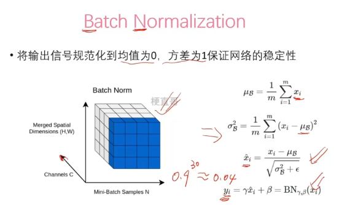
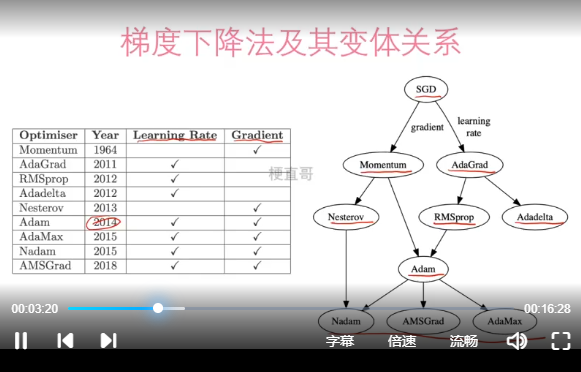
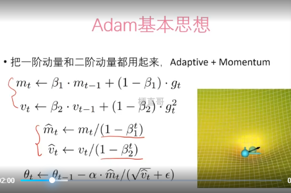
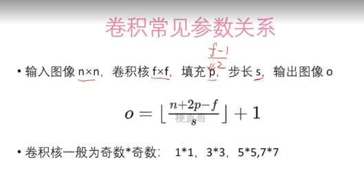
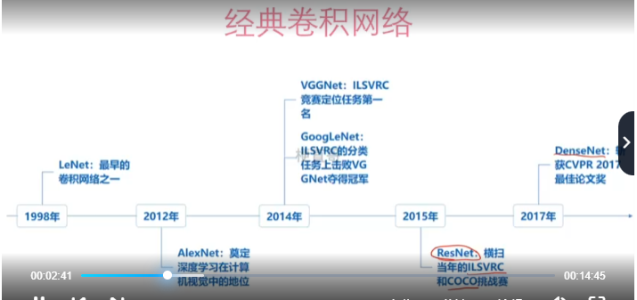

# 核心部分

- 网络结构
- 损失函数
- 参数优化算法
- 如何处理过拟合等中间问题

- 如何解决过拟合欠拟合的问题：
  - 原因是：数据复杂度与模型复杂度不相匹配
  - 数据方面：多采集数据、数据增强
  - 模型方面：选择更简单的模型（配合验证集）、正则项、DropOut
  - 训练策略方面：交叉验证、提前终止EarlyStop

- L1 & L2 正则化：
  - L1 更倾向于产生稀疏解，适用于**特征选择**
  - L2 更倾向于产生小的非零值，适用于**优化问题**

- DropOut
  - 在训练过程中随机删除一些神经元（即将其权重设为0）
  - **只用在训练期间，不用在测试期间**；
  - 本质是Bagging集成学习，平均化的作用；
  - 减少神经元之间复杂的关系
  - 优缺点：
    - 优点：可以有效的降低过拟合；简单方便；
    - 缺点：降低训练效率（因为多了一个计算是否置零的随机）；损失函数不够明确（因为部分节点直接置零导致最后的损失函数有差异）；

- 梯度消失和梯度爆炸
  - 梯度消失：反向链式传播过程中，梯度<1,累乘过程中消失；现象：
  - 梯度爆炸：权重初始化的值过大，网络层数；现象：训练过程不稳定不收敛，溢出
  - 解决方法：
    - 调节学习率
    - 梯度剪切：（针对梯度爆炸）限制梯度最大值
    - ReLU激活函数：LeakyReLU
    - BatchNorm： 可以让训练过程更稳定
      - 
      - 先规范化到 均值为0 方差为1，然后再进行缩放
      - 所以 BN层里可以有可训练的参数，缩放参数与平移参数
    - 残差结构

## 优化算法

- 
- 先用 Adam 快速实验，再用SGD调优

### 梯度下降
- 三要素
  - 权重初始值
  - 学习率
  - 梯度
- 1951年  SGD

### 动量法
- 1993年
- 将当前的梯度与上一步的梯度加权平均来减少梯度的震荡
- 优缺点：
  - 优点：可以跳过局部最小值点；减小因学习率过大导致的震荡风险；减轻权重初始值的敏感度；
  - 缺点：需要维护当量项，速度变慢

### AdaGrad
- 2011年
- 根据**二阶动量**动态**调整学习率**，使得不同权重参数使用不同的学习率
- 更新越频繁的权重，更新的梯度值越小，
- 优缺点：
  - 优点：能有效处理**稀疏特征**（部分样本特征出现次数很少的情况）；能自动调整学习率
  - 缺点：训练后期收敛速度变慢；学习率调整的方式固定

### RMSProp Adadelta
- 2012年
- 不再累积全部历史梯度，而只关注过去**一段时间窗口**（使用滑动平均的方式）的下降梯度
- 优缺点：
  - 优点：先比AdaGrad收敛速度快

### Adam
- 结合一阶动量和二阶动量，Adaptive+Momentum
- 

### AdamW

## 学习率调节器
- 
### 学习率衰减
- 每训练一定次数就将学习率降低一定比例
- 
### 指数衰减
- 每次迭代时将学习率乘上一个衰减率，从而使学习率逐渐降低
- 
### 余弦学习率衰减
- 
### WarmUp
- 学习率从较小值逐渐提升到较大值

## 卷积
- 卷积层的性质
  - 稀疏交互  跟全连接相比，不再是每个节点的连接，参数量减少
  - 参数共享  kernel参数是共享的
  - 平移等变  
- 

- 
# ResNet

## BottleNeck
- 结构：`1x1(降维) --> 3x3(提特征，维度不变) --> 1x1(升维)`
- 相比传统三层卷积核，参数量能减少 30%

# 可变形卷积

- 卷积不再是计算相邻区域，而是多算 x y 方向的偏移量之后的卷积
- 使得卷积更多集中计算前景区域
- 适用于有很多遮挡物的场景；

# 可变形注意力机制

- 因为注意力机制，在计算`self-attention`时计算量特别大，因为要和每个头两两计算注意力；
- 提出可变形注意力，即多预测两个值，只关注4个头之间的注意力，从而降低计算量；

# SqueezeNet

# DarkNet

# CSPNet
- Cross Stage Partial Network
- 时间：2020
- 解决传统卷积神经网络中，重复梯度信息的问题，通过分割特征图，并在不同阶段进行部分融合，从而减少计算量提升模型效率
- 核心结构：
  - CSP模块：
    - 特征图分割：将特征图，沿着通道方向分为两部分，一部分直接保留原始特征，另一部分输入密集块处理
    - 密集块处理：通过卷积生成高阶特征
    - 过渡层：对处理后的特征进行下采样或通道压缩
    - 特征融合：将两部分特征图进行拼接
    - 输出

# Transformer

## Attention

- **多头注意力**相比单头注意力的优势
  
维度	|单头注意力|	多头注意力
---|---|---
表征能力|	单一模式	|多样化模式
鲁棒性|	易受噪声干扰|	多路径抗干扰
计算效率|	无法并行优化|	并行计算加速
梯度传播|	单一路径易消失|	多路径缓解梯度消失
任务适配性|	适合简单任务|	适合复杂任务（如翻译、生成）

### KVCach

## ViT
1. 图像分块：将输入图像切分成固定大小的块，每个块展平后通过线性投射转换为嵌入向量；
2. 位置编码：为每个块添加可学习的位置编码，保留空间信息；
3. Transformer编码：由多头自注意力+MLP堆叠而成，捕捉块间全局关系
4. 分类头：使用特殊的CLS标记聚合全局信息，通过全连接层输出分类结果

- 多头自注意力：
- 优势：建模能力强，适合大规模数据
- 局限：计算复杂度高（与序列长度平方相关），依赖大量训练数据

## Swin-Transformer
- 算法思想：通过**分层结构**和**移位窗口**机制，在局部窗口内计算自注意力，逐步融合多尺度特征，平衡全局建模与计算效率
- 优势：计算高效，适合密集预测任务
- 局限：窗口划分可能引入边界信息损失

# 轻量级网络结构

## LCNet
- 时间：2021
- 核心结构：
  - 基于MobileNet
  1. 激活函数：H-Swish  避免了指数运算  
  2. SE模块后置，提分明显
  3. 大卷积核（5x5）卷积后置，
  4. GAP之后加了一个更高维度的FC层，提升模型的储存能力（看最后的消融实验，涨点最多）

## SqueezeNet
- 时间：2016
- 核心结构：
  - Fire模块
    - Squeeze层  使用1x1卷积，降低输入特征图的通道数，降低计算量
    - Expand层：并行使用1x1和1x3卷积，分别提取特征后拼接，增加特征多样性
    - `输入 → 1×1卷积（压缩通道） → [1×1卷积 + 3×3卷积] → 拼接 → 输出`
    - 
## MobileNet
- 时间：V1 2017  V2 2018  V3 2019
- 核心结构：
  - 深度可分离卷积 --- V1
    - 深度卷积：对每个输入通道单独进行空间卷积，不改变通道数
    - 逐点卷积：使用1x1卷积调整通道数，实现跨通道信息融合
  - 逆残差结构 --- V2  BottleNeck
    - 在残差块中，先1x1卷积扩展层，再执行DepthWise卷积（3x3分组卷积），最后1x1卷积降维，并引入激活函数，防止信息丢失
    - 传统残差是，先降维再DepthWise卷积，最后再升维
  - 轻量注意力机制 --- V3
    - 引入**SE（Squeeze-and-Excitation）**模块，动态调整通道权重
      - Squeeze 将每个通道的空间信息压缩成一个值
      - Excitation 通过两个全连接层，来生成每个通道的权重
      - Scale 将Excitation得到的权重，乘以原始输入特征图的对应通道，从而实现强调重要通道，抑制不重要的通道
  - 
## ShuffleNet
- 时间：V1 2017  V2 2018
- 核心结构：
  - 分组卷积：将1x1卷积替换为分组卷积，降低参数量
  - 通道重排：解决分组卷积导致的信息隔离问题，促进跨组信息交互
- 
## GhostNet
- 时间：
- 核心结构：
- 
## EfficientNet
- 时间：2019
- 核心结构：
  - 复合缩放 Compound Scaling 同时调整网络的深度、宽度、分辨率
  - MBConv块：EfficientNet的基本构建块，
  - 自适应空间金字塔池化层
  - Swish激活函数
  - Squeeze-and-Excitation（SE）模块
- 

# ViT

- `CNN` 卷积是通过卷积核提取区域特征，通过多层堆叠获取更大的感受野，从而获得全局语义信息；
- `Transformer` 第一步使用CNN提取区域特 m征，然后用`Self-Attention`机制提取不同区域之间的关系，从而获得全局语义信息；
- `注意力机制`是通过`Q K V` 三个矩阵实现的，其中 `Q K V` 分别是通过`MLP`全连接网络，从`Token`经过`Embedding` 得到的
- `多头注意力机制` 是将 `Q K V` 的特征维度，拆分成多份，每个头训练一部分，最好`concate`起来；

# CLIP
- Contrastive Language-Image Pre-Training
- 文本和图片对，图片经过ViT网络，文本通过Transformer网络，最大化正样本对之间的相似度，最小化负样本对之间的相似度
  

# DINO

- https://medium.com/@anuj.dutt9/emerging-properties-in-self-supervised-vision-transformers-dino-paper-summary-4c7a6ed68161

- Self-DIstillation with NO Labels
- 基于对比学习  Contrastive Learning
- 自蒸馏机制：一个学生网络，一个教师网络，两个网络结构完全一致，参数不一致
- 同一张图片，做不同的转变，分别给学生网络和教师网络，最小化两者输出的差异，教师网络的参数使用学生网络参数的指数移动平均来更新

- 训练方法
  - 多重裁剪策略：采用多种数据集增强技术，同一张图产生多种变形后的视角；
  - Local-to-Global Learning：所有裁剪的图传入 Student Model ，Global view 传入 Teacher Model；让Student Model学习 Local 图 与 Global 图的关系？？？ 传入学生网络的图小于原图的50%，传入教师网络的图大于原图的50%；
  - 损失：最小化 Teacher Model 和 Student Model 之间的， 针对同一张图片，不同视角下的表征偏差，所以不需要标签；
  - 
  - 
  - Teacher Model 和 Student Model 有相同的结构，但是不同的参数；
  - 传入两个模型的是，同一张图片的不同随机增强的结果；
  - Teacher Model 的参数 是根据 Student Model 参数的指数滑动平均（ema）结果进行更新的，Student Model 是根据反向传播更新的；
  - 

# DCN

- Dual-channel Convolutional Network  基于双通道的卷积神经网络