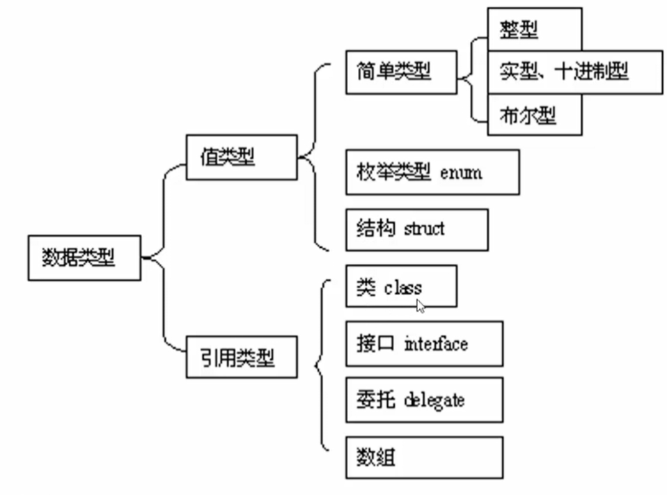

# C#
- aliyun-bei-3.1.1
## 基础

### CLR

- Common Language Runtime  公共语言运行时
- 底层的，统一运行各种语言的运行环境；
- 设计目标：
  - 简化开发：安全性、内存管理；（统一做内存管理，不需要自己释放内存）
  - 简化应用程序部署；
  - 基类库
  - 支持多种语言；
- 相当于Java中的虚拟机；
- 
  - exe文件中的内容：
    - IL指令  Intermediate Language
    - 元信息
    - 反编译工具 ildasm.exe  可以用来对编译生成的exe文件进行反编译，可以查看各个函数指令

### 面向对象

#### 对象
- 属性(Property): 
  - 一个事物的**基本状态和特征**，
  - 用名字或形容词
- 方法(Method)：
  - 指事物的**动作或功能**
  - 用动词
- 事件(Event)
  - 指该对象与其他对象之间的**通知机制或消息机制**
  - 用动词
  - 通常用 `+=` 进行事件的注册

#### 数据类型


- 值类型：
  - `float`  4个字节， `3.14f`
  - `double`  8个字节， `3.14   1.5e-3`
  - `decimal`  16个字节 `120.50m`  注意数字后面加 `m`
  - `char`  C# 中的字符使用 `Unicode` 表示，占两个字符 `\u0061`

```C#
Console.WriteLine("size of int value: {0}", sizeof(int));  // 4
Console.WriteLine("size of Int32 value: {0}", sizeof(System.Int32));  // 4
Console.WriteLine("size of long value: {0}", sizeof(long));  // 8

Console.WriteLine("size of float value: {0}", sizeof(float));  // 4
Console.WriteLine("size of double value: {0}", sizeof(double));  // 8

Console.WriteLine("size of decimal value: {0}", sizeof(decimal));  // 16
Console.WriteLine("size of char value: {0}", sizeof(char));  // 2
Console.WriteLine("size of bool value: {0}", sizeof(bool));  // 1
```

## 高级特性

### 委托 delegate

- 委托： 函数指针，是对函数原型的包装，给函数原型起了一个名字
- 委托声明： `public delegate double MyDelegate(double x);`
- 委托实例化：`MyDelegate d2 = new MyDelegate(obj.myMethod);`
- 委托调用： `委托变量名（参数列表）  d2(8.9);`
- 目的：使得可以像一个变量一样的去传递各种函数（例如将一种类型的函数传递给另一个函数做计算）；
- C#中已经定义好的委托：
  - `Action<T1, T2>`  代表 无返回值，任意参数个数的函数原型；
  - `Func<T1, T2, Tresult>`  代表 有返回值，任意参数个数的函数原型
- **委托的合并**：
  - 一个委托实例中可以 **包含多个函数**  多播；
  - 调用委托时，就是调用了其中多个函数
  - 通过 `+  -  +=  -=` 可以动态的增减其中的函数，提高程序灵活性

### 事件 

- 事件  相当于 回调函数
- 事件的声明：`public event 委托名 事件名`
- 事件的注册和移除：`事件名 += 或 -=`
- 事件的触发：`事件名（参数列表） `


### Lambda 表达式

- 形式：`(参数)=>{}`
  - `button1.Click += (sender, e)=>{...}`
  - `new Thread(()=>{...}).Start()`
  - 

## IO

- File
- FileInfo
- Directory

### 文本文件操作
```C#
{
    // StreamReader(filePath, fileEncode);
    var sr = new StreamReader(@"D:\test.txt", System.Text.Encoding.UTF8);
    Console.WriteLine(sr.Read());  // 读取一个字符
    Console.WriteLine(sr.ReadLine());  // 读取一行
    Console.WriteLine(sr.ReadToEnd());  // 读取到末尾
    sr.Close();
}

{
    // StreamWriter(filePath, isAppend, fileEncode);
    var sw = new StreamWriter(@"D:\test.txt", true, System.Text.Encoding.ASCII);
    sw.Write('H');  // 写一个字符
    sw.WriteLine("ello World");  // 写一行
    sw.WriteLine("你好，范闲");
    sw.Flush();  // 刷新缓存 实际写入文件中
    sw.Close();
}
```

### 序列化

- 直接把一个对象序列化为一个二进制文件进行存储
```c#
TestSerialize.Test.main();


[Serializable]
class Book
{
    public string name;
    public int num = 13;
    public string[] reader;

    public string ToString()
    {
        return name + ":" + string.Join(",", reader) + ":" + num;
    }
}


namespace TestSerialize
{
    class Test
    {
        static public void main()
        {            
            BinaryFormatter formatter = new BinaryFormatter();

            Book book = new Book();
            book.name = "C#";
            book.num = 20;
            book.reader = new string[] { "xiaoli", "xiaowang", "xiaozhang" };

            // 序列化
            FileStream stream = new FileStream("D://testSerielObj.t", FileMode.Create, FileAccess.Write, FileShare.None);
            formatter.Serialize(stream, book);
            stream.Close();

            // 反序列化
            FileStream read_stream = new FileStream("D://testSerielObj.t", FileMode.Open, FileAccess.Read, FileShare.Read);
            Book b = (Book)formatter.Deserialize(read_stream);
            Console.WriteLine(b.name + " : " + b.num);
            read_stream.Close();
        }
    }
}
```


# 编译

- 编译器  csc.exe
  - `csc.exe file1.cs` 直接使用编译器对指定文件进行编译；
  - `csc.exe /target:library file.cs`  生成库 dll
  - `csc.exe /reference:Counter.dll file.cs`   生成可执行文件 exe
- C#编译器将一系列 .cs 扩展名的源代码文件编译成程序集；
- 程序集（assembly）
  - 托管代码的容器称为程序集 或 可移植程序集（portable executable）
  - 程序集是 .NET 中 最小打包和部署单元；
  - 可以是一个 exe （包含一个Main方法） 也可以是一个 dll（没有入口点）
  - 不仅包含 IL，还包含元数据 metadata （元数据的引入使程序集无须额外的文件就可以引用其他程序集中的类型）

# .NET

- 包含：language  runtime  libraries
- C# 编译器并不直接提供二进制可执行文件，而是提供 MSIL（Microsoft Intermediate Language）不能直接被机器使用
- CLR 通常会在执行前，将 IL 转换成机器原生代码 称为即时编译 JIT（just-in-time)
- 只有借助于 JIT 翻译成机器码，即 JIT 将 MSIL / IL 翻译成 机器码；
- .Net Framework
  - .Net Framework 是由CLR和大量程序库组成
  - 仅运行在Microsoft Windows（桌面版本和服务器）
- .Net Core
  - 可以更好的跨平台；支持 Windows Linux macOS
  - 开源的
  - 有命令行工具
- 


- `checked`  当遇到数值溢出时报错  运行时报错

- ```c#
  int maxVal = int.MaxValue;
  int addnum = 19;
  int sumVal = checked(maxVal + addnum);
  ```


- 获取变量的类型： `num.GetType();` 
- foreach 只用于容器类的对象


- 可以实现动态类型

  - ```c#
    dynamic dynamicString = "This is a string";
    dynamicString = 20;  // 动态类型
    Console.WriteLine($"Run time type of {nameof(dynamicString)} is {dynamicString.GetType()}");
    
    ```

- 解析字符串

  - ```c#
    bool is_success = int.TryParse("123aa", out int result);
    Console.WriteLine(is_success);  // False
    Console.WriteLine(result);  // 0
    
    bool is_success = int.TryParse("123", out int result);
    Console.WriteLine(is_success);  // True
    Console.WriteLine(result);  // 123
    ```

- 在函数内定义函数

  - ```c#
    void WriteCubes(){
    	Console.WriteLine(Cube(3));
    	Console.WriteLine(Cube(4));
    	Console.WriteLine(Cube(5));
        int Cube(int val)=>val*val*val;
    
    }
    
    WriteCubes();
    ```

- 函数可以通过元组返回多个返回值；

# 数据类型


- enum: 在 C# 中，`enum` 类型只能在命名空间、类、接口或结构体的级别定义，不能直接在函数内定义。也就是说，**枚举类型定义不能出现在方法、属性或者其他成员的内部**，这是因为枚举类型是在编译时确定的类型：
- StringBuilder
  - string 是 不可变类型
  - System.Text.StringBuilder 是可变类型，方便字符串的编辑
    - Append
    - Remove

## 类

- 唯一基类，和多个接口
- 花括号内：类成员
  - 方法
  - 字段
  - 属性：属性和字段的声明很类似，但是属性比字段多了 get / set（有一个名为value的隐含参数） 代码块
  - 索引器：为访问类或者结构体中封装的列表或字典型数据元素提供了自然的访问接口；
    - 例如 string 类具有索引器，可以通过int索引访问其中每一个char的值；
  - 事件
  - 构造器：与方法的定义类似，区别在于 构造器的名称和返回值只能和封装它的类型相同；
  - 解构器：解构器的名字必须为 Deconstruct  ，并且拥有一个或多个out参数
  - 重载运算符
  - 嵌套类型
  - 终结器 ：只能够在类中使用的方法；该方法在垃圾回收器回收未被引用的对象占用的内存前调用
    - 语法：类型的名称前加 ~ 前缀
- 字段修饰符
  - 静态修饰符  static
  - 访问权限修饰符    public   internal（仅可以在本程序集内访问）   private   protected
  - 只读修饰符  readonly
    - 防止字段在构造后进行变更；
    - **只读字段**只能在**声明时**或者在其所属的类型**构造器中赋值**；
- 方法
  - 方法的签名：**方法的名字** + **一定顺序的参数类型**（但不包含参数名和返回值类型）组成
  - 表达式方法：`int Func(int x){return x*2;}`     `int Func(int x)=>x*2;`
  - 表达式方法和 Lambda方法有什么区别？？？？
  - 方法重载
    - `void Func(int x){...}`    `void Func(ref int x){...}`    可以同时出现
    - `void Func(int x){...}`    `void Func(out int x){...}`    可以同时出现    
    - `void Func(ref int x){...}`    `void Func(out int x){...}`    **不能同时**出现
- 继承
  - 只有当父类中的字段 加 `protected` 修饰符之后， 子类中才能使用父类中的字段！！！

## 结构体

- 结构体：值类型，不需要在堆上进行实例化；
  - 结构体不能包含无参数构造方法
  - 每个字段在定义时，不能给初始值
  - 构造方法中，必须对每个字段进行赋值
  - Struct 是 Sealed的， **不能被继承**；
  - 实例化时，也使用`new`,但与引用类型变量的内存不同；
  - `struct`变量在赋值时，实行的是字段的`copy`
- 结构体隐式包含一个**无法重写的无参数构造器**，将字段按位置为0；
- 定义结构体的构造器时，必须显示的为每一个字段赋值；
- **不能在结构体字段声明时赋初始值**！
- 结构体不支持 字段的初始化器（使用花括号的方式初始化字段）


## 容器

### ArrayList

- 可变长，可以容纳多种数据类型

- `ArrayList a1 = new ArrayList()`

- `a1.Add(element)`

- ```c#
  using System.Collections;
  
  ArrayList a1 = new ArrayList();
  a1.Add(1);
  a1.Add("haha");
  a1.Add(true);
  
  foreach(var ele in a1){
      Console.WriteLine("element: " + ele);
  }
  Console.WriteLine(a1.Count);
  Console.WriteLine(a1.Contains(1));
  a1.RemoveAt(1);
  
  ```

- 

### Stack

- LIFO

- 不能通过index访问元素

- ```c#
  Stack st = new Stack();
  st.Push(1);
  st.Push("haha");
  st.Push(true);
  
  st.Pop();
  foreach (var ele in st)
      Console.WriteLine(ele);
  
  Console.WriteLine("The number of elements in the stack: " + st.Count);
  st.Contains(1);
  ```

- 

### Queue

- FIFO

- ```c#
  Queue q = new Queue();
  q.Enqueue(1);
  q.Enqueue("hahah");
  q.Enqueue(true);
  foreach (var ele in q)
      Console.WriteLine(ele);
  Console.WriteLine("The number of elements in the queue: " + q.Count);
  q.Contains(3);
  q.Dequeue();
  Console.WriteLine("The number of elements after dequeue: " + q.Count);
  ```

- 

### Hashtable

- 

- ```c#
  Console.WriteLine("----------------Hashtable-----------------");
  Hashtable ht = new Hashtable();
  ht.Add("001", ".Net");
  ht.Add("002", "C#");
  ht.Add("003", "ASP.Net");
  
  ICollection keys = ht.Keys;
  foreach (String k in keys)
      Console.WriteLine(ht[k]);
  
  Console.WriteLine(ht.ContainsKey("002"));
  Console.WriteLine(ht.ContainsValue("C#"));
  
  ht.Remove("001");
  foreach (String k in keys)
      Console.WriteLine($"key:{k} value:{ht[k]}");
  ```

- 


# 函数

- 自定义的函数

  - 参数传递

    - 默认是值传递

    - ref  按引用方式， 传入，函数声明与函数调用都需要有

      - 需要在传入前赋值，否则编译时报错

    - out  按引用方式，传出，函数声明与函数调用都需要有

      - 不需要在传入前赋值
      - 必须在函数结束前赋值

    - params  参数修饰符 

      - 只能修饰方法中的最后一个参数

      - 它能够使方法接受任意数量的指定类型参数

      - 参数类型必须声明为数组

      - ```c#
        static int Sum(params int[] numbs){
            int sum = 0;
            for (int i=0; i<numbs.Length; i++)
                sum += numbs[i];
            return sum;
        }
        
        int total = Sum(1, 2, 3, 4);  // 接受任意数量的指定类型参数
        ```

    - 命名参数

      - 除了用位置确定参数外，还可以用名称来确定参数

      - ```c#
        void Func(int x, int y){
            Console.WriteLine(x + ", "+y);
        }
        
        Func(y:2, x:1);
        ```

      - 

- 运算符

  - 右结合运算符

    - 赋值运算符   `x=y=3`;

    - Lambda 运算符  =>

    - null 合并运算符  ??   

      - 如果操作数不是 null 结果为操作数，否则结果为一个默认的值；

      - ```c#
        string s1 = null;
        string s2 = s1 ?? "nothing";   // s2 evaluates to nothing
        ```

      - 

    - 条件运算符    ?:

- 构造器

- 属性

- 事件

- 索引器

- 终结器

# LINQ

- C# 3.0 引入
- Language Integrated Query  语言集成查询
- LINQ 令 C# 程序可以直接编写查询并以静态方式检查其正确性
- 可以查询本地集合（列表 XML文档）  也可以查询远程数据库


# Reflection

- Reflection
- Collection
- delegate
  
  - 函数指针，在C#中使用委托将函数作为值传递给其他函数，或者从其他函数中返回；
  
  - 委托，是一种知道如何调用方法的对象；
  
  - ```c#
    delegate int Transformer (int x);   // 可以兼容任何返回类型为int 并有一个int类型参数的方法
    
    static int Square (int x) => x*x;
    // 将一个方法委托给一个 委托变量 就创建了一个 委托实例
    Transformer t = Square;
    // 调用委托
    int answer = t(3);
    ```
  
  - 这种调用方法可以把 **调用者** 与 **目标方法解耦**；
  
  - 可以在运行时，指定一个目标方法，这个特性可以用于编写插件方法；
  
  - 多播委托： 添加多个目标方法，依次调用； ？？？
  
- events


# File I/O

- `using System.IO`

- 判断文件是否存在

  - `File.Exists(file_pth);`

- 读取文件内的所有行

  - `string[] lines=File.ReadAllLines(file_pth);`  返回一个列表
  - `string content = File.ReadAllText(file_pth);`  返回一个字符串

- 文件拷贝

  - `File.Copy(src_pth, dst_pth);`

- 文件删除

  - `File.Delete(src_pth);`

- 流式读写文件

  - 读取： `File.OpenText()`

  - ```c#
    using (StreamReader sr = File.OpenText(file_pth))
    {
        string s = "";
        while ((s = sr.ReadLine()) != null)
        {
            rtContent.AppendText("----------\n");
            rtContent.AppendText(s);
        }
    }
    ```

  - 写入： `File.AppendText()`

  - ```C#
    using(StreamWriter sr = File.AppendText(file_pth))
    {
        sr.WriteLine("Test Line");
        sr.Close();  // Close Stream
    }
    ```

  - 

# 指针 IntPtr

在 C# 中，`IntPtr` 是一个结构体，用于表示一个指针或一个句柄。它可以存储任意类型的指针，适用于与非托管代码（如 C++ DLL）交互时以及处理底层内存的情况。以下是关于 `IntPtr` 的作用和用法的详细解释：

### 作用：

1. **处理非托管代码**：`IntPtr` 用于与非托管代码进行交互。当你需要在 C# 中与使用指针的非托管代码进行通信时，通常会使用 `IntPtr` 来传递指针、句柄或其他指针相关的数据。
2. **内存操作**：`IntPtr` 可用于直接操控内存，比如在进行底层操作时需要处理指针。
3. **跨平台开发**：`IntPtr` 在跨平台开发中也很有用，因为它提供了一种通用的表示指针的方式，不受平台限制。

### 用法：

1. **通过 Marshal类转换**：可以使用 `Marshal` 类的静态方法来进行 `IntPtr` 与其他类型之间的转换，比如将指针转换为一个特定类型的对象或数组。
2. **与非托管代码交互**：当与非托管代码交互时，`IntPtr` 可以用作传递指针、句柄或其他指针相关的数据的中间类型。
3. **在调用外部函数时使用**：当调用需要返回指针的外部函数时，在 C# 中声明函数返回值为 `IntPtr` 类型来接收指针。
4. **释放内存**：需要注意的是，使用完 `IntPtr` 后，特别是当它指向动态分配的内存时，需要手动释放内存以避免内存泄漏。可以使用 `Marshal.FreeHGlobal` 或其他适当的方法来释放 `IntPtr`。
5. **与其他指针类型的转换**：可以根据需要将 `IntPtr` 转换为其他指针类型，比如 `int*`、`void*`等类型。

总的来说，`IntPtr` 提供了一种在 C# 中处理指针和与非托管代码交互的安全和通用机制。它在需要处理指针、句柄的情况下非常有用，但也需要小心使用，以避免出现内存安全问题和泄漏。


# 内存泄漏

- 当涉及图片处理时，需要手动回收
- `GC.Collect();`

# 多线程


# 调用CPP DLL

- CPP 定义形式

- ```cpp
  #define MY_DLL extern "C" __declspec(dllexport)
  
  MY_DLL void* initModel(const char* onnx_pth, char* msg, size_t msg_len=1024);
  MY_DLL void warmUp(void* compiled_model, char* msg, size_t msg_len=1024);
  MY_DLL int doInferenceByImgPth(const char* image_pth, void* compiled_model, const int* roi, const int roi_len, char* msg, size_t msg_len=1024);
  
  ```

- C# 调用形式

```c#
        [DllImport(@"E:\cpp_proj\openvino_infer\bin\Debug\cls_infer_lib.dll", CallingConvention=CallingConvention.Cdecl)]
        private static extern IntPtr initModel(string onnx_pth, StringBuilder msg, int msg_len);
        [DllImport(@"E:\cpp_proj\openvino_infer\bin\Debug\cls_infer_lib.dll", CallingConvention=CallingConvention.Cdecl)]
        private static extern void warmUp(IntPtr compiled_model, StringBuilder msg, int msg_len);
        [DllImport(@"E:\cpp_proj\openvino_infer\bin\Debug\cls_infer_lib.dll", CallingConvention=CallingConvention.Cdecl)]
        private static extern int doInferenceByImgPth(string image_pth, IntPtr compiled_model, int[] roi, int roi_len, StringBuilder msg, int msg_len);
```

- C# 中的CallingConvention
  - `CallingConvention.Cdecl`    C语言的调用方式
  - `CallingConvention.Fastcall`
  - `CallingConvention.StdCall`
  - `CallingConvention.ThisCall`
  - `CallingConvention.Winapi`
  
- 传递结构体数组！！

  - ```c#
    Point[] points = new Point[3];
    points[0] = new Point { x = 1, y = 2 };
    points[1] = new Point { x = 3, y = 4 };
    points[2] = new Point { x = 5, y = 6 };
    
    IntPtr ptr = Marshal.AllocHGlobal(Marshal.SizeOf<Point>() * points.Length);
    for (int i = 0; i < points.Length; i++)
    {
        Marshal.StructureToPtr(points[i], ptr + i * Marshal.SizeOf<Point>(), false);
    }
    
    string result = AddPoints(ptr, points.Length);
    
    for (int i = 0; i < points.Length; i++)
    {
        points[i] = Marshal.PtrToStructure<Point>(ptr + i * Marshal.SizeOf<Point>());
    }
    
    Marshal.FreeHGlobal(ptr);
    tbLog.AppendText(result);
    foreach (var i in points)
        tbLog.AppendText($"Point: {i.x}  {i.y}" + Environment.NewLine);
    ```

## c# 与 cpp 对应关系

| cpp数据类型 | c#数据类型    | 备注                               |
| ----------- | ------------- | ---------------------------------- |
| char*       | StringBuilder | StringBuilder 类似CPP stringstream |
| const char* | string        |                                    |
| int*        | int[ ]        | 传递数组时，要传数组长度           |
| void*       | IntPtr        |                                    |

## Marshal

- 用于在托管代码（managed code) 和非托管代码(unmanaged code) 之间进行数据转换和交互；
- 主要用于处理不同内存布局或数据类型的转换；

- 调用openvino时，如果用debug版本会出错！！用release版本OK，不知道为什么。。。

### 案例：C#与CPP数据交互

- 调用分类模型

  ```c#
  // cls
  string onnx_pth = @"D:\share_dir\repository_check\workdir_v8_0325\check_package\use_small_model\weights\best.onnx";
  StringBuilder msg = new StringBuilder();
  //test(onnx_pth, msg, 1024);
  //tbLog.AppendText(msg.ToString() + Environment.NewLine);
  IntPtr model = initModel(onnx_pth, msg, 1024);
  tbLog.AppendText(msg.ToString() + Environment.NewLine);
  warmUp(model, msg, 1024);
  tbLog.AppendText(msg.ToString() + Environment.NewLine);
  string img_pth = @"D:\share_dir\repository_check\datasets\test2\2024-4-20-11-40-12_OK.jpg";
  int[] roi = { 300, 50, 1500, 900 };
  doInferenceByImgPth(img_pth, model, roi, 4, msg, 1024);
  tbLog.AppendText(msg.ToString() + Environment.NewLine);
  ```

- 调用检测模型

  ```c#
  string onnx_pth = @"D:\share_dir\pd_mix\workdir\det_pcb_img_cls2\train\weights\best.onnx";
  StringBuilder msg = new StringBuilder();
  IntPtr model = initModel(onnx_pth, msg, 1024);
  tbLog.AppendText(msg.ToString() + Environment.NewLine);
  warmUp(model, msg, 1024);
  tbLog.AppendText(msg.ToString() + Environment.NewLine);
  string img_pth = @"E:\DataSets\pd_mix\test_pd_images\test\20240412_00001_P51-L_A741533600_2_17_C4_FK_A2FK4D4212ICA147_A2FK4D4212KDB107.jpg";
  int[] roi = { 300, 50, 1500, 900 };
  int num = 0;
  IntPtr res = doInferenceByImgPth(img_pth, model, roi, 4, out num, msg, 1024);
  tbLog.AppendText(msg.ToString() + Environment.NewLine);
  
  DET_RES[] det_res = new DET_RES[num];
  for(int i=0; i<num; ++i)
  {
      det_res[i] = Marshal.PtrToStructure<DET_RES>(res + i * Marshal.SizeOf<DET_RES>());
      tbLog.AppendText($"det res: {det_res[i].tl_x} {det_res[i].tl_y} {det_res[i].br_x} {det_res[i].br_y} confidence: {det_res[i].confidence} class:{det_res[i].cls}"+Environment.NewLine);
  }
  ```

## WinForm

### 最佳实践

- 变量名: camelCase,  `firstNameLabel`
- 创建控件后，首先给控件命名（便于后续事件名与控件名关联）；

### 常用控件

- `TabIndex`  使用 Tab 键跳转时的顺序；

#### StatusStrip

- 状态栏
- 窗口最下缘，边框；
- 用于提示信息

#### MenuStrip

- 菜单栏
- 类似按钮，可以创建点击事件
- 在`Text`属性中，插入`&`, 可以使用 `Alt+字母` 的方式快捷打开
  - 在日常软件使用中，也可以使用该特性，按住`Alt`键，此时菜单栏上的字母会出现下划线，点击对应的字母即可打开相应的标签；

### 常用布局

- 绝对布局：
  - Location  以像素为单位，设置控件的X Y 坐标
  - Size  以像素为单位，设置控件的宽高
- 相对布局：
  - Anchor  把控件附着在窗体的一个或多个边框上
  - Dock   把控件和窗体的一个或多个边框连接起来，放置并填充（占据的位置）

### 线程

- 耗时操作放在子线程中运行
  
```c#
Task.Run(()=>{
  string html = webClient.DownloadString("https://www.hello.com");  // 阻塞；
})
```

- 在子线程中执行完得到的结果，要回传给界面元素，需要创建委托
  
```c#
this.Invoke(new Action(()=>{
  textBox1.Text = html;
}));
```

- 也可以通过异步方法实现 （`async`   `await`）
  
```c#
# await 直接拿到 Task<T> 类型参数
string html = await myDownloadAsync(url);
textBox1.Text = html;

private Task<string> myDownloadAsync(string url){
  WebClient webClient = new WebClient();
  return Task.Run(()=>{
    return webClient.DownloadString(url);
  });
}
```

## 算法

### 台阶问题

> 假设：一次只能上一个台阶或者上两个台阶，问上9个台阶总共有几种上法？
- 上1个台阶只有一种上法；
- 上2个台阶有两中上法；
- 逆向思考，上到第9个台阶前，只有可能从第7个台阶或者第8个台阶上，所以`f(9)=f(7)+f(8)`
- 是**斐波那契数列**

> 韩信点兵：若将士兵3个人一排还剩2个人，若5个人一排还剩3个人，若7个人一排还剩5个人
- “3个人一排还剩2个人” 翻译成数学表达式是 `x%3=2`
- “5个人一排还剩3个人” 翻译成数学表达式是 `x%5=3`
- “7个人一排还剩5个人” 翻译成数学表达式是 `x%7=5`
- 用编试的算法，依次测试直到找到满足这三个表达式的数字
