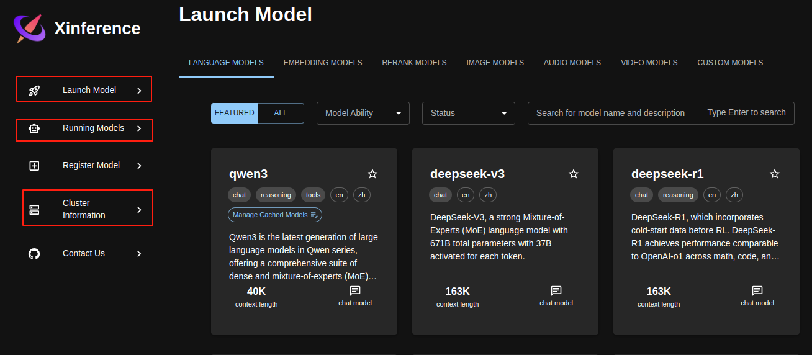

# 部署推理大模型

1. 先搞定部署
2. 使用n8n或RAG 调用大模型能力，测试效果
   1. n8n 构建由LLM决策驱动的工作流
   2. RAG 可以检索 关系型数据库 + 图数据库 + 向量数据库，作为prompt
3. 大模型微调  如果大模型在特定专业领域效果不好，则尝试微调


## Transformers


```python
import time
from transformers import AutoTokenizer, AutoModelForCausalLM

print("Use Transformers")

model_path = "./qwen/Qwen3-1.7B"
# model_path = "/root/mimo"  # Failed maybe VRAM too small
# model_path = "/root/qwen3/Qwen3-0.6B-FP8"  # 当前显卡不支持 FP8 推理
print(f"Use Model: {model_path}")

tokenizer = AutoTokenizer.from_pretrained(model_path, trust_remote_code=True)
model = AutoModelForCausalLM.from_pretrained(model_path, device_map="auto", trust_remote_code=True).eval()

input_texts = ["Hi, please introduce yourself", "Shanghai is"]

start_time = time.time()
responses = []
for text in input_texts:
    inputs = tokenizer(text, return_tensors="pt").to(model.device)
    outputs = model.generate(**inputs)
    response = tokenizer.decode(outputs[0], skip_special_tokens=True)
    responses.append(response)
#'''
# around 9s to use transformers


end_time = time.time()
elapsed_time = end_time - start_time

print(responses)
print(f"Total cost: {elapsed_time} s")

```


## vllm

1. 推理 LLM  VLM
2. 理解不同模型的推理模板
3. 做量化推理，提升推理速度

### 安装
- 需要结合 cudatoolkit 版本选择 vllm 安装包，目前官方编译的版本有：cuda11.8  12.1  12.4
- python 虚拟环境中可以使用与宿主机不同的cudatoolkit版本
- `pip install vllm-0.8.5+cu121-cp38-abi3-manylinux1_x86_64.whl --extra-index-url https://download.pytorch.org/whl/cu121`
  - whl 文件指定 python 3.8，但实测使用 python 3.12 也可以正常使用！！！

### 模型
- 默认情况下，vLLM 会从 HuggingFace 下载模型文件
- 可以通过 `export HF_ENDPOINT=https://hf-mirror.com` 修改为从镜像网站下载
- 也可以通过 `export VLLM_USE_MODELSCOPE=True` 修改为从 ModelScope 下载

### 服务
- `vllm serve Qwen/Qwen2.5-0.5B-Instruct`  最简单的启动服务命令
- `vllm serve Qwen/Qwen3-1.7B --gpu-memory-utilization 0.7 --max-num-seqs 1 --max-num-batched-tokens 4096 --max-model-len 2048 --swap-space 16`
  - `--max-num-seqs`  引擎同时处理的最大请求序列数量，这个值影响并发能力和峰值KVCache需求
  - `--max-num-batched-tokens`  调度器在一个推理批次中处理的最大Token数量，该参数限制了单步计算量和显存占用峰值，默认不限制（对OOM影响很大！）
  - `--max-model-len`  模型能处理的最大序列长度 （上下文窗口大小）
  - `--gpu-memory-utilization` 控制 vLLM引擎使用GPU显存比例，取值范围(0, 1) 默认 0.9， vLLM 会预先加载模型权重，然后将剩余显存的这个比例用于 PagedAttention 的物理分配，降低此值可以减少KVCache可用空间，但也降低OOM风险；
  - `--swap-space`  指定用于KVCache CPU 交互空间的大小（以GB为单位），当GPU显存不足以容纳所有活动序列的KVCache时，可以将一部分暂时不活跃的Cache块交换到CPU内存，会显著增加延迟，默认值4GB
  - `--host`: 服务监听的主机地址，默认为 localhost。设为 0.0.0.0 可允许外部访问。
  - `--port`: 服务监听的端口，默认为 8000。
  - `--served-model-name`: 对外暴露的模型名称路径。
  - `--response-role`: 设置 OpenAI API 兼容接口返回消息中的 role 字段。

- 测试服务
  - 接口举例
    - `http://localhost:8000/v1/models`  GET 获取支持的模型
    - `http://localhost:8000/v1/chat/completions`  POST 对话  只支持 **messages**
      - ```bash
          {  
            "model": "NousResearch/Meta-Llama-3-8B-Instruct",  
            "messages": [  
              {"role": "system", "content": "You are a helpful assistant."},  
              {"role": "user", "content": "What is machine learning?"}  
            ]  
          } 
        ```
    - `http://localhost:8000/v1/completions`  POST 文本续写
      - ```bash
          {  
            "model": "NousResearch/Meta-Llama-3-8B-Instruct",  
            "prompt": "Machine learning is",  
            "max_tokens": 100  
          }
        ```
  - curl 测试
    - model 字段，要与 `vllm serve model_path`  model_path 保持一致，否则会报找不到模型错误
  ```bash
  curl http://127.0.0.1:8000/v1/completions \
      -H "Content-Type: application/json" \
      -d '{
          "model": "Qwen/Qwen2.5-1.5B-Instruct",
          "prompt": "what is your name?",
          # "max_tokens": 7,  # 限制输出的字符数量
          "temperature": 0.8
      }'
  ```

  - python 测试
  ```python
  from openai import OpenAI

  openai_api_key = "EMPTY"
  openai_api_base = "http://127.0.0.1:8000/v1"
  client = OpenAI(
    api_key=openai_api_key,
    base_url=openai_api_base,
  )

  #completion = client.completions.create(model="Qwen/Qwen2.5-1.5B-Instruct", prompt="Who are you?")

  chat_response = client.chat.completions.create(
    model="Qwen/Qwen2.5-1.5B-Instruct",
    messages=[
      {"role":"system", "content":"You are a helpful assistant."},
      {"role":"user", "content":"Tell me a joke."}
    ]
  )
  print(f"Completion result: {chat_response}")
  ```

### 离线批量推理测试

- 使用 python库加载模型并执行推理，打印结果
```python

```

## xinference

- 需要提前安装好 CUDA 和 pytorch
- `pip install "xinference[transformers]"`  
  - `xinference[all]`  llama-cpp-python 会编译错误，待解决
- 启动本地服务：
  - `xinference-local --host 192.168.3.9 --port 9997`
    - 这里使用了局域网ip，为了让部署在docker里的Dify可以访问
    - 
    - `Launch Model` 选择要部署的模型
    - `Running Models` 查看正在运行的模型，可以打开`webui`测试模型效果
    - `Cluster Information` 查看系统资源使用情况
  - 更改模型保存路径：`export XINFERENCE_HOME=/path/to/save`
    - 在启动服务时，可能会报没有写入权限的错误，因为xinference要向这个文件夹写入模型和日志
    - `sudo chmod 777 /path/to/save`  赋权
  - 更改模型下载源：`export XINFERENCE_MODEL_SRC="modelscope"`

## llama.cpp

## ollama

### 安装
- `curl -fsSL https://ollama.com/install.sh | sh`
- 测试：`curl -v http://localhost:11434`  返回： "Ollama is running" 即成功
- 修改模型默认的存储路径：`export OLLAMA_MODELS=/path/to/save/models`
  - 默认存储路径：`/usr/share/ollama/.ollama/models`
  - 修改后需要赋权给ollama `sudo chown -R ollama:ollama /path/to/save/models`
- 修改ollama host `export OLLAMA_HOST=0.0.0.0:11434`  监听所有ip
- `OLLAMA_HOST=0.0.0.0:11434 ollama serve`  修改环境变量可能没有生效，直接指定后启动服务，可以确定有效
  - 发现这种方式更稳定，这样启动服务后，就可以直接使用 ollama命令

### 使用
- `ollama list`  查看本地现有镜像
- `ollama run qwen3`  拉取并进入交互模式
- `ollama pull qwen3` 仅拉取镜像
- `ollama rm qwen3`  删除模型
- `ollama ps` 查看正在运行的模型
- 
- `sudo systemctl restart ollama`  重启ollama服务
- `sudo systemctl stop ollama`  停止ollama服务
- `sudo systemctl status ollama`  查看服务状态
- 


## LMDeploy

### 安装
```bash
# 安装addict软件包
pip install addict mmengine mmengine-lite fire accelerate==0.32.1 nvidia-ml-py

# 解决LMDeploy对tranformers版本要求的Iusse：
pip install transformers==4.47.1

# 下载lmdeploy，并进入目录
git clone https://github.com/InternLM/lmdeploy.git
cd lmdeploy

# mxgpu
# checkout对应的版本
git checkout 832bfc45b4497e8d16e08ecfd663671e634aae40
# 安装lmdeploy
LMDEPLOY_TARGET_DEVICE=maca python setup.py develop
```

### 模型


### 服务

- `lmdeploy serve api_server model_pth --server-port 2333 --session-len 8192`

- ``

#### API 接口
- 与 vllm 类似
- `http://0.0.0.0:2333/v1/models`
- `http://0.0.0.0:2333/v1/completions`
- `http://0.0.0.0:2333/v1/chat/completions`
- 

### Python