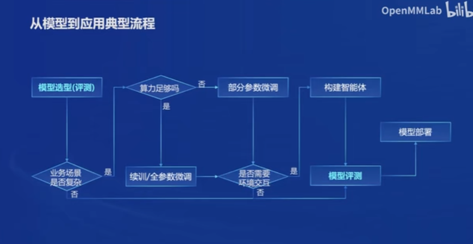

# InternLM

- 增量续训：
  - 使用场景：让基座模型学到一些新知识
  - 训练数据：细分领域的文章、书籍、代码
- 有监督微调：
  - 使用场景：让模型学会理解各种指令进行对话；
  - 训练数据：高质量的对话、问答数据

## 问题：
1. 如果要构建一个对话智能体，需要构建多大的数据集？
2. 怎么为下游任务微调？
3. 能不能给一些专业领域的文档，后续就可以直接提问了？