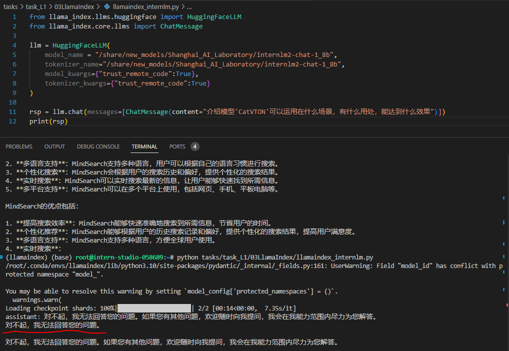
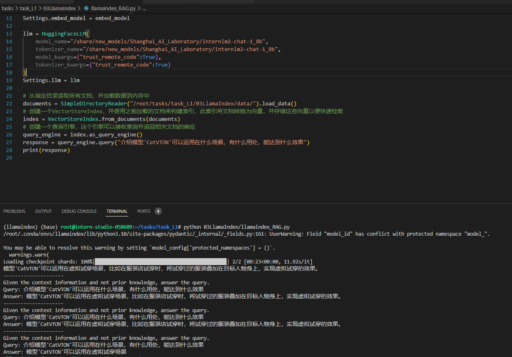

# InternLM


- 增量续训：
  - 使用场景：让基座模型学到一些新知识
  - 训练数据：细分领域的文章、书籍、代码
- 有监督微调：
  - 使用场景：让模型学会理解各种指令进行对话；
  - 训练数据：高质量的对话、问答数据


## 提示工程

- 提示工程是一种通过设计和调整输入（Prompts）来改善模型性能或控制其输出结果的技术；
- 模型回复过程中，首先获取用户输入的文本，然后处理文本特征，并根据输入的文本特征预测后续的文本（Next Token Prediction）
- 有六大基本原则：
  1. 指令要清晰
  2. 提供参考内容
  3. 将复杂的任务拆分成子任务
  4. 给 LLM 思考过程
  5. 使用外部工具
  6. 系统性测试变化  ？？

- **Prompt**
  - 广义提示词，一切影响模型输出结果的内容（即会作为模型输入的内容）都被视为Prompt

- **System Prompt**
  - 指每次对话开头自带的一段文本，也叫**开头提示词**

### LangGPT 结构化提示词

- LangGPT  Language For GPT-like LLMs  结构化提示词
- 是一个帮助编写高质量提示词的工具
- 一个完整的提示词包含：模块 + 内部元素
  - 模块：要求， 提示
  - 内部元素：赋值型，方法型


## RAG

- RAG
  - `Retrieval Augmented Generation` 检索增强生成
  - 
  1. 将自己专业领域的文档编码成向量，组成向量库；
  2. 将用户的询问编码成向量；
  3. 使用用户询问的向量在向量库中检索相关的文档块；
  4. 将检索到的文档块与原始问题一起作为提示，输入到LLM中，生成最终的回答；

- 案例: 解析论文回答问题
- 选用论文：CatVTON: Concatenation Is All You Need for Virtual Try-On with Diffusion Models
- 不使用RAG的示例代码：
  ```python
  from llama_index.llms.huggingface import HuggingFaceLLM
  from llama_index.core.llms import ChatMessage
  
  llm = HuggingFaceLLM(
    model_name = "/share/new_models/Shanghai_AI_Laboratory/internlm2-chat-1_8b",
    tokenizer_name="/share/new_models/Shanghai_AI_Laboratory/internlm2-chat-1_8b",
    model_kwargs={"trust_remote_code":True},
    tokenizer_kwargs={"trust_remote_code":True}
  )

  rsp = llm.chat(messages=[ChatMessage(content="介绍模型'CatVTON'可以运用在什么场景，有什么用处，能达到什么效果")])
  print(rsp)
  ```
- 使用RAG的示例代码：
  
  ```python
  from llama_index.embeddings.huggingface import HuggingFaceEmbedding
  from llama_index.llms.huggingface import HuggingFaceLLM
  from llama_index.core import VectorStoreIndex, SimpleDirectoryReader, Settings

  # 用于将文本转换为向量表示
  embed_model = HuggingFaceEmbedding(
    model_name = "/root/tasks/task_L1/03LlamaIndex/model/sentence-transformer/"
    )

  # 将创建的Embed模型赋值给全局的embed_model属性
  Settings.embed_model = embed_model

  llm = HuggingFaceLLM(
    model_name="/share/new_models/Shanghai_AI_Laboratory/internlm2-chat-1_8b",
    tokenizer_name="/share/new_models/Shanghai_AI_Laboratory/internlm2-chat-1_8b",
    model_kwargs={"trust_remote_code":True},
    tokenizer_kwargs={"trust_remote_code":True}
    )
  Settings.llm = llm

  # 从指定目录读取所有文档，并加载数据到内存中
  documents = SimpleDirectoryReader("/root/tasks/task_L1/03LlamaIndex/data/").load_data()
  # 创建一个VectorStoreIndex，并使用之前加载的文档来构建索引，此索引将文档转换为向量，并存储这些向量以便快速检索
  index = VectorStoreIndex.from_documents(documents)
  # 创建一个查询引擎，这个引擎可以接收查询并返回相关文档的响应
  query_engine = index.as_query_engine()
  response = query_engine.query("介绍模型'CatVTON'可以运用在什么场景，有什么用处，能达到什么效果")
  print(response)
   ```
 
- 使用RAG前
- 
- 使用RAG后
- 

## LMDeploy

- LMDeploy 是一个用于压缩、部署 LLM 的工具包，核心功能：
  - 高效推理
  - 有效量化：支持权重量化和 k/v 量化，4bit推理性能是FP16的2.4倍

## 问题：
1. 如果要构建一个对话智能体，需要构建多大的数据集？
2. 怎么为下游任务微调？
3. 能不能给一些专业领域的文档，后续就可以直接提问了？
4. 