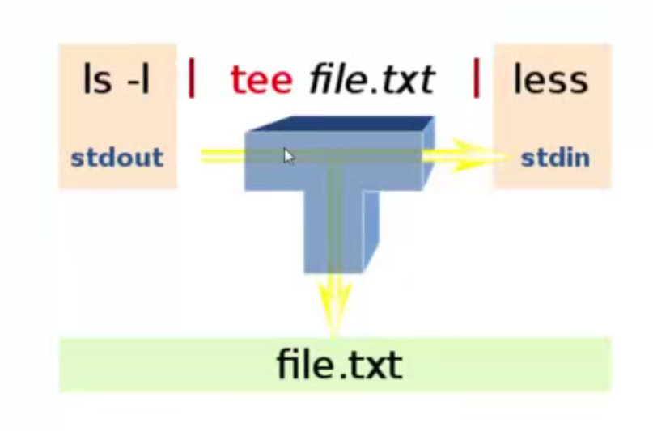
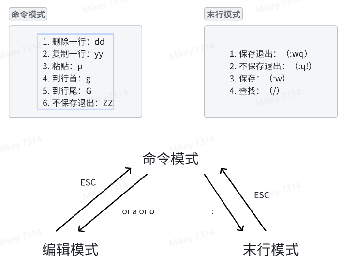

# Linux相关

- 进度 `ch04 - 013`  complete

## 基础命令

- **Linux**中的命令是**大小写敏感**的（Windows中命令大小写不敏感）
- `clear`  清屏  `ctrl+L` 也可以
- `history`  查看历史命令
- `date`  查看当前日期时间
- `sudo apt update`  更新 apt 索引
- `sudo apt upgrade`  更新软件
- `which echo`  查询指定命令的程序文件在什么路径下

- 命令的结构
  - `commandName options inputs`  
  - 从环境变量里搜索相应的`commandName`
  - `echo $PATH` 查看环境变量 以 冒号`:`分隔多个路径，从左到右依次遍历查询
- 通过手册学习命令的使用 Manual (Man) Pages
  - `man -k which` 在手册中查找`which`  `-k` 代表查找指令
  - `man 1 which` 查看 `section-1` 中关于 `which`指令相关的内容，通常查看`section-1`中的内容可以省略 `1`；
  - `[xx]`  可选项，有没有都行
  - `<xx>`  必选项  必须得有
  - `man -k "list directory contents"`  根据描述查找相应的命令

- 
  - `Standard Input   0`
  - `Standard Output  1`
  - `Standard Error   2`
  - `cat 1> output.txt`  将标准输出流重定向到 文件中  覆盖式写入
  - `cat 1>> ouptut.txt`  以追加的方式写入
  - `cat -k 2>> error.txt`  将报错信息以追加的方式写入文件 **只在有错误发生时才会写入**
  - `cat 0< input.txt`  从文件中输入到标准输入流，然后在打印在屏幕上  0可以省略
  - `cat <input.txt >/dev/pts/2`  
    - 将 input.txt 中的内容输入到标准输入流中，然后写入到另一个终端
    - `tty` 查看当前终端的位置，其实就是个文件的位置
  - `date | cut --delimiter ' ' --fields 1`
    - 将 `date` 命令输出的内容，输入给 `cut` 命令
- 
  - `tee` 即保证了数据继续沿着 `pipline` 流，也让它在中间保存了一份
  - `tee` 命令的用途，将 `pipline` 中某个节点的数据保存下来
  - `date | tee fulldate.txt | cut --delimiter ' ' --fields 1`

- `xargs` 将标准输入流的数据转为 命令行参数
  - 在使用 `pipline` 时，有的命令不能接收标准输入流作为参数，需要使用 `xargs` 进行转换
  - `date | xargs echo` date 返回的数据，经过 `xargs` 转换后，作为 `echo` 的参数返回
  - `cat < files2delete.txt | xargs rm` 将文件中的文件依次删除

- `Alias` 可以给自己创建的 `pipline` 创建别名 方便后续调用
  
  ```bash
  # .bash_aliases  in your home folder
  alias calmagic="xargs cal -A 1 -B 1 > /home/kun/thing.txt"
  ```

  - 后续调用时，可直接使用 `calmagic`
  - 要使用你刚写的`alias` 需要重启 终端

## 文件管理

- `pwd`  print working directory
- `file <file_name>`  查看文件信息，linux不以文件后缀判断文件类型，而是根据`文件头`的内容判断文件类型
- `ls file[1234567890].txt`  `ls file[0-9].txt`
- `ls file[0-9][0-9].txt`
- `ls file?[A-Z].txt`  `?` 只匹配`一个任意字符`

- `Brace Comprehension`
  - `mkdir 2014` 创建文件夹 名为2014，不能创建嵌套文件夹
  - `mkdir -p 2014/07/14/test` 创建完整的文件夹路径
  - `mkdir {jan,feb,mar,apr,may,jun,july,aug,sep,oct,nov,dec}_{2017,2018,2019,2020}` 产生多个文件夹
  - `mkdir {jan,feb,mar,apr,may,jun,july,aug,sep,oct,nov,dec}_{2017..2022}`
  - `touch {jan,feb,mar,apr,may,jun,july,aug,sep,oct,nov,dec}_{2017..2020}/file_{001..010}`  在每个文件夹下产生文件
  - `ls {jan,feb,mar,apr,may,jun,july,aug,sep,oct,nov,dec}_{2017..2020}` 查看每个目录下的内容
- `rm` 删除
  - 删除文件  `rm file_name`
  - 删除文件夹  `rm -r dir_name`
  - `rm -ri dir_name`  在删除之前逐个进行询问
  - `rmdir dir_name/*` 删除指定文件夹下的所有的**空文件夹**
- 复制和移动文件
  - null
- 编辑文件
  - null

## Shell

## 开源软件使用

## 用户权限管理

- 怎么创建用户，限制其权限？
- 一个用户创建的文件或文件夹，是否能做到其他用户不能访问？

# WSL

- wsl 更新 `wsl --update`  在`powershell`中进行
- 查看wsl版本信息 `wsl -v`
- 查看有哪些用户 ``
## 怎么安装cuda驱动

## 怎么创建多用户

## 怎么多用户远程登陆

## 怎么远程访问wsl进行本地开发

## 案例

- TODO 办公室网络不行，需要在家实现
### root用户搭建paddle环境，普通用户使用框架进行训练
1. 创建新用户
   1. `sudo useradd -m username`  -m 会自动创建家目录
   2. `sudo passwd username`  给用户名创建密码
   3. `less /etc/passwd`  查看当前都有哪些用户
   4. `sudo usermod -aG groupname username`  将指定用户添加到指定组中
2. 使用conda安装paddle环境
3. 使用root用户创建多个普通用户，创建普通用户组
4. 使用普通用户登录
5. 使用git clone 代码
6. 上传数据集 / 使用本地数据集
7. 进行模型训练
8. 模型精度验证

# `vi` or `vim`


# SSH 连接
- 安装ssh功能
  - `sudo apt install openssh-server -y`
  - `sudo systemctl start ssh`  开启SSH服务
  - `sudo systemctl status ssh`  查看 SSH 状态
  - `sudo ufw allow ssh`  开启防火墙？？
  - `sudo ufw allow 22`  开启22端口
  - `sudo ufw status`  查看开启的状态
  - `sudo apt install net-tools -y`  安装 ifconfig 网络工具包
- 登录命令 `ssh -p 34655 root@ssh.intern-ai.org.cn -o StrictHostKeyChecking=no -o UserKnownHostsFile=/dev/null`
  - `StrictHostKeyChecking=no UserKnownHostsFile=/dev/null`  绕过指纹检查
- 输入登录密码： 密码是怎么获取的？？
  
## vscode 使用 SSH 连接
- vscode 安装 `Rmote-SSH`
- `Romote Explorer` >> `Remotes Tunnels/SSH` >> `+ New Remote` >> 输入上述登录命令 >> connect >> 输入密码
- 打开远程路径：`Explorer` >> 打开文件夹 
- `ctrl+shift+~` 打开终端，可以直接在远程服务器中的环境中执行代码
- vscode 端口映射：将远程服务器的进程端口映射到本地  vscode >> `PORTS`  程序运行后会自动建立映射关系