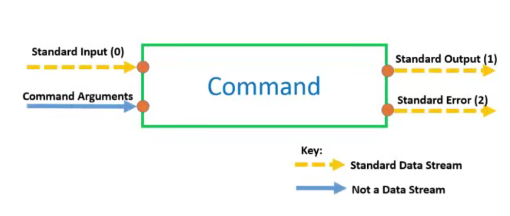

# Linux相关

- 进度 `ch06 - 004`  complete

## 基础命令

- **Linux**中的命令是**大小写敏感**的（Windows中命令大小写不敏感）
- `lsb_release -a`  查看ubuntu的系统信息
- `clear`  清屏  `ctrl+L` 也可以
- `history`  查看历史命令
- `date`  查看当前日期时间
- `sudo apt update`  更新 apt 索引
- `sudo apt upgrade`  更新软件
- `which echo`  查询指定命令的程序文件在什么路径下
- `du [目录]` 显示指定目录机器子目录的磁盘使用情况
  - du： disk usage
  - `--max-depth=N`  仅显示指定深度的目录使用情况（N为层级数）
  

- 命令的结构
  - `commandName options inputs`  
  - 从环境变量里搜索相应的`commandName`
  - `echo $PATH` 查看环境变量 以 冒号`:`分隔多个路径，从左到右依次遍历查询
- 通过手册学习命令的使用 Manual (Man) Pages
  - `man -k which` 在手册中查找`which`  `-k` 代表查找指令
  - `man 1 which` 查看 `section-1` 中关于 `which`指令相关的内容，通常查看`section-1`中的内容可以省略 `1`；
  - `[xx]`  可选项，有没有都行
  - `<xx>`  必选项  必须得有
  - `man -k "list directory contents"`  根据描述查找相应的命令

- 
  - `Standard Input   0`
  - `Standard Output  1`
  - `Standard Error   2`
  - `cat 1> output.txt`  将标准输出流重定向到 文件中  覆盖式写入
  - `cat 1>> ouptut.txt`  以追加的方式写入
  - `cat -k 2>> error.txt`  将报错信息以追加的方式写入文件 **只在有错误发生时才会写入**
  - `cat 0< input.txt`  从文件中输入到标准输入流，然后在打印在屏幕上  0可以省略
  - `cat <input.txt >/dev/pts/2`  
    - 将 input.txt 中的内容输入到标准输入流中，然后写入到另一个终端
    - `tty` 查看当前终端的位置，其实就是个文件的位置
  - `date | cut --delimiter ' ' --fields 1`
    - 将 `date` 命令输出的内容，输入给 `cut` 命令
- 
  - `tee` 即保证了数据继续沿着 `pipline` 流，也让它在中间保存了一份
  - `tee` 命令的用途，将 `pipline` 中某个节点的数据保存下来
  - `date | tee fulldate.txt | cut --delimiter ' ' --fields 1`

- `xargs` 将标准输入流的数据转为 命令行参数
  - 在使用 `pipline` 时，有的命令不能接收标准输入流作为参数，需要使用 `xargs` 进行转换
  - `date | xargs echo` date 返回的数据，经过 `xargs` 转换后，作为 `echo` 的参数返回
  - `cat < files2delete.txt | xargs rm` 将文件中的文件依次删除

- `Alias` 可以给自己创建的 `pipline` 创建别名 方便后续调用
  
  ```bash
  # .bash_aliases  in your home folder
  alias calmagic="xargs cal -A 1 -B 1 > /home/kun/thing.txt"
  ```

  - 后续调用时，可直接使用 `calmagic`
  - 要使用你刚写的`alias` 需要重启 终端

## 文件管理

- `pwd`  print working directory
- `file <file_name>`  查看文件信息，linux不以文件后缀判断文件类型，而是根据`文件头`的内容判断文件类型
- `ls file[1234567890].txt`  `ls file[0-9].txt`
- `ls file[0-9][0-9].txt`
- `ls file?[A-Z].txt`  `?` 只匹配`一个任意字符`
- `ls` 参数说明 (注意大小写)
  - `-a`  显示所有文件和目录
  - `-l`  以长格式显示详细信息
  - `-h`  以人类可读的方式显示文件大小
  - `-R`  递归列出子目录的内容
  - `-t`  按文件修改时间排序显示

### 创建
- `mkdir 2014` 创建文件夹 名为2014，不能创建嵌套文件夹
- `mkdir -p 2014/07/14/test` 创建完整的文件夹路径
- `mkdir {jan,feb,mar,apr,may,jun,july,aug,sep,oct,nov,dec}_{2017,2018,2019,2020}` 产生多个文件夹
- `mkdir {jan,feb,mar,apr,may,jun,july,aug,sep,oct,nov,dec}_{2017..2022}`
- `touch {jan,feb,mar,apr,may,jun,july,aug,sep,oct,nov,dec}_{2017..2020}/file_{001..010}`  在每个文件夹下产生文件
- `ls {jan,feb,mar,apr,may,jun,july,aug,sep,oct,nov,dec}_{2017..2020}` 查看每个目录下的内容

### 删除

- 删除文件  `rm file_name`
- 删除文件夹  `rm -r dir_name`
- `rm -ri dir_name`  在删除之前逐个进行询问
- `rmdir dir_name/*` 删除指定文件夹下的所有的**空文件夹**

### 复制

- 复制和移动文件
  - `cp file1.txt file2.txt destination/`
    - 注意要复制到的地方**不需要加文件名**；
  - `cp -r src_dir/ destination_dir/`
    - 可以直接把整个文件夹拷贝到其他目录下；

### 移动

- `mv oldname.txt newname.txt`
- `mv src_dir/* .`  把源路径下的所有文件都移动到当前路径下
- `mv ~/Document/old_dir/ ./new_dir`  移动指定文件夹并同时改名字

### 编辑

- 编辑文件
  - 使用 `nano`
  - `nano /etc/nanorc`  使用 `nano`  去编辑 `nano` 的配置文件
    - `set linenumbers`  显示行号
  - 快捷键：
    - `^` 代表 `CTRL`
    - `M-` 代表 `Alt`

- 找文件：`locate` 命令
  - `sudo apt install plocate`  安装结束或会自动创建数据库，对系统中的文件建立索引
  - `locate -S` 显示数据库的信息 在哪，有多少文件夹，有多少文件等... ?? 命令不对
    - 数据库默认**一天仅更新一次**
  - `locate -e *.conf` 查询配置文件在哪，返回之前会确认文件是否还存在
    - `locate --existing *.conf`
  - `locate fileName` 根据数据库来返回文件位置，速度快，但是需要更新数据库索引
  - `sudo updatedb`  更新数据库对文件的索引
- 找文件：`find` 命令
  - 不需要根据数据库，所以更实时，但是查找的速度会慢一些
  - `find . -maxdepth 1 -type f -size +10k -name "*.conf"`
    - `-maxdepth` 要遍历查找的深度
    - `-type`  要查找的类型  f 文件  d 文件夹
    - `-size`  指定要查找的文件大小
    - `-name` 指定要查找的文件名称

### 打包

- `tar -cvf my_archive.tar file[1-5].txt`
  - `c` create  创建 `tar ball`
  - `v` verbose 显示详细信息
  - `f` target archive file  指定最终的打包文件名 
- `tar -tf my_archive.tar` 查看 `tar ball` 中都有什么
  - `-t` test 
- `tar -xvf my_archive.tar` 解包
  - `-x` extract 解包
- 压缩
  - `gzip`  速度快，压缩率差一点
    - `gzip my_archive.tar`
    - `gunzip my_archive.tar.gz`  还原 `tarball`
  - `bzip2`  速度慢一些，压缩率更好
    - `bzip2 my_archive.tar`
    - `bunzip2 my_archive.tar.bz2`  还原 `tarball`
  - `zip`
    - `zip my_zip.zip file1 file2 file3`
    - `unzip my_zip.zip`
- 一步打包并压缩
  - `tar -cvzf my_archive.tar.gz file[1-5].txt`
    - `-z` 代表使用 `gzip` 算法
  - `tar -cvjf my_archive.tar.bz2 file[1-5].txt`
    - `-j` 代表使用 `bzip2` 算法
  - `tar -xvzf my_archive.tar.gz`
  - `tar -xvjf my_archive.tar.bz2`

## Shell

### 进程管理
命令|含义|示例
---|---|---
ps | 查看正在运行的进程 | `ps aux`
top | 动态显示正在运行的进程 | `top`
pgrep | 查找匹配条件的进程，可以根据进程名、用户等条件查找进程 | `pgrep -u username`
nice | 更改进程的优先级 数值越低 优先级越高 | `nice -n 10 long-running-command`
nvidia-smi | 监控和管理NVIDIA GPU 设备 | `nvidia-smi -l 2` loop per 2s
kill | 发送信号到指定的进程，通常用于杀死进程 | `kill PID`，  `kill -9 PID` 强制杀死进程

- `nvidia-smi`
- 

### bash

- 编写`bash`脚本
  - 第一行写 `#!/bin/bash`  指定使用的翻译器，同理python脚本可以写 `#!/bin/python`
  - 让bash可执行 `chmod +x script.sh`
  - 添加环境变量
    - `nano ~/.bashrc`  
    - `PATH="$PATH:$HOME/path/to/script.sh"`
- 定时执行 `cron`
  - `crontab -e`  创建定时任务
  - `m(minutes) h(hours-24) dom(dayofmonth) mon(month) dow(dayofweek) com`
  - 例如 `* * * * * echo "hello world!" >> ~/hello.txt`  每一分钟都往文件中写入一行 "hello world!"
  - `*/5 * * * * xxx` 每5min 执行一次
  - 可用于定期执行文件备份操作 `59 23 * * FRI bash ~/bin/backup`

## 开源软件使用

### 软件仓库 Repositories
- `apt`: advance package manage tools
- 根据关键字查找软件(离线查找缓存)： `apt-cache search python`
- 查看指定软件的详细信息(离线查找缓存)： `apt-cache show python-colorama`
- 更新缓存：`apt-get update`  get update from repositories
- 更新软件：`apt-get upgrade`  
- 安装软件：`apt-get install <package_name>`
- 卸载软件：`apt-get purge <package_name>`
- 

### `CMake`
- `cmake --version`  查看版本信息
- `apt remove camke -y`  移除cmake
- `pip install cmake --upgrade`  安装最新版camke


### `Tmux`
- 终端多路复用器，可以在多个终端之间轻松切换，分离它们（不会杀死它们，继续在后台运行），或者将它们重新连接到其他终端中
- 安装 `apt install tmux`
- `https://www.ruanyifeng.com/blog/2019/10/tmux.html`  教程

### `conda`
- `conda --version` 查看版本信息
- 设置国内镜像
  ```
  #设置清华镜像
  conda config --add channels https://mirrors.tuna.tsinghua.edu.cn/anaconda/pkgs/main
  conda config --add channels https://mirrors.tuna.tsinghua.edu.cn/anaconda/pkgs/free
  conda config --add channels https://mirrors.tuna.tsinghua.edu.cn/anaconda/pkgs/r
  conda config --add channels https://mirrors.tuna.tsinghua.edu.cn/anaconda/pkgs/pro
  conda config --add channels https://mirrors.tuna.tsinghua.edu.cn/anaconda/pkgs/msys2
  ```
- `conda config --show` 查看配置信息

## 用户权限管理

- 怎么创建用户，限制其权限？
- 一个用户创建的文件或文件夹，是否能做到其他用户不能访问？

# WSL

- wsl 更新 `wsl --update`  在`powershell`中进行
- 查看wsl版本信息 `wsl -v`
- 查看有哪些用户 ``
## 怎么安装cuda驱动

## 怎么创建多用户

## 怎么多用户远程登陆

## 怎么远程访问wsl进行本地开发

## 案例

- TODO 办公室网络不行，需要在家实现
### root用户搭建paddle环境，普通用户使用框架进行训练
1. 创建新用户
   1. `sudo useradd -m username`  -m 会自动创建家目录
   2. `sudo passwd username`  给用户名创建密码
   3. `less /etc/passwd`  查看当前都有哪些用户
   4. `sudo usermod -aG groupname username`  将指定用户添加到指定组中
2. 使用conda安装paddle环境
3. 使用root用户创建多个普通用户，创建普通用户组
4. 使用普通用户登录
5. 使用git clone 代码
6. 上传数据集 / 使用本地数据集
7. 进行模型训练
8. 模型精度验证

# `vi` or `vim`


# SSH 连接
- 安装ssh功能
  - `sudo apt install openssh-server -y`
  - `sudo systemctl start ssh`  开启SSH服务
    - `sudo service ssh restart`
  - `sudo systemctl status ssh`  查看 SSH 状态
  - `sudo ufw allow ssh`  防火墙允许ssh通过
  - `sudo ufw allow 22`  开启22端口
  - `sudo ufw status`  查看防火墙开启的状态
  - `sudo apt install net-tools -y`  安装 ifconfig 网络工具包
- 登录命令 `ssh -p 34655 user_name@ip_to_target_server -o StrictHostKeyChecking=no -o UserKnownHostsFile=/dev/null`
  - `StrictHostKeyChecking=no UserKnownHostsFile=/dev/null`  绕过指纹检查
- 输入登录密码： 密码是Linux登录用户的密码，也可以采用公钥的方式登录
  
## vscode 使用 SSH 连接
- vscode 安装 `Rmote-SSH`
- `Romote Explorer` >> `Remotes Tunnels/SSH` >> `+ New Remote` >> 输入上述登录命令 >> connect >> 输入密码
- 打开远程路径：`Explorer` >> 打开文件夹 
- `ctrl+shift+~` 打开终端，可以直接在远程服务器中的环境中执行代码
- vscode 端口映射：将远程服务器的进程端口映射到本地  vscode >> `PORTS`  程序运行后会自动建立映射关系