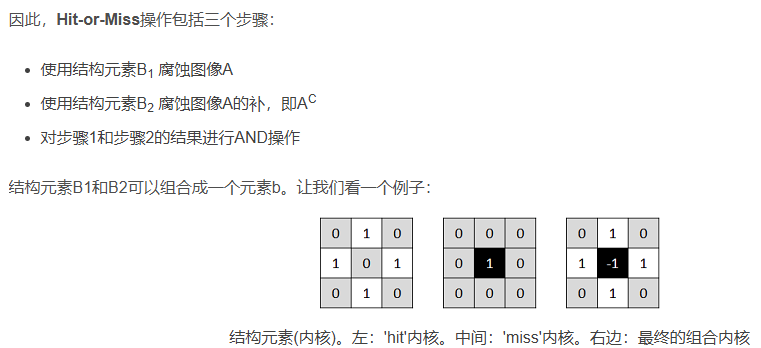

# OpenCV

## 编译

### MinGW
- 下载地址：`https://winlibs.com/`

### MSVC

## 基础数据类型

### Mat
#### 创建 `Mat`
  ```cpp
    // image  im1  im2 指向相同的内存地址
    cv::Mat im1(image);
    cv::Mat im2;
    im2 = image;

    // image  im3  im4 指向不同的内存地址
    cv::Mat im3;
    image.copyTo(im3);  // 注意不要搞反
    cv::Mat im4 = image.clone();
    cv::Mat im5;
    image.convertTo(im5, CV_32F, 1/255.0, 0.0);

    cv::circle(image, cv::Point(100, 100), 100, 0, 5);
    cv::imshow("original", image);  // 有圆圈
    cv::imshow("im1", im1);  // 有圆圈
    cv::imshow("im2", im2);  // 有圆圈

    cv::imshow("im3", im3);  // 无圆圈
    cv::imshow("im4", im4);  // 无圆圈
    cv::imshow("im5", im5);  // 无圆圈
  ```

  - 可以安全的从函数中返回图像
    - 返回值拷贝了 Mat 数据头
  ```cpp
    cv::Mat getTestMat(){
        cv::Mat m{cv::Size(100, 100), CV_8UC3, cv::Scalar(0, 100, 100)};
        return m;
    }   

    cv::Mat im6 = getTestMat();  // 可以从主函数中获取函数中创建并返回的图像
    cv::imshow("im6", im6);
  ```

#### 遍历像素
- 访问图像中的每个元素
- `mat.at<uchar>(y, x)`  坐标，第一个是纵坐标，第二个是横坐标！！！
  ```cpp
    void addSalt(cv::Mat img, size_t num){
        size_t h = img.rows;
        size_t w = img.cols;

        for(int i{}; i<num; ++i){
            int x = std::rand()%w;
            int y = std::rand()%h;

            if(img.type() == CV_8UC1){
                img.at<uchar>(y, x) = 255;        
            }
            else if(img.type() == CV_32F){
                img.at<float>(y, x) = 1.0;
            }
            else if(img.type() == CV_8UC3){
                img.at<cv::Vec3b>(y, x)[0] = 255;
                img.at<cv::Vec3b>(y, x)[1] = 255;
                img.at<cv::Vec3b>(y, x)[2] = 255;
            }
            else if(img.type() == CV_32FC3){
                img.at<cv::Vec3f>(y, x)[0] = 1.0;
                img.at<cv::Vec3f>(y, x)[1] = 1.0;
                img.at<cv::Vec3f>(y, x)[2] = 1.0;
            }
        }
    }
  ```

  ```cpp
    void colorReduce(cv::Mat img, int div=8){
        // 本地修改
        int nc = img.cols * img.channels();
        for(int y{}; y(y);
            uchar* row_data = img.ptr<uchar>(y);

            for(int x{}; x<nc; ++x){
                row_data[x] = row_data[x]/div*div + div/2;
            }
        }
    }

    void colorReduce(const cv::Mat& img, cv::Mat& result, int div=8){
        // 原图加const，在result上修改
        result.create(img.rows, img.cols, img.type());  // 确保result大小与类型都与原图一致
        int nc = img.cols * img.channels();

        for(int row_{}; row_(row_);
            uchar* data_o = result.ptr<uchar>(row_);

            for(int col_{}; col_<nc; ++col_){
                data_o[col_] = data_i[col_]/div*div + div/2;
            }
        }
    }
  
  ```

#### 三种像素遍历方式对比
- `uchar* row_data = image.ptr<uchar>(row_id)  // 获取一行像素`  **最快**
- `auto it = image.begin<cv::Vec3b>()`  **中等  不容易出错**
- `cv::Vec3b data = image.at<cv::Vec3b>(y, x)`  **最慢，用于随机位置像素点的访问**

```cpp
void colorReduce(const cv::Mat& img, cv::Mat& result, int div=8){
    result.create(img.rows, img.cols, img.type());
    int nc = img.cols * img.channels();

    for(int row_{}; row_(row_);
        uchar* data_o = result.ptr<uchar>(row_);

        for(int col_{}; col_<nc; ++col_){
            data_o[col_] = data_i[col_]/div*div + div/2;
        }
    }
}

void colorReduce2(const cv::Mat& img, cv::Mat& result, int div=8){
    result.create(img.rows, img.cols, img.type());

    // auto it = result.begin<uchar>();  // 仅单通道能用<uchar> 因为会做尺寸比对 elemSize!=sizeof(_Tp)
    auto it = result.begin<cv::Vec3b>();
    auto it_end = result.end<cv::Vec3b>();
    for(; it!=it_end; ++it){
        // *it = *it/div*div + div/2;  //  单通道
        (*it)[0] = (*it)[0]/div*div+div/2;
        (*it)[1] = (*it)[1]/div*div+div/2;
        (*it)[2] = (*it)[2]/div*div+div/2;
    }
}

void colorReduce(cv::Mat img, int div=8){
    for(int y{}; y(y, x)[0] = img.at<cv::Vec3b>(y, x)[0]/div*div + div/2;
            img.at<cv::Vec3b>(y, x)[1] = img.at<cv::Vec3b>(y, x)[1]/div*div + div/2;
            img.at<cv::Vec3b>(y, x)[2] = img.at<cv::Vec3b>(y, x)[2]/div*div + div/2;
        }
    }
}

// Test image 5472x3648  cpu 17-10700  release
const int64 start = cv::getTickCount();
colorReduce(image, image, 200);  // 48 ms
colorReduce2(image, image, 200);  // 53 ms
colorReduce(image, 200);  // 65 ms
double duration = (cv::getTickCount() - start)/cv::getTickFrequency();
std::cout << "duration: " << duration*1000 << std::endl;
```

#### 算术运算
```cpp
   // c[i]= a[i]+b[i]; 
   cv::add(imageA,imageB,resultC);  
   // c[i]= a[i]+k; 
   cv::add(imageA,cv::Scalar(k),resultC);  
   // c[i]= k1*a[1]+k2*b[i]+k3;  
   cv::addWeighted(imageA,k1,imageB,k2,k3,resultC); 
   // c[i]= k*a[1]+b[i];  
   cv::scaleAdd(imageA,k,imageB,resultC); 
   // if (mask[i]) c[i]= a[i]+b[i];   mask 必须是单通道
   cv::add(imageA,imageB,resultC,mask);  
```

#### 多通道图像拆分通道
```cpp
   // create vector of 3 images 
   std::vector<cv::Mat> planes; 
   // split 1 3-channel image into 3 1-channel images 
   cv::split(image1,planes); 
   // add to blue channel 
   planes[0]+= image2; 
   // merge the 3 1-channel images into 1 3-channel image 
   cv::merge(planes,result);
```

## 图像处理算法

### 图像过滤

#### 拉普拉斯过滤
- 当前像素与上下左右像素的取差
- 可以让图像锐化
```cpp
// 像素遍历
void lapl(const cv::Mat& org_img, cv::Mat& result){
    result.create(org_img.size(), org_img.type());
    // result = cv::Mat(org_img.size(), org_img.type(), cv::Scalar(0));
    int nchannels = result.channels();

    for(int j=1; j<result.rows-1; ++j){
        const uchar* prev_row = org_img.ptr<const uchar>(j-1);
        const uchar* curr_row = org_img.ptr<const uchar>(j);
        const uchar* post_row = org_img.ptr<const uchar>(j+1);

        uchar* output_ptr = result.ptr<uchar>(j);
        for(int i=nchannels; i<(org_img.cols-1)*nchannels; ++i){
            // std::cout << "org: " << static_cast<int>(*output_ptr) << std::endl;
            // std::cout << "curr: " << static_cast<int>(curr_row[i]) << std::endl;
            // *output_ptr++ = cv::saturate_cast<uchar>(5*curr_row[i]-curr_row[i-nchannels]-curr_row[i+nchannels]-prev_row[i]-post_row[i]);      
            // 可以兼容 单通道 和 三通道      
            *output_ptr++ = cv::saturate_cast<uchar>(5*curr_row[i]-curr_row[i-nchannels]-curr_row[i+nchannels]-prev_row[i]-post_row[i]);                        
            // std::cout << "post: " << static_cast<int>(*output_ptr) << std::endl;
            // output_ptr[i] = cv::saturate_cast<uchar>(5*curr_row[i]-curr_row[i-nchannels]-curr_row[i+nchannels]-prev_row[i]-post_row[i]);
        }
    }
}
lapl(image, result);

// 调用 库函数 cv::filter2D
cv::Mat k(cv::Size(3,3),CV_32F,cv::Scalar(0));  // 注意使用 cv::Scalar(0) 初始化，不能使用 0 
k.at<float>(1,1) = 5;
k.at<float>(0,1) = -1;
k.at<float>(1,0) = -1;
k.at<float>(1,2) = -1;
k.at<float>(2,1) = -1;
cv::filter2D(image, result, image.depth(), k);

```

### 图像remapping
- 将原图上的像素点，根据指定映射关系，映射到新的位置上；
- 可以用于相机拍摄图片的正畸
- 原理：
  - srcX, srcY 存储的是原图中的像素坐标，用于索引原图中相应的像素，
  - 构建的result图像与原图像素关系是：`result.at&lt;uchar&gt;(y, x) = src_img.at&lt;uchar&gt;(srcY.at&lt;float&gt;(y, x), srcX.at&lt;float&gt;(y,x))`

```cpp
void remappingImage(const cv::Mat& image, cv::Mat& result){
    result.create(image.size(), image.type());

    cv::Mat srcX{image.size(), CV_32F};
    cv::Mat srcY{image.size(), CV_32F};
    for(size_t i{}; i<image.rows; ++i){
        for(size_t j{}; j<image.cols; ++j){
            srcX.at<float>(i, j) = j;
            srcY.at<float>(i, j) = i + 10*std::sin(j/2);  // 分母可以控制波浪的个数 乘的系数控制振幅大小
        }
    }

    cv::remap(image, result, srcX, srcY, cv::INTER_AREA);
}

remappingImage(image, result);
```

### 常用的二值化算法
1. 简单阈值法（全局阈值）
   - 手动设定阈值
   - 场景：光照均匀的图像
2. 自适应阈值法
   - 根据局部领域动态计算阈值（如均值或高斯加权均值）
   - 场景：光照不均匀的图像（如阴影图像）
3. OTSU大津法
   - 自动寻找最佳阈值，根据最大化类间方差
   - 场景：双峰直方图图像（如文档扫描）
4. Triangle三角法
   - 在单峰直方图中，通过寻找直方图峰值到最远点的垂直距离最大点作为阈值
   - 场景：单峰直方图图像


### 形态学变换
- 通常用于二值化图像，主要依赖于一个核，用来探测图像中的特定形状
- 很大程度上取决于**结构元素的大小和形状**；
- `cv::getStructuringElement()`  
  - 矩形 cv::MORPH_RECT  椭圆 cv::MORPH_ELLIPSE  十字 cv::MORPH_CROSS
- `cv::morphologyEx()` 
1. 腐蚀 Erosion
   - 定义：结构元素覆盖区域内全为前景时保留中心点；
   - 应用：消除小物体，分离物体，细化边界
2. 膨胀 Dilation
   - 定义：结构元素覆盖区域内至少有一个前景时保留中心点；
   - 应用：连接断裂，填充孔洞，扩大区域
3. 开运算 Opening
   - 先腐蚀后膨胀
   - 应用：去噪，平滑轮廓、断开窄链接
4. 闭运算 Closing
   - 先膨胀后腐蚀
   - 应用：填充孔洞，连接邻近物体，平滑边界
5. 形态学梯度 Morphological Gradient
   - 膨胀 - 腐蚀
   - 应用：边缘检测
6. 顶帽变换 Top Hat
   - 原图 - 开运算结果
   - 应用：用于提取亮特征，提取亮的小物体
7. 黑帽变换 Black Hat
   - 闭运算 - 原图
   - 应用：用于提取暗特征，提取暗的小区域或孔洞
8. 击中击不中变换 Hit-or-Miss
   - 使用两个结构元素（S1用于匹配前景，S2用于匹配背景），仅当S1完全匹配前景，S2完全匹配背景时，中心像素保留
   - 应用：形状检测、模式识别，精确匹配特定形状，如识别特定字符或符号
   - 

### 常用的边缘检测算法

- Canny
- Sobel

### 特征提取与匹配

- SIFT
- ORB
- findContours
- minAreaRect

### 目标跟踪

- 光流法
- 卡尔曼滤波