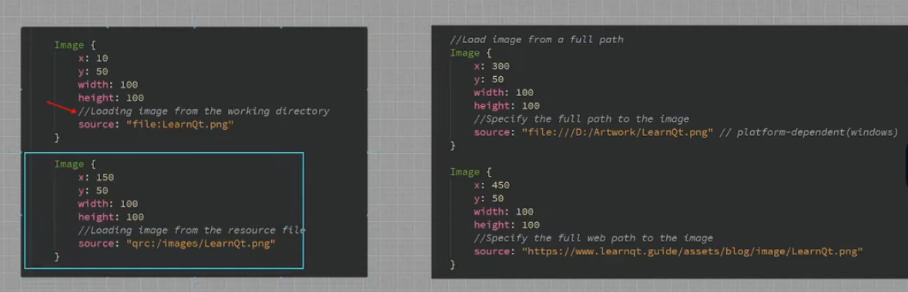

# Qt

## 常用组件介绍

- QCore
- 
- QQuick
  - QML

- 前后端分离
  - 前端：QML
  - 后端：C++ / Python

## QML

- `path/to/qml.exe path/to/main.qml` 运行 QML 文件
  - `D:\Qt\6.4.3\mingw_64\bin\qml.exe`

### 常用控件

### 常用布局

### Signal Slots

#### QML向Python传递数据

#### Python向QML传递数据