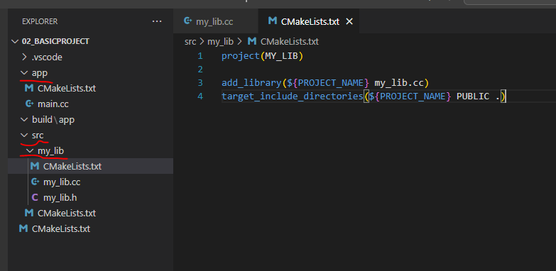
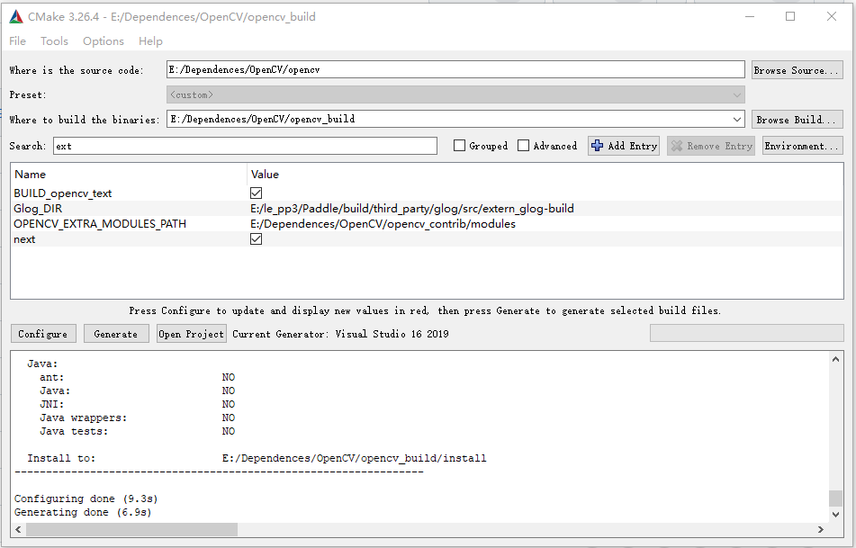
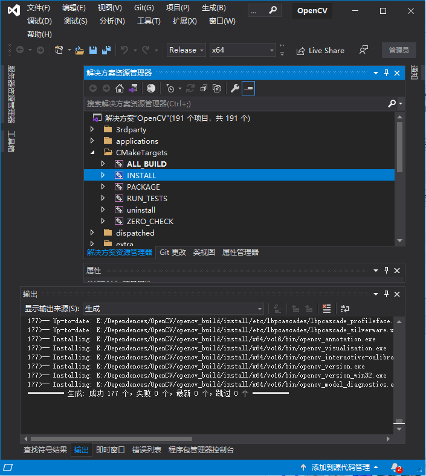

# CMake
- [官方教程][https://cmake.org/cmake/help/latest/guide/tutorial/index.html]

- `CMake, Tests and Tooling for CC++ Projects [2022 Edition] ch02--09`

- `Udemy: Complete CMake Project Management [2024] - ch5/13 -- 3`

## VSCode 使用
- 安装扩展：`C/C++ Extension Pack`  
- `ctrl+shift+p`  打开指令窗口快捷键
- `CMake:Config`  自动配置cmake环境
- `CMake:Scan for Kits `  扫描系统中已有的编译器
- `CMake: Select a Kit`  选择一个编译器

- `mingw-64` 下载路径：`https://github.com/niXman/mingw-builds-binaries/releases/x86_64-13.2.0-release-posix-seh-ucrt-rt_v11-rev0.7z`


## 问题：

1. 将不同的库放在不同文件夹后，编译生成的库文件都分散在不同文件夹中，怎么链接到可执行文件上？
2. 库的头文件，在各自的文件夹下，怎么让app文件可以找到对应的头文件？？

## CMake 命令

### CMake 命令行指令
- 生成MakeFile  `cmake -S dir/to/src_files -B dir/to/make_files`
- 编译项目： `cmake --build dir/to/make_files`
  - `cmake --build dir/to/make_files --target target_name`  指定要编译的对象，可以只编译库文件
- 使用脚本编译工程
  - ```bash
    rmdir /S /Q build
    mkdir build
    cmake -S . -B build -DCOMPILE_APP=ON  # -S 指定源路径  -B 指定生成的路径  -D 定义外部变量
    cmake --build build --config Release  # 使用vscode时，需要在编译时指定是Debug还是Release
    ```

### CMakeLists 指令

#### :cactus: 变量
- :star:**变量是大小写敏感的**

- `String`
- `Number`
- `List`  使用空格 或 分号 分隔
- `Path`
- `Boolean`
  - TRUE ON YES Y 1 
  - FALSE OFF NO N 0 IGNORE NOTFOUND
  - `option(<variable> <"help_text"> [value])`
  - `if()  elseif()  else()  endif()`
  - `AND OR NOT`
  - `GREATER LESS IN_LIST STREQUAL`

####  :coffee: 常用函数
- :star:**指定是大小写不敏感的**

- `cmake_minimum_required`
  - 指定cmake的最低版本
  - `cmake_minimum_required(VERSION 3.10)`
  
- `project(<project_name> [CXX] [C] [Java] [Python])`
  - 定义项目名称，语言类型
  - 例如：`project(MyProject CXX)`
  
- 通过`message`可以打印信息
  - `message("Hello, CMake!")`  
  - `message(STATUS "Hello, CMake!")`  
  - STATUS 控制输出的形式，
  - 还可以用`WARNING`  
  - `FATAL_ERROR`(不执行后续操作)  
  - `SEND_ERROR`(打印错误信息，可继续执行后续步骤)
  
- 通过 set 设置变量，允许后续用户修改对应的值，例如依赖库的位置、选择机器架构等
  - `set(<variable> <value> CACHE <type> <docstring>)`  设置变量
  - `message(STATUS ${variable})`  使用变量 `${var}`
  - 可选的type:
    1. FILEPATH    可以打开一个选择文件的窗口
    2. PATH            可以打开一个选择文件夹的窗口
    3. STRING        任意的字符串
    4. BOOL            布尔值，显示一个checkbox 表征 ON/OFF
    5. INTERNAL    无GUI 入口，用于开发者设定好的变量，不允许用户修改
  - 用户选择的结果，会以 key-value pairs 的方式，保存在 CMakeCache.txt 中
  
- 从命令行传参：
  - `cmake -S . -B build_dir -DMY_OUTSIDE_VAR=5`  外部定义变量以 `-D` 开头
  - `message(STATUS ${MY_OUTSIDE_VAR})` 打印外部定义的变量
  
- :ice_cream: 生成可执行文件： 
  - `add_executable(<target> [WIN32] [MACOSX_BUNDLE] [EXCLUDE_FROM_ALL] source1 source2 ...)`
  - 生成可执行文件
  - `WIN32`  指定生成的可执行文件是Windows平台的
  - `MACOSX_BUNDLE`  指定生成的可执行文件是Mac平台的
  
- :ice_cream: 生成库文件
  - `add_library(<target> [STATIC | SHARED | MODULE] [EXCLUDE_FROM_ALL] source1 source2...)`
  
- 添加子目录
  - `add_subdirectory(<dir> [EXCLUDE_FROM_ALL])`
  - 用于添加子目录，子目录的CMakeLists.txt文件会被执行
  - 子目录的CMakeLists.txt文件中，可以使用父目录的变量
  
- :icecream: 添加依赖
  - `target_link_libraries(<target> PRIVATE|INTERFACE|PUBLIC <libname>...)`
  - 用于指定目标库的依赖关系
  - `PRIVATE`  仅当前目标可见
  - `INTERFACE`  仅接口可见
  - `PUBLIC`  接口和当前目标可见
  
- :icecream: 添加include文件
  
  1. 为自己添加 include 文件路径
  2. 为调用方开放 include 文件路径
  
  - `target_include_directories(<target> [PUBLIC|PRIVATE] <include_dir>...)`
    - :star2: 如果是 `PRIVATE` 在该头文件，不能出现在调用方的头文件中，**只能出现在 cpp 文件中**
  
- 收集文件名
  
  - `file(GLOB_RECURSE HEADERS "${CMAKE_CURRENT_SOURCE_DIR}/include/**/*.h")`   找出指定路径下所有的头文件，并赋值给变量 `HEADERS`
  
    ```cmake
    project(Test)
    file(GLOB_RECURSE HEADERS CONFIGURE_DEPENDS "${CMAKE_CURRENT_SOURCE_DIR}/include/**/*.h")
    file(GLOB_RECURSE SOURCES CONFIGURE_DEPENDS "${CMAKE_CURRENT_SOURCE_DIR}/src/**/*.cpp")
    
    add_library(
    	${PROJECT_NAME}
    	${HEADERS}
    	${SOURCES}
    )
    ```
  
    
  
- 进行数据计算
  - `math(EXPR <output_var> <expression>)`
  - `math(EXPR NUM "${NUM}+1")`  将最后表达式的计算结果赋值给第二个参数`NUM`

- 定义函数
  ```cmake
  function(my_fun my_param)
    message(STATUS ${my_param})
  endfunction()
  
  my_fun(10)
  ```

- 定义宏 `marco`
  - 可以直接访问全局变量，并修改全局变量

- CMake内建的变量
  - `PROJECT_NAME` 
  - 都有哪些内建变量：`https://cmake.org/cmake/help/latest/manual/cmake-variables.7.html`
  - 

- 定义预处理符号

  - add_definitions

  - `add_definitions(-DFOO=\"xxxx\")`

  - `add_definitions(-DBAR)`

  - 预定义符号，可以在源码中直接使用

  - ```cmake
    add_definitions(-DFOO="this is a message from cmake")
    add_definitions(-DBAR)
    ```

  - ```cpp
    #ifdef BAR
        std::cout << "Bar" << std::endl;
    #endif
        std::cout << "Msg: " << FOO << std::endl;
    ```

  - `option(USE_MYLIB "docstrings" ON)`

    - 在cmake时，通过 `cmake dir/to/cmakelists -DUSE_MYLIB=OFF`  设定
    - 为了加速编译过程，cmake会自动产生`CMakeCache.txt`文件，里面存了变量的值，直接改`CMakeLists.txt`文件并不会使`Cache`文件内容发生改变，需要手动删除后，重新生成
  - `if`

    - ```cmake
      option(BuildExample "wheather or not to build example" False)
      
      if(BuildExample)
          message(STATUS "Build Example")
      endif()
      ```

    - `cmake -S . -B build -DBuildExample=True`  命令行中可以控制编译的过程


- 复制文件
  - `file(COPY someexe/res.txt DESTINATION Debug)`
  - 


- `set(VarName varVal)`  创建变量
b1244ee4e1e669f15e328a17338bdab1a5afc039
- `set(CMAKE_WINDOWS_EXPORT_ALL_SYMBOLS ON)`
  - 在Windows环境下，CMAKE 链接dll，需要加这个指令，以确保产生lib文件，用于链接
- `set(CMAKE_RUNTIME_OUTPUT_DIRECTORY ${CMAKE_SOURCE_DIR}/bin)`
  - 设置二进制文件输出路径

- `message(STATUS "Hello, Cmake")`
  - STATUS, WARNING, ERROR

- 创建函数
  - `function(my_func argument)   endfunction()`
  
#### :facepunch: 常用的预定义变量

- `PROJECT_NAME`  项目名称
- `CMAKE_SOURCE_DIR` / `PROJECT_SOURCE_DIR`  项目根目录
- `CMAKE_CURRENT_SOURCE_DIR`  当前 `CMakeLists.txt` 文件的路径
- `CMAKE_RUNTIME_OUTPUT_DIRECTORY`  编译生成的目录(将项目中生成的二进制文件存到该目录下)
- `CMAKE_WINDOWS_EXPORT_ALL_SYMBOLS`
  - 当编译静态库（STATIC）时 不需要设置
  - **当编译动态库（SHARED）时 需要设置为ON**

#### :taco: 常用的预定义函数

- add_library  生成库文件
  - `add_library(lib_name source_file.cxx)` 
  - 在库目录的 CMakeLists 中使用，生成库文件

- 

- `include()`  导入`cmake`模块 （`xxx.cmake`）
-  find_package
  - 第三方库的作者以及维护好了  package_name.cmake 文件，例如 OpenVINOConfig.cmake
  - find_package(OpenVINO REQUIRED)
  - 配合 target_link_libraries 使用 链接动态库
  - 当你使用 `find_package` 导入一个库时，实际上是在告诉 CMake 去查找这个库的配置文件，通过这些配置文件，CMake 知道了库的具体安装位置和相关信息，从而能够正确地包含头文件和链接库，使得编译过程更加自动化和方便。
- - 
- target_link_libraries
  - 是用来链接实际的库文件到目标上，它指定了要与目标一起链接的库。
  - 在 `add_executable()`  之后使用
  - 如果库文件的cmakelists中，使用了 interface，即不需要在主cmakelists中指定头文件路径
    - `target_include_directories(MathFunctions INTERFACE ${CMAKE_CURRENT_SOURCE_DIR})`  在库文件中指定，调用方仅需要使用 target_link_libraries，而不需要再指定头文件目录
    - 
- target_include_directories

  - 指定查找库**头文件**的路径
  - 在 `add_executable()`  之后使用
  - 可多次使用，添加多个库目录
- target_link_directories
  - `target_link_directories` 用于指定在链接过程中搜索库文件的目录，告诉链接器在这些目录中查找要链接的库。
- target_compile_definitions
  - 将cmake中定义的变量 传递到源文件中
  - `target_compile_definitions(MathFunctions PRIVATE "USE_MYMATH")`
    - 将 `USE_MYMATH` 作为预定义的符号传入
    - 可用于控制源文件中使用不同的实现方式
- include_directories
  - `include_directories` 指定了包含目录，以便编译器能够找到 `mylib.h` 头文件
- aux_source_directory
  - `aux_source_directory(<dir> <variable>)` 
    - 将指定的 dir 中的源文件路径，保存在 variable 中
    - variable 是一个列表

## CPP项目文件管理

- `CPP`工程目录结构
  - 
  - 

- 版本号：`MajorVersion.MinorVersion.PatchVersion`
  - `MajorVersion`  重大更新，可能不兼容之前的版本
  - `MinorVersion`  新增小特性
  - `PatchVersion`  BugFix

- 在库目录下的`CMakeLists.txt` 写`target_include_directories(${PROJECT_NAME} PUBLIC .)` 可执行文件的源码中即可引入头文件


- 使用`config_file`函数
  - `config_file(<input_file> <output_file> )`
  - 将输入文件中的`@VAR@`,替换为CMake中定义的变量，如果没有则是空字符串
  - 用于将`CMakeLists.txt`中定义的信息，引入到工程中，例如`版本信息`
  - ```cmake
    # CMakeLists.txt
    configure_file(
      "config.hpp.in"
      "${CMAKE_BINARY_DIR}/configured_files/include/config.hpp"
      ESCAPE_QUOTES
    )
    ```

  - ```cpp    
    #pragma once
    // config.hpp.in  输入文件
    
    #include <cstdint>
    #include <string_view>
    
    static constexpr std::string_view project_name = "@PROJECT_NAME@";
    static constexpr std::string_view project_version = "@PROJECT_VERSION@";
    
    static constexpr std::int32_t project_version_major{@PROJECT_VERSION_MAJOR@};
    static constexpr std::int32_t project_version_minor{@PROJECT_VERSION_MINOR@};
    static constexpr std::int32_t project_version_patch{@PROJECT_VERSION_PATCH@};
    ```

- `cmake` 文件夹
  - 用于存放`cmake`的模块文件
  - 可以在`xxxxx.camke`文件中定义一些函数，在其他`CMakeLists.txt`文件中进行调用
  

### 引入三方库

#### GitHub中的CMake项目
- 项目文件中有`CMakeLists.txt` 文件
- 可以使用FetchContent 方法，直接获取github代码进行生成
- ```cmake
  include(FetchContent)
  
  FetchContent_Declare(
      nlohmann_json
      GIT_REPOSITORY https://github.com/nlohmann/json
      GIT_TAG v3.11.2
      GIT_SHALLOW TRUE
  )
  FetchContent_MakeAvailable(nlohmann_json)
  ```
- 自动从GitHub拉取代码，放在`build/_deps`目录下

#### GitHub中的非CMake项目
- 非CMake的项目，需要自己写 `add_libraries()` 生成库文件
- 然后通过`target_link_libraries()`方法链接库文件

#### 直接使用编译好的库
- 

### 单元测试

### 项目文档

### 三方库管理

# 案例：编译OpenCV

## 下载源码
- `https://github.com/opencv/opencv.git`
- `https://github.com/opencv/opencv_contrib.git`

## CMake生成
- 配置 SourceCode 路径
- 配置 BuildBinaries 路径
- `Configure` --> 解析工程配置项  选择编译工具
- 修改 `OPENCV_EXTRA_MODULES_PATH=path/to/opencv_contrib/modules`
- 再次刷新 `Configure`
- `Generate` --> 生成 VS 工程文件 .sln
- 

## VS编译
- 打开VS工程文件后，`CMakeTargets --> INSTALL` 右键生成
- 编译两次 `Debug/Release`
- 

## 调用测试
- `CMakeLists.txt`
  ```cmake
  cmake_minimum_required(VERSION 3.17)
  project(TestDependences)

  set(CMAKE_PREFIX_PATH "E:\\Dependences\\OpenCV\\opencv_build")
  find_package(OpenCV REQUIRED)

  add_executable(${PROJECT_NAME} main.cpp)
  target_link_libraries(${PROJECT_NAME} PUBLIC ${OpenCV_LIBS})
  ```

- `main.cpp`
  ```cpp
  #include <iostream>
  #include <opencv2/opencv.hpp>

  void main(){
      std::string img_pth{R"(E:\DataSets\TmpDLTrainData\detection\pokemon_det\fix_size\283_2048_1732872505861.jpg)"};
      auto im = cv::imread(img_pth);
      cv::imshow("TEST", im);
      cv::waitKey(0);     
  }
  ```


# 案例：编译自定义的库

## 静态库

### 文件结构

```
 :project_folder/
 | -- CMakeLists.txt
 | -- include/
 |	| -- calculator.h
 | -- src/
 |	| -- calculator.cpp
 | -- app/
 |	| -- main.cpp
```


### 编译生成静态库

```cmake
cmake_minimum_required(VERSION 3.0)
project(CalculatorLibraryAndApp)

# 设置C++标准
set(CMAKE_CXX_STANDARD 11)
set(CMAKE_CXX_STANDARD_REQUIRED True)

# 静态库的构建
# add_library(calculator_library STATIC src/calculator.cxx)
target_include_directories(calculator_library PUBLIC ${CMAKE_CURRENT_SOURCE_DIR}/include)

# 示例可执行文件的构建
add_executable(MyCalculatorApp app/main.cxx)
target_link_libraries(MyCalculatorApp PRIVATE calculator_library)

```


### 单纯引用静态库

```cmake
cmake_minimum_required(VERSION 3.0)
project(CalculatorLibraryAndApp)

# 设置C++标准
set(CMAKE_CXX_STANDARD 11)
set(CMAKE_CXX_STANDARD_REQUIRED True)

include_directories(${CMAKE_CURRENT_SOURCE_DIR}/include)
link_directories(${CMAKE_CURRENT_SOURCE_DIR}/build)

# 示例可执行文件的构建
add_executable(MyCalculatorApp app/main.cxx)
target_link_libraries(MyCalculatorApp PRIVATE libcalculator_library.a)
```


## 动态库

- 与静态库的差异只是，`add_library` 时，使用 `SHARED` 

```cmake
cmake_minimum_required(VERSION 3.0)
project(CalculatorLibraryAndApp)

# 设置C++标准
set(CMAKE_CXX_STANDARD 11)
set(CMAKE_CXX_STANDARD_REQUIRED True)

# 动态库的构建
add_library(calculator_library SHARED src/calculator.cxx)
target_include_directories(calculator_library PUBLIC ${CMAKE_CURRENT_SOURCE_DIR}/include)

# 示例可执行文件的构建
add_executable(MyCalculatorApp app/main.cxx)
target_link_libraries(MyCalculatorApp PRIVATE calculator_library)
```


### 单纯引用动态库

- 相比静态库，只需要修改引入库文件的后缀

```cmake
cmake_minimum_required(VERSION 3.0)
project(CalculatorLibraryAndApp)

# 设置C++标准
set(CMAKE_CXX_STANDARD 11)
set(CMAKE_CXX_STANDARD_REQUIRED True)

include_directories(${CMAKE_CURRENT_SOURCE_DIR}/include)
link_directories(${CMAKE_CURRENT_SOURCE_DIR}/build)

# 示例可执行文件的构建
add_executable(MyCalculatorApp app/main.cxx)
target_link_libraries(MyCalculatorApp PRIVATE libcalculator_library.dll)
```


# 案例：使用cmake+vcpkg进行cpp工程管理

- 工作中常用到的库：
  1. opencv
  2. openvino
  3. tensorRT
  4. spdlog
  5. httplib
  6. Cache2  unit_test
  7. fmt ??
  8. json ??

CMake + vcpkg 管理 C++ 代码的工作流程
1. 环境准备
安装 CMake：确保在你的系统上安装了 CMake。
安装 vcpkg：
从 GitHub 克隆 vcpkg：
git clone https://github.com/microsoft/vcpkg.git
编译 vcpkg：
./bootstrap-vcpkg.sh  # Linux/Mac
.\bootstrap-vcpkg.bat  # Windows
1. 创建项目结构
以下是推荐的项目目录结构：
```
MyProject/
├── CMakeLists.txt
├── include/
│   └── myproject/
│       └── my_header.h
├── src/
│   ├── main.cpp
│   └── my_source.cpp
├── tests/
│   └── my_test.cpp
└── vcpkg.json
```

3. 使用 vcpkg 添加依赖
在项目根目录下，创建一个 vcpkg.json 文件：

{
    "dependencies": [
        "boost",
        "fmt"
    ]
}
4. 编写 CMakeLists.txt
在项目根目录下创建 CMakeLists.txt 文件：

cmake_minimum_required(VERSION 3.10)
project(MyProject)

## 设置 vcpkg 路径
set(CMAKE_TOOLCHAIN_FILE "${CMAKE_CURRENT_SOURCE_DIR}/vcpkg/scripts/buildsystems/vcpkg.cmake" CACHE STRING "Vcpkg toolchain file")

## 查找必要的模块
set(CMAKE_CXX_STANDARD 17)

## 创建可执行文件
add_executable(MyExecutable src/main.cpp src/my_source.cpp)

## 指定头文件搜索路径
target_include_directories(MyExecutable
    PRIVATE
        ${CMAKE_CURRENT_SOURCE_DIR}/include
)

## 链接 vcpkg 库
find_package(fmt CONFIG REQUIRED)  # 使用 fmt 库
find_package(Boost REQUIRED)       # 使用 Boost 库

target_link_libraries(MyExecutable
    PRIVATE
        fmt::fmt
        Boost::Boost
)
5. 构建项目
安装依赖：
在项目目录下执行以下命令安装 vcpkg 依赖：

./vcpkg install
构建项目：
使用 CMake 构建项目：

mkdir build
cd build
cmake ..
cmake --build .
6. 测试与验证
在 tests/ 目录中添加测试代码，通过 CMake 添加测试支持，可以使用 Google Test 或 Catch2 等测试框架。

例子 (假设使用 Catch2)
在 CMakeLists.txt 中添加测试支持：

include(EnableCTest)
enable_testing()

## 假设使用 Catch2
find_package(Catch2 REQUIRED)

add_executable(MyTests tests/my_test.cpp)
target_link_libraries(MyTests PRIVATE Catch2::Catch2)

include(CTest)
include(Catch)
catch_discover_tests(MyTests)

## 总结工作流程
创建项目结构：定义清晰的文件夹布局。
使用 vcpkg 管理依赖：通过 vcpkg.json 以及 vcpkg 命令安装库。
编写 CMake 文件：使用 CMakeLists.txt 指定项目设置和依赖。
构建和测试：使用 CMake 来构建项目，并包含测试框架。
目录结构总结：
include/：存放公共头文件。
src/：存放源代码文件。
tests/：存放测试文件。
vcpkg.json：定义项目使用的第三方库。
这种结构和工作流程确保你的项目模块化、可维护，并容易扩展。


# 案例：使用第三方库

## 使用opencv做简单的图像处理

### CMakeLists

```cmake
cmake_minimum_required(VERSION 3.10)
project(opencv_base)
set(CMAKE_CXX_STANDARD 11)
set(TARGET_NAME opencv_base)

set(CMAKE_PREFIX_PATH D:\\opencv\\opencv\\build)
find_package(OpenCV REQUIRED)

add_executable(${TARGET_NAME} src/main.cxx)
target_link_libraries(${TARGET_NAME} PUBLIC ${OpenCV_LIBS})

```

- CMAKE_PREFIX_PATH ： find_package 在搜索库时，默认的搜索路径，
  - 要求是包含 "OpenCVConfig.cmake"  "opencv-config.cmake"  文件的路径
- Release 
  - `cmake --build path_to_save_build_files --config Release` 
  - opencv 读取图片  debug模式下 200+ms   release模式下 70+ms  图片 5472x3648

### CPP

```cpp
#include <iostream>
#include <opencv2/opencv.hpp>
#include <chrono>

using std::cout;
using std::endl;
using std::string;
int main(int argc, char* argv[]){
    cout << "Test OpenCV Base" << endl;

    cout << "Get Parameters Num: " << argc << endl;
    cout << "Parameters:" << endl;
    for(int i=0; i<argc; ++i)
        cout << argv[i] << endl;
    cout << endl;

    cout << "OpenCV Version: " << cv::getVersionString() << endl;

    if (argc>1){
        auto start = std::chrono::high_resolution_clock::now();
        cout << "Read Image: " << endl;
        string img_pth{argv[1]};
        cv::Mat img = cv::imread(img_pth);
        cout << img.size() << endl;
        auto end = std::chrono::high_resolution_clock::now();
        std::chrono::duration<double, std::milli> spend = end - start;
        cout << "Use Time: " << spend.count() << "ms" << endl;
    }

    getchar();   
}
```


## 使用openvino做图片分类推理

### CMakeLists

```cmake
cmake_minimum_required(VERSION 3.10)
set(CMAKE_CXX_STANDARD 11)
set(CMAKE_BUILD_TYPE Release)
project(test_cls_openvino)

set(CMAKE_PREFIX_PATH E:/cpp_packages/w_openvino_toolkit_windows_2023.2.0.13089.cfd42bd2cb0_x86_64/w_openvino_toolkit_windows_2023.2.0.13089.cfd42bd2cb0_x86_64/runtime/cmake)
find_package(OpenVINO REQUIRED)

set(CMAKE_PREFIX_PATH D:\\opencv\\opencv\\build)
find_package(OpenCV REQUIRED)

add_executable(${PROJECT_NAME} src/main.cxx)
target_link_libraries(${PROJECT_NAME} PRIVATE openvino::runtime)
target_link_libraries(${PROJECT_NAME} PRIVATE ${OpenCV_LIBS})
```

### CPP

```cpp
#include <iostream>
#include <openvino/openvino.hpp>
#include <opencv2/opencv.hpp>
#include <chrono>

using std::cout;
using std::endl;
using std::string;

int main(){
    std::cout << "Test OpenVINO: " << std::endl;

    ov::Core core;
    std::vector<std::string> availableDevices = core.get_available_devices();
    for(auto it=availableDevices.begin(); it!=availableDevices.end(); ++it)
        std::cout << it->c_str() << std::endl;

    auto start = std::chrono::high_resolution_clock::now();
    // load model
    string onnx_pth = R"(D:\share_dir\repository_check\workdir_v8_0325\check_package\use_middle_model\weights\best.onnx)";    
    ov::CompiledModel compiled_model = core.compile_model(onnx_pth, "CPU");
    ov::InferRequest infer_request = compiled_model.create_infer_request();
    auto load_model_done = std::chrono::high_resolution_clock::now();

    std::vector<double> img_prep_vec, infer_vec;
    int loop_num {50};
    for(int epoch=0; epoch<loop_num; ++epoch){
        auto infer_start = std::chrono::high_resolution_clock::now();
        // image preprocess
        cv::Mat img = cv::imread(R"(E:\DataSets\vacuum_package\cut_roi\NG_unseal\2024_1_18\NG_unseal_1705566508.jpg)");
        // std::cout << img.size() << std::endl;
        cv::Mat blob_img = cv::dnn::blobFromImage(img, 1.0/255.0, cv::Size(224,224), cv::Scalar(0,0,0), true, false, CV_32F);
        auto image_preprocess_done = std::chrono::high_resolution_clock::now();
        
        // inference
        auto input_port = compiled_model.input();    // only have one input tensor
        ov::Tensor input_tensor(input_port.get_element_type(), input_port.get_shape(), blob_img.ptr());
        infer_request.set_input_tensor(input_tensor);
        infer_request.infer();
        auto infer_done = std::chrono::high_resolution_clock::now();

        auto output = infer_request.get_output_tensor();
        // const float* output_buffer = output.data<const float>();
        // for(int i=0; i<4; ++i)
        //     cout << output_buffer[i] << endl;

        std::chrono::duration<double, std::milli> img_preprocess_use = image_preprocess_done - infer_start;
        std::chrono::duration<double, std::milli> infer_use = infer_done - image_preprocess_done;
        img_prep_vec.push_back(img_preprocess_use.count());
        infer_vec.push_back(infer_use.count());
    }

    std::chrono::duration<double, std::milli> load_model_use = load_model_done - start;
    double img_prep_total = std::accumulate(img_prep_vec.begin(), img_prep_vec.end(), 0);
    double infer_total = std::accumulate(infer_vec.begin(), infer_vec.end(), 0);

    cout << "load model use: " << load_model_use.count() << endl;
    cout << "image preprocess use: " << img_prep_total/loop_num << endl;
    cout << "infer use: " << infer_total/loop_num << endl;

    getchar();
}
```

- Debug：【middle模型】
  - 加载模型 2138ms
  - 图片前处理 38ms
  - 推理 24ms
- Release：【middle模型】
  - 加载模型  216ms
  - 图片前处理  9ms
  - 模型推理  11ms
  - 在exe同级目录下要有：    
    - 


## 使用onnx做图片分类推理


## 自己编译库文件

```cmake
cmake_minimum_required(VERSION 3.0)
project(scf_anomaly)

set(CMAKE_CXX_STANDARD 11)
set(CMAKE_CXX_STANDARD_REQUIRED True)

# 设定编译模式
set(CMAKE_BUILD_TYPE "Release")

# 编译静态库
add_library(my_logger STATIC src/logger.cxx)
target_include_directories(my_logger PUBLIC ${CMAKE_CURRENT_SOURCE_DIR}/include)
target_include_directories(my_logger PUBLIC E:\\cpp_packages\\spdlog-1.x\\include)

add_executable(scf_anomaly_detect src/main.cxx src/utils.cxx src/receiver.cxx src/config.cxx src/plc.cxx)
target_include_directories(scf_anomaly_detect PUBLIC ${CMAKE_CURRENT_SOURCE_DIR}/include)
target_link_libraries(scf_anomaly_detect PUBLIC my_logger)
```


# 《CMake构建实战》

## 构建的基本原理

## CMake基本语法

## CMake常用命令

## 模块使用

## 案例

### Boost 头文件库使用
- 头文件库（header-only library）指只包含头文件（.h .hpp）的程序库
- 只需要引用它的头文件，无需对库本身进行额外的编译；


