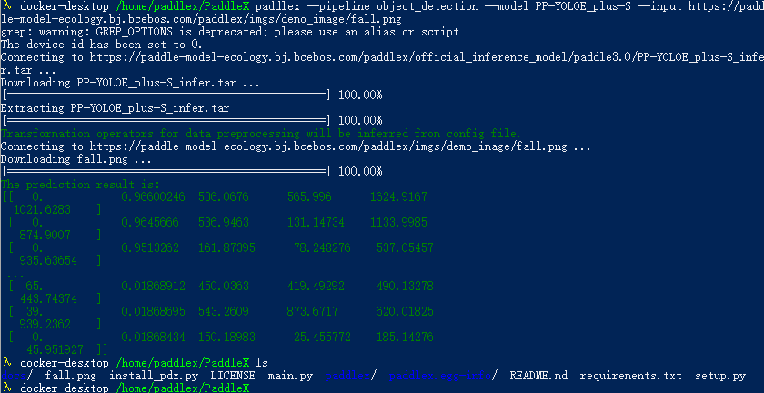
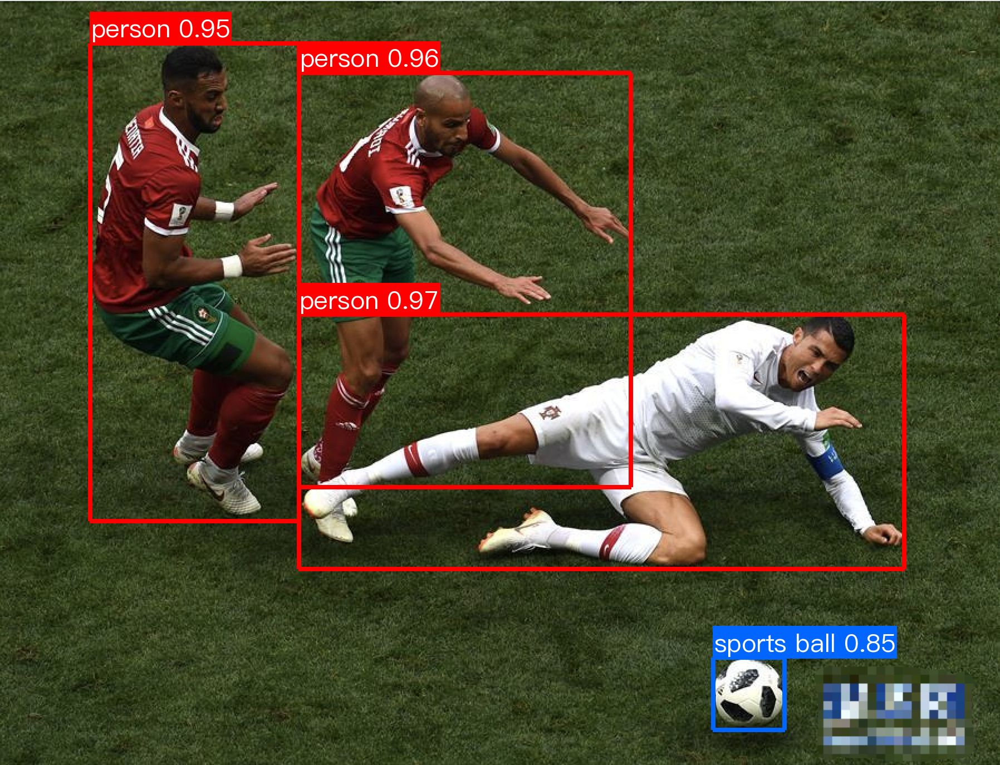
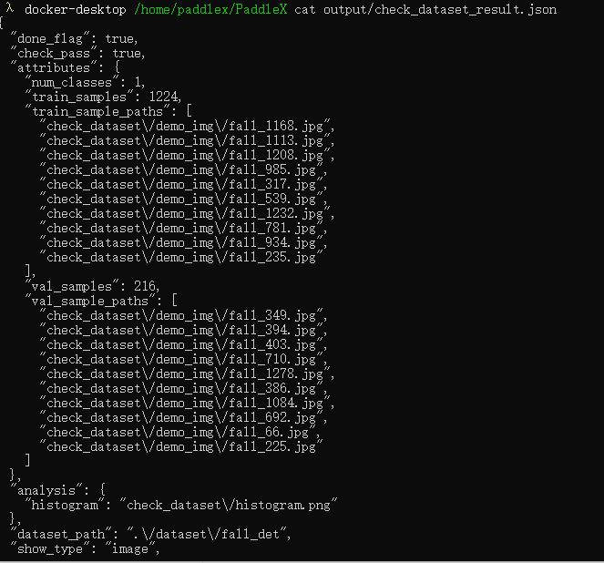
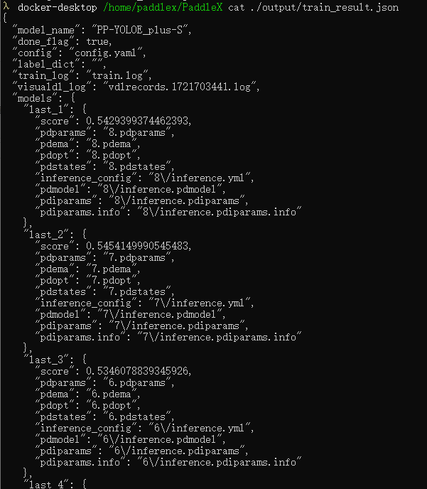
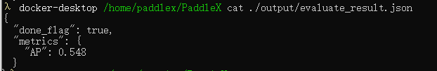

# PaddlePaddle

## PaddleCls

### 环境搭建
- `conda create -n paddle_cls_env python=3.8 -y`
- `conda activate paddle_cls_env`
- 查看本地`CUDA`版本 `nvcc -V`
- 选择相应`CUDA`版本的`PaddlePaddle`安装 `https://www.paddlepaddle.org.cn/en`
- `pip install paddlepaddle-gpu==2.6.1 -i https://pypi.tuna.tsinghua.edu.cn/simple`
- `pip install paddleclas`


### 训练

#### 数据集组织方式

- `PaddleClas` 使用 `txt` 格式文件指定训练集和测试集
- 通常 训练集 与 验证集 图像分别存放在两个文件夹中，`train_list.txt` 和 `val_list.txt` 存储标注信息
- `train_list.txt`
  ```
  # 每一行采用"空格"分隔图像路径与标注
  # 下面是 train_list.txt 中的格式样例
  train/n01440764/n01440764_10026.JPEG 0
  ...
  # 下面是 val_list.txt 中的格式样例
  val/ILSVRC2012_val_00000001.JPEG 65
  ...
  ```

#### 配置文件

- Configs
  
字段名|功能
----|----
Global|描述整体的训练配置，包括预训练权重、预训练模型、输出地址、训练设备、训练epoch数、输入图像大小等
Arch|描述模型的网络结构参数，在构建模型时调用
Loss|描述损失函数的参数配置，在构建损失函数时调用
Optimizer|描述优化器部分的参数配置，在构建优化器时调用
DataLoader|描述数据处理部分的参数配置，包括数据集读取方式、数据采样策略、数据增强方法等
Metric|描述评价指标

- 从头训练
  ```
  # windows在cmd中进入PaddleClas根目录，执行此命令
  python tools/train.py -c ./ppcls/configs/quick_start/new_user/ShuffleNetV2_x0_25.yaml
  ```
  - `-c` 指定训练的配置文件路径
  - `-o` 修改`config`中的参数

- 基于预训练模型从头训练
  - 自动下载预训练模型
    - `python tools/train.py -c ./ppcls/configs/quick_start/new_user/ShuffleNetV2_x0_25.yaml -o Arch.pretrained=True`
  - 使用本地下载好的模型
    - `python E:\paddle\paddleclas\tools\train.py -c E:\my_paddle\train_workdir\ShuffleNetV2_x0_25.yaml -o Global.pretrained_model=E:\Pretrained_models\paddle_cls\ShuffleNetV2_x0_25_pretrained.pdparams`
  - 基于预训练模型，效果好非常多，只需要几个epoch，验证精度就已经96%+ ！！
- 基于预训练模型冻结部分层后训练 
- 训练过程可视化
  - `visualdl --logdir ./output`
- 训练过程Log定制

### 验证

- ``
- `python tools/infer.py -c ./ppcls/configs/quick_start/ResNet50_vd.yaml -o Infer.infer_imgs=dataset/flowers102/jpg/image_00001.jpg -o Global.pretrained_model=output/ResNet50_vd/best_model`

### 推理部署
- 刚训练完，保存到的是 `xxx.pdparams` 文件，导出得到三个文件 
  - `inference.pdmodel`  存储网络结构信息
  - `inference.pdiparams`  存储网络权重信息
  - `inference.pdiparams.info`  存储模型的参数信息，在paddle分类模型和识别模型中可忽略 ？？
- 导出 Paddle
  - `python3 tools/export_model.py -c ./ppcls/configs/Products/ResNet50_vd_Aliproduct.yaml -o Global.pretrained_model=./product_pretrain/product_ResNet50_vd_Aliproduct_v1.0_pretrained -o Global.save_inference_dir=./deploy/models/product_ResNet50_vd_aliproduct_v1.0_infer`
- 导出 onnx

#### 轻量化

#### CPP Inference

## PaddleDetection

### 环境搭建
- `conda create -p d:\envs\paddle_det_env python=3.10`
- `conda activate d:\envs\paddle_det_env`
- `pip install paddlepaddle-gpu==2.6.1 -i https://pypi.tuna.tsinghua.edu.cn/simple`
- `cd /d e:\paddle\paddledet` cd 到 `PaddleDetection` 项目下
- `pip install -r requirements.txt`
  - 注意 `numpy` 版本 `numpy<1.24.0` 过高版本会导致后续安装失败
- `python install paddledet`
- `python ppdet/modeling/tests/test_architectures.py`  测试安装是否成功
- `python E:\paddle\paddledet\tools\infer.py -c E:\paddle\paddledet\configs\ppyolo\ppyolo_r50vd_dcn_1x_coco.yml -o use_gpu=false --infer_img=E:\paddle\paddledet\demo\000000014439.jpg -o weights=E:\Pretrained_models\paddle_det\ppyolo_r50vd_dcn_1x_coco.pdparams`  执行一次推理，测试模型效果


### 训练

#### 数据集组织方式

- 转为 `coco` 的形式
  - `annotations/`
    - `instance_train.json`  train数据集的标注信息
    - `instance_val.json`  val数据集的标注信息
  - `train/`  train数据集的图片与标注
  - `val/`   val数据集的图片与标注
  - `label_list.txt`  对象的类别标签，一个类别一行
- 使用 `paddle` 提供的脚本，从 `LabelMe` 转为 `coco` 
  - `python x2coco.py --dataset_type labelme --json_input_dir E:\DataSets\dents_det\cut_patches\with_dent --image_input_dir E:\DataSets\dents_det\cut_patches\with_dent --output_dir E:\DataSets\dents_det\cut_patches\coco_tmp --train_proportion 0.8 --val_proportion 0.2 --test_proportion 0.0`

#### 训练过程可视化
- 开启可视化服务
  - `visualdl --logdir vdl_dir/scalar/ --host <host_IP> --port <port_num>`
- 配置可视化项目

#### 配置图像增强


#### 配置优化器

#### 配置模型
- 迁移学习：
  - 在模型配置文件中可以修改 `freeze_at` 参数，控制冻结的网络层

#### 配置损失函数

### 验证
- 在测试集上验证模型精度

### 推理部署

#### 轻量化

## PaddleOCR
### 环境搭建
- `pip install -v -e .`  基于源码安装

### 训练

### CPP Inference

- 预训练模型：
  - det: `https://paddleocr.bj.bcebos.com/PP-OCRv4/english/en_PP-OCRv4_det_infer.tar`
  - cls: `https://paddleocr.bj.bcebos.com/dygraph_v2.0/ch/ch_ppocr_mobile_v2.0_cls_infer.tar`
  - rec: `https://paddleocr.bj.bcebos.com/PP-OCRv4/english/en_PP-OCRv4_rec_infer.tar`
    - 英文字符字典: `https://gitee.com/paddlepaddle/PaddleOCR/raw/release/2.6/ppocr/utils/en_dict.txt`


## 低代码平台 PaddleX

### 安装

- 使用docker环境
- 使用命令行传参的方式，更新`config`文件中的配置项
 
### 数据校验


### 模型训练

- `python main.py -c paddlex/configs/object_detection/PP-YOLOE_plus-S.yaml -o Global.mode=train -o Global.dataset_dir=./dataset/fall_det -o Train.num_classes=1 -o Global.device=gpu:0`

### 模型评估
- `python main.py -c paddlex/configs/object_detection/PP-YOLOE_plus-S.yaml -o Global.mode=evaluate -o Global.dataset_dir=./dataset/fall_det -o Global.device=gpu:0`

### 模型推理
- `python main.py -c paddlex/configs/object_detection/PP-YOLOE_plus-S.yaml  -o Global.mode=predict -o Predict.model_dir=output/best_model -o Predict.input_path=https://paddle-model-ecology.bj.bcebos.com/paddlex/imgs/demo_image/fall.png`

### 实战营打卡记录
#### 第一天

- 模型推理测试日志
  - 
- 模型推理结果可视化
  - 

#### 第二天

- 数据校验日志
  - 
- 模型训练日志
  - 
- 模型评估日志
  - 


## 部署（FastDeploy）
- FastDeploy API: `https://baidu-paddle.github.io/fastdeploy-api/`

### 图像分类任务
- 推理程序

- CMake配置
  ```cmake
  CMAKE_MINIMUM_REQUIRED(VERSION 3.10)
  PROJECT(infer_demo CXX)
  set(FASTDEPLOY_INSTALL_DIR "E:\\cpp_packages\\FastDeploy\\fastdeploy-win-x64-0.0.0")
  include(${FASTDEPLOY_INSTALL_DIR}/FastDeploy.cmake)
  # fastdeploy 需要include的头文件目录
  include_directories(${FASTDEPLOY_INCS})

  # Only Cls
  add_executable(${PROJECT_NAME} ${PROJECT_SOURCE_DIR}/infer_onnx_openvino.cc)
  # 添加FastDeploy库依赖
  target_link_libraries(${PROJECT_NAME} ${FASTDEPLOY_LIBS})
  ```

- 依赖项移植
  - 使用自带批处理脚本 `fastdeploy_init.bat`
  - 将所有依赖库都复制到可执行文件路径下：`fastdeploy_init.bat install Path/to/fastdeploy_root Path/to/inference.exe`
  - `E:\my_paddle\bin>E:\cpp_packages\FastDeploy\fastdeploy-win-x64-0.0.0\fastdeploy_init.bat install E:\cpp_packages\FastDeploy\fastdeploy-win-x64-0.0.0 E:\my_paddle\bin\OCR\Release`