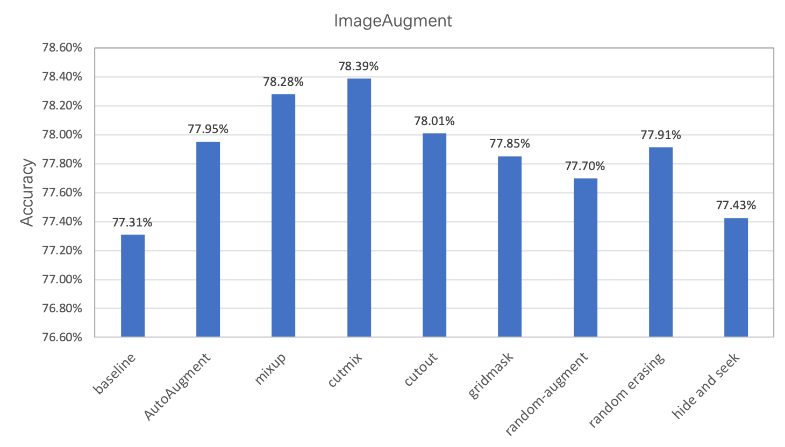
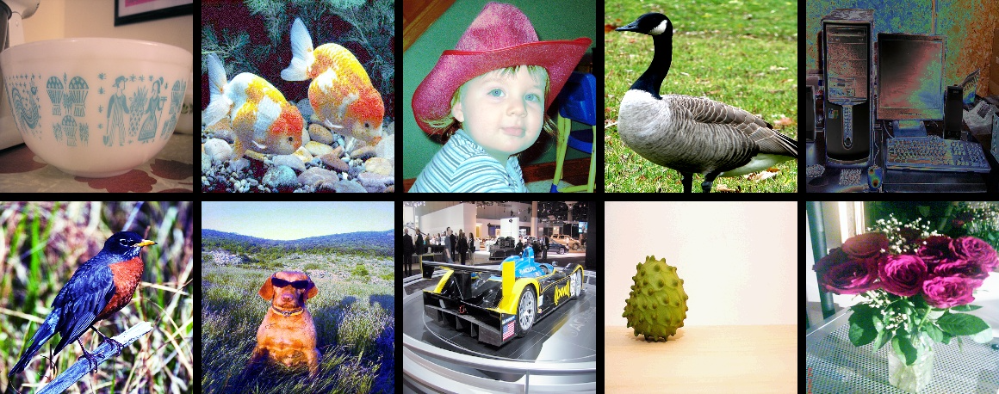
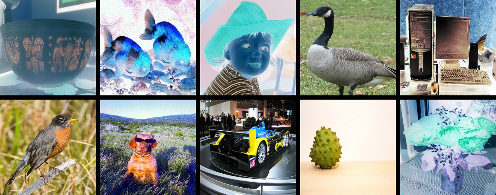
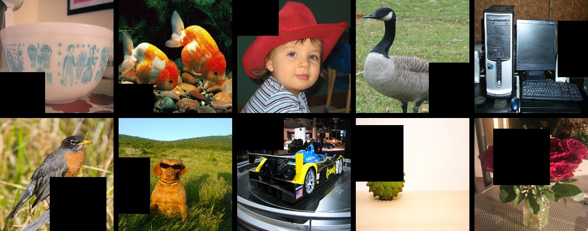
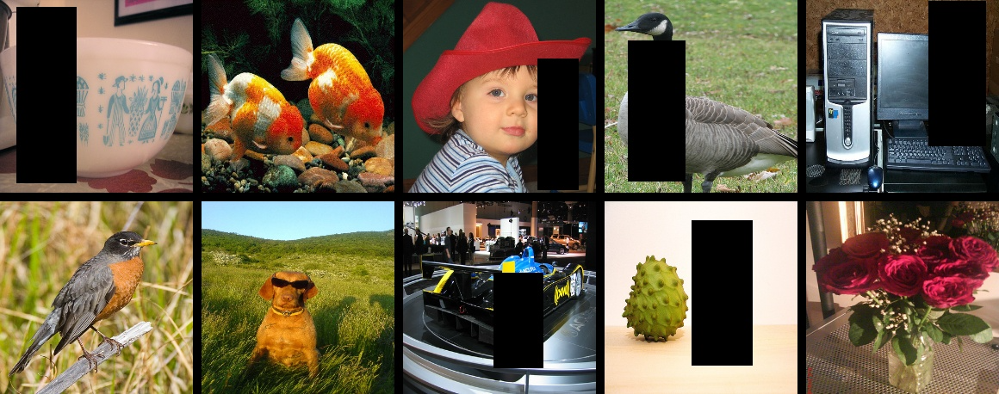
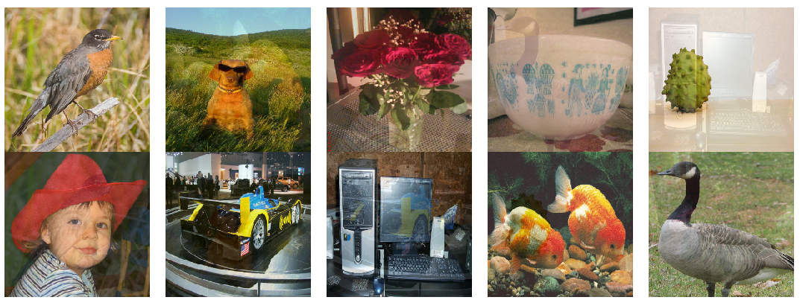
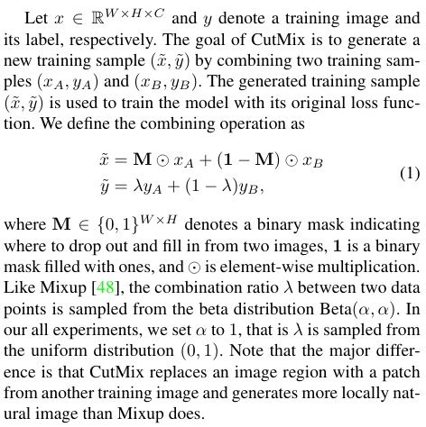
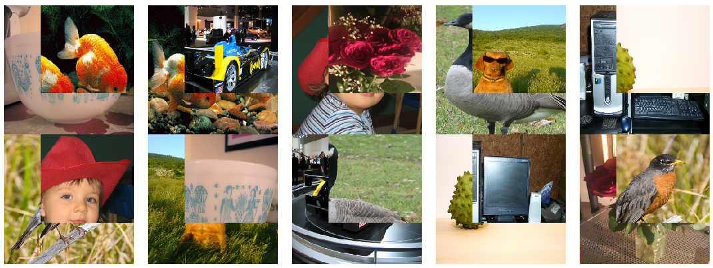

# PaddlePaddle

## Paddle 3.0
- 3.0 开始 .whl 包中包含了 CUDA。CUDNN 等库，不需要提前安装了
- 
### 环境安装


## PaddleCls

### 环境搭建
- `conda create -n paddle_cls_env python=3.8 -y`
- `conda activate paddle_cls_env`
- 查看本地`CUDA`版本 `nvcc -V`
- 选择相应`CUDA`版本的`PaddlePaddle`安装 `https://www.paddlepaddle.org.cn/en`
- `pip install paddlepaddle-gpu==2.6.1 -i https://pypi.tuna.tsinghua.edu.cn/simple`
- `pip install paddleclas`

### 使用批处理完成整个流程
```yaml
# global configs
Global:
  checkpoints: null
  pretrained_model: null
  output_dir: ./PPHGNetV2_B6_3/
  device: gpu
  save_interval: 10
  eval_during_train: True
  eval_interval: 1
  epochs: 400
  print_batch_step: 1
  use_visualdl: True
  # used for static mode and model export
  image_shape: [3, 224, 224]
  save_inference_dir: ./inference

# mixed precision
AMP:
  use_amp: True
  use_fp16_test: False
  scale_loss: 128.0
  use_dynamic_loss_scaling: True
  use_promote: False
  # O1: mixed fp16, O2: pure fp16
  level: O1

# model architecture 
Arch:
  name: PPHGNetV2_B6  # 自己想使用的模型名称
  class_num: 2  # 自己数据集的类别个数
  pretrained: True  # 框架自动下载模型到 C:\Users\Administrator\.paddleclas\weights
 
# loss function config for traing/eval process
Loss:
  Train:
    - CELoss:
        weight: 1.0
  Eval:
    - CELoss:
        weight: 1.0

Optimizer:
  name: Momentum
  momentum: 0.9
  lr:
    name: Cosine
    learning_rate: 0.06
    warmup_epoch: 5
  regularizer:
    name: 'L2'
    coeff: 0.0001

# data loader for train and eval
DataLoader:
  Train:
    dataset:
      name: ImageNetDataset  # 需要标注文件  `image_pth  0/1`
      image_root: E:\DataSets\edge_crack\classify_ppcls_1106 
      cls_label_path: E:\DataSets\edge_crack\classify_ppcls_1106/train_list.txt
      transform_ops:
        - DecodeImage:
            to_rgb: True
            channel_first: False
        - RandCropImage:
            size: 224
        - RandFlipImage:
            flip_code: 1
        - RandAugment:
            num_layers: 2
            magnitude: 5
        - NormalizeImage:
            scale: 1.0/255.0
            mean: [0.485, 0.456, 0.406]
            std: [0.229, 0.224, 0.225]
            order: ''
        - RandomErasing:
            EPSILON: 0.25
            sl: 0.02
            sh: 1.0/3.0
            r1: 0.3
            attempt: 10
            use_log_aspect: True
            mode: pixel

    sampler:
      name: DistributedBatchSampler
      batch_size: 64
      drop_last: False
      shuffle: True
    loader:
      num_workers: 4
      use_shared_memory: True

  Eval:
    dataset: 
      name: ImageNetDataset
      image_root: E:\DataSets\edge_crack\classify_ppcls_1106 
      cls_label_path: E:\DataSets\edge_crack\classify_ppcls_1106/val_list.txt
      transform_ops:
        - DecodeImage:
            to_rgb: True
            channel_first: False
        - ResizeImage:
            resize_short: 256
        - CropImage:
            size: 224
        - NormalizeImage:
            scale: 1.0/255.0
            mean: [0.485, 0.456, 0.406]
            std: [0.229, 0.224, 0.225]
            order: ''
    sampler:
      name: DistributedBatchSampler
      batch_size: 64
      drop_last: False
      shuffle: False
    loader:
      num_workers: 4
      use_shared_memory: True


Infer:
  infer_imgs: docs/images/inference_deployment/whl_demo.jpg
  batch_size: 10
  transforms:
    - DecodeImage:
        to_rgb: True
        channel_first: False
    - ResizeImage:
        resize_short: 256
    - CropImage:
        size: 224
    - NormalizeImage:
        scale: 1.0/255.0
        mean: [0.485, 0.456, 0.406]
        std: [0.229, 0.224, 0.225]
        order: ''
    - ToCHWImage:
  PostProcess:
    name: Topk
    topk: 1
    class_id_map_file: E:\DataSets\edge_crack\classify_ppcls_1106\label.txt


Metric:
  Train:
    - TopkAcc:
        topk: [1, 5]
  Eval:
    - TopkAcc:
        topk: [1, 5]
```

```bash
# 训练  注意修改配置文件中的 *保存路径*  *模型名称*  *类别个数*  *数据路径* 
python E:/le_ppcls/PaddleClas/tools/train.py -c config.yaml

# 验证
python E:/le_ppcls/PaddleClas/tools/eval.py -c config.yaml -o Global.pretrained_model=E:/le_ppcls/crack_cls/PPHGNetV2_B6_3/best_model

# 推理  可以推理单张图 也 可以遍历推理文件夹
python E:/le_ppcls/PaddleClas/tools/infer.py -c config.yaml -o Global.device=cpu -o Global.pretrained_model=E:/le_ppcls/crack_cls/PPHGNetV2_B4/best_model -o Infer.infer_imgs=E:/DataSets/edge_crack/cut_patches_0905/crack/20240628100710_1108.jpg

# 导出静态图
python E:/le_ppcls/PaddleClas/tools/export_model.py -c config.yaml ^
       -o Global.pretrained_model=E:/le_ppcls/crack_cls/PPHGNetV2_B4/best_model ^
	     -o Global.save_inference_dir=E:/le_ppcls/crack_cls/PPHGNetV2_B4/inference

# 修改输入尺寸  固定输入batch，兼容openvino推理模块
python E:/le_ppcls/Paddle2ONNX/tools/paddle/infer_paddle_model_shape.py ^
  --model_path E:/le_ppcls/crack_cls/PPHGNetV2_B6_3/inference/inference  ^
	--input_shape_dict {'x':[1,3,224,224]} ^
	--save_path E:/le_ppcls/crack_cls/PPHGNetV2_B6_3/inference/new_inference

# 导出onnx
paddle2onnx --model_dir E:/le_ppcls/crack_cls/PPHGNetV2_B6_3/inference ^
            --model_filename new_inference.pdmodel ^
	      		--params_filename new_inference.pdiparams ^
			      --save_file inference.onnx --opset_version 13
```

### 训练
- 多种模型效果对比：`https://github.com/PaddlePaddle/PaddleClas/blob/release/2.6/docs/zh_CN/models/ImageNet1k/README.md`

#### 数据集组织方式

- 通常使用 `ImageNetDataset` 的方式组织数据
  - 训练集、验证集、测试集图像存在一个目录下，使用 `txt` 格式文件指定训练集和测试集
  - 通常 训练集 与 验证集 图像分别存放在两个文件夹中，`train_list.txt` 和 `val_list.txt` 存储标注信息
  - `train_list.txt`
  ```
  # 每一行采用"空格"分隔图像路径与标注
  # 下面是 train_list.txt 中的格式样例
  train/n01440764/n01440764_10026.JPEG 0
  ...
  # 下面是 val_list.txt 中的格式样例
  val/ILSVRC2012_val_00000001.JPEG 65
  ...
  ```
  - `label.txt` 文件存各个类的名称，例如 `0 ng \n 1 ok`

#### 配置文件

- Configs
  
字段名|功能
----|----
Global|描述整体的训练配置，包括预训练权重、预训练模型、输出地址、训练设备、训练epoch数、输入图像大小等
Arch|描述模型的网络结构参数，在构建模型时调用
Loss|描述损失函数的参数配置，在构建损失函数时调用
Optimizer|描述优化器部分的参数配置，在构建优化器时调用
DataLoader|描述数据处理部分的参数配置，包括数据集读取方式、数据采样策略、数据增强方法等
Metric|描述评价指标

- 从头训练
  ```
  # windows在cmd中进入PaddleClas根目录，执行此命令
  python tools/train.py -c ./ppcls/configs/quick_start/new_user/ShuffleNetV2_x0_25.yaml
  ```
  - `-c` 指定训练的配置文件路径
  - `-o` 修改`config`中的参数

- 基于预训练模型从头训练
  - 自动下载预训练模型
    - `python tools/train.py -c ./ppcls/configs/quick_start/new_user/ShuffleNetV2_x0_25.yaml -o Arch.pretrained=True`
  - 使用本地下载好的模型
    - `python E:\paddle\paddleclas\tools\train.py -c E:\my_paddle\train_workdir\ShuffleNetV2_x0_25.yaml -o Global.pretrained_model=E:\Pretrained_models\paddle_cls\ShuffleNetV2_x0_25_pretrained.pdparams`
    - `python E:\paddle\paddleclas\tools\train.py -c E:\my_paddle\train_workdir\ShuffleNetV2_x0_25.yaml -o Global.pretrained_model=True`
    - `-o Global.pretrained_model=True` 自动下载
  - 基于预训练模型，效果好非常多，只需要几个epoch，验证精度就已经96%+ ！！
- 基于预训练模型冻结部分层后训练 
- 训练过程可视化
  - `visualdl --logdir ./output`
- 训练过程Log定制

#### 常用图像增强配置
- 通常流程：DecodeImage >> ResizeImage >> NormalizeImage

- 解码图片 DecodeImage

- ResizeImage

- 归一化  NormalizeImage

##### 图像变换类
- RandFlipImage

- RandCropImage

- RandomRotation

- 以下几种增强方式对精度提升的效果：
- 

- AutoAugment  **归一化前**
  - 论文地址：https://arxiv.org/abs/1805.09501v1
  - 有25个子策略组合，每个子策略都包含两种变换
  - 子策略的调节概率是基于ImageNet数据集搜索出来的，可能泛化性不好
  - 

- RandAugment  **归一化前**
  - 论文地址：https://arxiv.org/pdf/1909.13719.pdf
  - 与 AutoAugment 类似，但不是指定数据集搜索，而是采用随机的方式，所有的子策略都会以同样的概率被选择
  - 
  - RandAugment 是在 uint8 数据格式上转换的，所有要放在归一化操作之前
  - 有两个参数
    - num_layers  子策略中组合几种变换，数值越大变换越复杂
    - magnitude  决定每个增强操作的程度，数值越大变换越剧烈
  - ```
    - RandAugment:
            num_layers: 2
            magnitude: 5
    ```
- TimmAutoAugment  **归一化前**
  - github地址：https://github.com/rwightman/pytorch-image-models/blob/master/timm/data/auto_augment.py
  - 是对AutoAugment和RandAugment的改进，目前很多地方使用
  - ```
    - TimmAutoAugment:
            config_str: rand-m9-mstd0.5-inc1
            interpolation: bicubic
            img_size: 224
    ```

##### 图像擦除/裁剪类   **归一化后** 
  - 归一化后，擦除的内容，保持黑色
  - CutOut
    - 
    - ```
      - Cutout:
            n_holes: 1
            length: 112
      ```
  - RandomErasing
    - 论文：https://arxiv.org/pdf/1708.04896.pdf
    - 
    - ```
      - RandomErasing:
            EPSILON: 0.25
            sl: 0.02
            sh: 1.0/3.0
            r1: 0.3
            attempt: 10
            use_log_aspect: True
            mode: pixel
      ```

##### 图像混叠类
  - 是**针对Batch后的数据进行混合**，开启后label有混叠，不能计算准确率，不能使用topk指标
  - 对一个Batch内的数据进行混叠
  - 开启后，训练集更困难，准确率较低，但是模型泛化能力好，验证集精度会高很多！！！
  - Mixup
    - 论文：https://arxiv.org/pdf/1710.09412.pdf
    - 直接将两张图相加
    - 
    - ```
      batch_transform_ops:
        - MixupOperator:
            alpha: 0.2
      ```
  - Cutmix
    - 论文：https://arxiv.org/pdf/1905.04899v2.pdf
    - 从一副图中随机裁剪出一个ROI，然后覆盖到当前图像中的相应位置
    - 
    - 新的label是两个label的加权平均
    - 
    - ```
      batch_transform_ops:
        - CutmixOperator:
            alpha: 0.2
      ```


### 验证

- ``
- `python tools/infer.py -c ./ppcls/configs/quick_start/ResNet50_vd.yaml -o Infer.infer_imgs=dataset/flowers102/jpg/image_00001.jpg -o Global.pretrained_model=output/ResNet50_vd/best_model`

### 推理部署
- 刚训练完，保存到的是 `xxx.pdparams` 文件，导出得到三个文件 
  - `inference.pdmodel`  存储网络结构信息
  - `inference.pdiparams`  存储网络权重信息
  - `inference.pdiparams.info`  存储模型的参数信息，在paddle分类模型和识别模型中可忽略 ？？
- 导出 Paddle  inference model
  - `python3 tools/export_model.py -c ./ppcls/configs/Products/ResNet50_vd_Aliproduct.yaml -o Global.pretrained_model=./product_pretrain/product_ResNet50_vd_Aliproduct_v1.0_pretrained -o Global.save_inference_dir=./deploy/models/product_ResNet50_vd_aliproduct_v1.0_infer`

- 转换固定尺寸  **在使用openvino推理时必须确定输入shape**
  - `python ../Paddle2ONNX/tools/paddle/infer_paddle_model_shape.py --model_path E:\le_ppcls\crack_cls\output\best\inference 
--save_path E:\le_ppcls\crack_cls\output\best\new_inference 
--input_shape_dict="{'x':[1,3,224,224]}" `

- 导出onnx
  - `paddle2onnx --model_dir E:\le_ppcls\crack_cls\output\best 
            --model_filename new_inference.pdmodel 
            --params_filename new_inference.pdiparams 
            --save_file new_model.onnx 
			--opset_version 13`

#### 轻量化

#### CPP Inference

## PaddleDetection

### 环境搭建
- `conda create -p d:\envs\paddle_det_env python=3.10`
- `conda activate d:\envs\paddle_det_env`
- `pip install paddlepaddle-gpu==2.6.1 -i https://pypi.tuna.tsinghua.edu.cn/simple`
- `cd /d e:\paddle\paddledet` cd 到 `PaddleDetection` 项目下
- `pip install -r requirements.txt`
  - 注意 `numpy` 版本 `numpy<1.24.0` 过高版本会导致后续安装失败
- `python install paddledet`
- `python ppdet/modeling/tests/test_architectures.py`  测试安装是否成功
- `python E:\paddle\paddledet\tools\infer.py -c E:\paddle\paddledet\configs\ppyolo\ppyolo_r50vd_dcn_1x_coco.yml -o use_gpu=false --infer_img=E:\paddle\paddledet\demo\000000014439.jpg -o weights=E:\Pretrained_models\paddle_det\ppyolo_r50vd_dcn_1x_coco.pdparams`  执行一次推理，测试模型效果


### 训练

#### 数据集组织方式

- 转为 `coco` 的形式
  - `annotations/`
    - `instance_train.json`  train数据集的标注信息
    - `instance_val.json`  val数据集的标注信息
  - `train/`  train数据集的图片与标注
  - `val/`   val数据集的图片与标注
  - `label_list.txt`  对象的类别标签，一个类别一行
- 使用 `paddle` 提供的脚本，从 `LabelMe` 转为 `coco` 
  - `python x2coco.py --dataset_type labelme --json_input_dir E:\DataSets\dents_det\cut_patches\with_dent --image_input_dir E:\DataSets\dents_det\cut_patches\with_dent --output_dir E:\DataSets\dents_det\cut_patches\coco_tmp --train_proportion 0.8 --val_proportion 0.2 --test_proportion 0.0`

#### 训练过程可视化
- 开启可视化服务
  - `visualdl --logdir vdl_dir/scalar/ --host <host_IP> --port <port_num>`
- 配置可视化项目

#### 配置图像增强


#### 配置优化器

#### 配置模型
- 迁移学习：
  - 在模型配置文件中可以修改 `freeze_at` 参数，控制冻结的网络层

#### 配置损失函数

### 验证
- 在测试集上验证模型精度

### 推理部署

#### 轻量化

## PaddleOCR
### 环境搭建
- `pip install -v -e .`  基于源码安装

### 训练

### CPP Inference

- 预训练模型：
  - det: `https://paddleocr.bj.bcebos.com/PP-OCRv4/english/en_PP-OCRv4_det_infer.tar`
  - cls: `https://paddleocr.bj.bcebos.com/dygraph_v2.0/ch/ch_ppocr_mobile_v2.0_cls_infer.tar`
  - rec: `https://paddleocr.bj.bcebos.com/PP-OCRv4/english/en_PP-OCRv4_rec_infer.tar`
    - 英文字符字典: `https://gitee.com/paddlepaddle/PaddleOCR/raw/release/2.6/ppocr/utils/en_dict.txt`


## 低代码平台 PaddleX

- Paddlex工作流程

- Paddlex支持的产线类型
  - 图像分类、目标检测、语义分割、实例分割
  - 结构分析、表格识别、文本检测、文本识别
  - 时间序列的分类、预测、异常检测

- Paddlex是怎么组织成Pipeline的？
  - 例如人脸识别：人脸检测+向量匹配，这个流程是怎么串起来的？怎么更换模型？
  - 在Pipeline config中配置 detect 模型路径和 recognition 模型路径，然后在调用Pipeline时就会使用相应的模型
  
### 各插件模块

#### PaddleClas
- LCNet
- HGNet
  - High-Performance GPU Network 
  - 更适用于GPU的高性能骨干网络
  - 尽可能多的使用3x3标准卷积


|模型名称|配置文件|模型文件大小|Openvino推理耗时|备注|
|---|---|---|---|---|
|HGNet|PP-HGNetV2-B6.yaml|279MB|105ms|i7-10700 训练特别慢|
|HGNet|PP-HGNetV2-B4.yaml|68MB|22ms|i7-10700|
|HGNet|PP-HGNetV2-B1.yaml|16MB|6ms|i7-10700|
|LCNet|PP-LCNetV2_large|35MB|10ms|i7-10700|
|LCNet|PP-LCNetV2_small|11MB|5ms|i7-10700 准确率竟然和B4差不多|
|ResNet|ResNet50_vd.yaml|90MB|28ms|i7-10700  能力和B4差不多|
|MobileNet|MobileNetV4_conv_small.yaml|9.6MB||学习能力不足|


#### PaddleDetection

#### PaddleSeg

#### PaddleOCR
- TextDetection
- TextOrientation
- TextRecognition

### 安装

- 有两种安装模式：
  - Wheel安装：适合于仅用paddlex做**模型推理**的场景
  - 插件式安装：适合于使用paddlex做**二次开发、模型微调**的场景

- 插件式安装：
  - `https://github.com/PaddlePaddle/PaddleX/blob/release/3.0-beta1/docs/installation/installation.md`
  - 先安装 paddlepaddle `python -m pip install paddlepaddle-gpu==3.0.0b1 -i https://www.paddlepaddle.org.cn/packages/stable/cu118/`
  - 再安装 paddlex 
    - `git clone https://github.com/PaddlePaddle/PaddleX.git`
    - `pip install -e .`
  - 最后安装相应的插件 例如 PaddleClas `paddlex --install PaddleClas`

- 使用docker环境
  - `docker run --gpus all --name ubuntu --privileged --network=host -p 2222:22 -v E:\paddle\paddlex:/home/paddlex -it <image_id> /bin/bash`
  - 使用的镜像版本：`paddle:3.0.0b1-gpu-cuda11.8-cudnn8.6-trt8.5`
- 使用命令行传参的方式，更新`config`文件中的配置项
 
### 数据校验

- 数据集格式说明：`https://github.com/PaddlePaddle/PaddleX/blob/release/3.0-beta/docs/tutorials/data/dataset_format.md`
- 分类问题
  ```plain
  dataset_dir    # 数据集根目录，目录名称可以改变
  ├── images     # 图像的保存目录，目录名称可以改变，但要注意与train.txt、val.txt的内容对应
  ├── label.txt  # 标注id和类别名称的对应关系，文件名称不可改变。每行给出类别id和类别名称，内容举例：45 wallflower
  ├── train.txt  # 训练集标注文件，文件名称不可改变。每行给出图像路径和图像类别id，使用空格分隔，内容举例：images/image_06765.jpg 0
  └── val.txt    # 验证集标注文件，文件名称不可改变。每行给出图像路径和图像类别id，使用空格分隔，内容举例：images/image_06767.jpg 10  

  // label.txt 组织方式：
  0 classname1
  1 classname2
  2 classname3
  ...
  ```

- 目标检测问题


### 模型训练

- `python main.py -c paddlex/configs/object_detection/PP-YOLOE_plus-S.yaml -o Global.mode=train -o Global.dataset_dir=./dataset/fall_det -o Train.num_classes=1 -o Global.device=gpu:0`
- 训练配置参数的优先级：
  1. 命令行追加 `-o` 参数，如：`-o Global.mode=train`；
  2. 编辑 `paddlex/configs/` 目录下对应的 yaml 配置文件，如 `paddlex/configs/image_classification/ResNet50.yaml`；
  3. 编辑 `paddlex/repo_apis/xxx_api/configs/` 目录下的 yaml 配置文件，如 `paddlex/repo_apis/PaddleClas_api/configs/ResNet50.yaml`；
   
- 使用预训练模型：
  - 命令行追加：`-o Train.Pretrain_weight_path=./xxxx`
  - 在上述目录下放一个 `xxx.pdparams` 的文件，框架会自己根据配置文件下载正确的预训练模型，（虽然很奇怪但是有效。。。）
  - 
    - 绿色为使用了预训练模型，蓝色为没有使用预训练模型，其余参数都一致


### 模型评估
- `python main.py -c paddlex/configs/object_detection/PP-YOLOE_plus-S.yaml -o Global.mode=evaluate -o Global.dataset_dir=./dataset/fall_det -o Global.device=gpu:0`
  - `-o Global.weight_path`  如果不指定模型路径，则使用配置文件中的路径

### 模型推理
- `python main.py -c paddlex/configs/object_detection/PP-YOLOE_plus-S.yaml  -o Global.mode=predict -o Predict.model_dir=output/best_model -o Predict.input_path=https://paddle-model-ecology.bj.bcebos.com/paddlex/imgs/demo_image/fall.png`

### 实战营打卡记录
#### 第一天

- 模型推理测试日志
  - 
- 模型推理结果可视化
  - 

#### 第二天

- 数据校验日志
  - 
- 模型训练日志
  - 
- 模型评估日志
  - 

#### 第三天
- 5次训练Log
  - 
- 5次评估结果
  - 

- 学习率调整
  |训练轮次|训练卡数|批大小|训练学习率|mAP@0.5|
  |---|---|---|---|---|
  |50|1|8|0.00005|**0.946**|
  |50|1|8|0.0001|0.935|
  |50|1|8|0.0002|0.912|
- 轮次调整
  |训练轮次|训练卡数|批大小|训练学习率|mAP@0.5|
  |---|---|---|---|---|
  |50|1|8|0.00005|**0.946**|
  |30|1|8|0.00005|0.933|
  |80|1|8|0.00005|0.929|


### 案例：时序-电力预测

#### 模型选项与数据准备

#### 模型训练

#### 模型评估与调优

#### 模型部署与服务调用

#### 多模型融合时序预测

### 案例：人脸识别

#### 整体流程
1. 使用yolo算法检测人脸区域
2. 使用ResNet算法训练人脸分类
3. 使用训练好的ResNet网络提取图片特征，做特征向量匹配
4. 使用Paddlex Pipeline将整个流程串联起来

#### 环境配置
```sh
# 安装 paddle
python -m pip install paddlepaddle-gpu==3.0.0b2 -i https://www.paddlepaddle.org.cn/packages/stable/cu118/

# 安装 paddlex
git clone https://github.com/PaddlePaddle/PaddleX.git
cd PaddleX
pip install -e .
paddlex --install PaddleXXX  # PaddleClas PaddleDetection PaddleSeg PaddleOCR PaddleTS  PaddleNLP

# 安装三方库

```

#### 人脸检测模型优化
- 四种可选模型
  - BlazeFace / BlazeFace-FPN-SSH / PicoDet_LCNet_x2_5_face / PP-YOLOE_plus-S_face
- 数据校验
  > `python path/to/Paddlex/main.py -c paddlex/configs/face_detection/PP-YOLOE_plus-S_face.yaml -o Global.mode=check_dataset -o Global.dataset_dir=path/to/dataset`
  - 数据组织格式可选：LabelMe  VOC  COCO
  - 通过改 `CheckDataset.convert, CheckDataset.split` 可以转换数据集格式和切分比例
- 模型训练
  >`python path/to/Paddlex/main.py -c paddlex/configs/face_detection/PP-YOLOE_plus-S_face.yaml -o Global.mode=train -o Global.dataset_dir=path/to/dataset -o Global.device=gpu:0 -o Global.output=output_base -o Train.epochs_iters=25 -o Train.learning_rate=0.0001`
  - xx.pdiparams  静态图网络参数
  - xx.pdmodel  静态图网络结构
  - xx.pdparams  动态图网络结构和参数
- 模型评估
  >`python path/to/Paddlex/main.py -c paddlex/configs/face_detection/PP-YOLOE_plus-S_face.yaml -o Global.mode=evaluate -o Global.dataset_dir=path/to/dataset -o Global.device=gpu:0 -o Global.output=output_base -o Evaluate.weight_path=path/to/model.pdparams`
  - 注意：评估时需要指定要评估的模型文件
  
- 模型推理
  >`python path/to/Paddlex/main.py -c paddlex/configs/face_detection/PP-YOLOE_plus-S_face.yaml -o Global.mode=predict -o Global.dataset_dir=path/to/dataset -o Global.device=gpu:0 -o Global.output=output_base -o Predict.model_dir=path/to/best_model/inference -o Predict.input=path/to/test_image`

#### 人脸识别模型优化
- 有两种人脸特征模型
  - MobileFaceNet, ResNet50_face
  
- 数据校验
  > `python path/to/Paddlex/main.py -c paddlex/configs/face_recognition/ResNet50_face.yaml -o Global.mode=check_dataset -o Global.dataset_dir=path/to/dataset`
  - 数据组织形式：图片/类别 + label.txt
  
- 模型训练
  >`python path/to/Paddlex/main.py -c paddlex/configs/face_recognition/ResNet50_face.yaml -o Global.mode=train -o Global.dataset_dir=path/to/dataset -o Global.device=gpu:0 -o Global.output=output_base -o Train.epochs_iters=25 -o Train.learning_rate=0.0001`
  - xx.pdiparams  静态图网络参数
  - xx.pdmodel  静态图网络结构
  - xx.pdparams  动态图网络结构和参数
- 模型评估
  >`python path/to/Paddlex/main.py -c paddlex/configs/face_recognition/ResNet50_face.yaml -o Global.mode=evaluate -o Global.dataset_dir=path/to/dataset -o Global.device=gpu:0 -o Global.output=output_base -o Evaluate.weight_path=path/to/model.pdparams`
  - 注意：评估时需要指定要评估的模型文件
  
- 模型推理
  >`python path/to/Paddlex/main.py -c paddlex/configs/face_recognition/ResNet50_face.yaml -o Global.mode=predict -o Global.dataset_dir=path/to/dataset -o Global.device=gpu:0 -o Global.output=output_base -o Predict.model_dir=path/to/best_model/inference -o Predict.input=path/to/test_image`

#### 特征库
- 图片库
  ```
  |---images
  |   |---ID0
  |   |   |---xxx.jpg
  |   |   |---xxx.jpg
  |   |---ID1
  |   |   |---xxx.jpg
  |   |   |---xxx.jpg
  |
  |---gallery.txt

  ```
- 特征库构建
  ```python
  from paddlex import create_pipeline
  pipeline = create_pipeline(pipeline='face_recognition')
  index_data = pipeline.build_index(gallery_imgs='path/to/gallery', gallery_label='path/to/gallery.txt')
  index_data.save("face_index")
  ```
- 特征库修改
  ```python
  from paddlex import create_pipeline

  pipeline = create_pipeline("face_recognition")
  index_data = pipeline.build_index(gallery_imgs="path/to/gallery", gallery_label="path/to/gallery.txt", index_type="Flat")
  index_data.save("face_index_base")

  index_data = pipeline.remove_index(remove_ids="path/to/remove_ids.txt", index="face_index_base")
  index_data.save("face_index_del")

  index_data = pipeline.append_index(gallery_imgs="path/to/gallery", gallery_label="path/to/gallery.txt", index="face_index_del")
  index_data.save("face_index_add")

  ```
- 效果测试
  ```python
  from paddlex import create_pipeline

  pipeline = create_pipeline(pipeline="face_recognition")
  output = pipeline.predict("path/to/test_image", index="path/to/index")
  for res in output:
    res.print()
    res.save_to_img("./output")
  ```


#### 集成
- 修改配置文件
  - `Paddlex/paddlex/pipelines/face_recognition.yaml`
  ``` yaml
  Global:
    pipeline_name: face_recognition
    input: https://paddle-model-ecology.bj.bcebos.com/paddlex/imgs/demo_image/friends1.jpg

  Pipeline:
    det_model: "/root/ppx/face_rec/task03/output_bs8_lr0001_ep20/best_model/inference"
    rec_model: "/root/ppx/face_rec/task04/output_base/best_model/inference"
    det_batch_size: 1
    rec_batch_size: 1
    device: gpu
    index: None
    score_thres: 0.4
    return_k: 5
  ```

- python脚本调用
  ```python
  from paddlex import create_pipeline

  pipeline = create_pipeline(pipeline="face_recognition")
  index_data = pipeline.build_index(gallery_imgs="path/to/img_gallery", gallery_label="path/to/img_gallery/gallery.txt")
  output = pipeline.predict("path/to/test_img", index=index_data)
  for res in output:
    res.print()
    res.save_to_img("./output")
  ```

- 服务部署
  - `paddlex --install serve` 安装服务插件
  - `paddlex --get_pipeline_config face_recognition --save_path ./`  下载指定的pipeline配置文件
  - 修改所使用的模型路径
  - `paddlex --serve --pipeline path/to/face_recognition.yaml`  启动服务，即可使用http请求进行访问
  - 客户端代码
    ```python
    import base64
    import pprint
    import sys
    import requests

    API_BASE_URL = "http://0.0.0.0:8899"
    infer_image_path = "../cartoonface_demo_gallery/test_images/cartoon_demo.jpg"
    with open(infer_image_path, "rb") as file:
        image_bytes = file.read()
        image_data = base64.b64encode(image_bytes).decode("ascii")

    payload = {"image":image_data}
    resp_infer = requests.post(f"{API_BASE_URL}/face-recognition-infer", json=payload)
    if resp_infer.status_code != 200:
        print(f"Request to face-recognition-infer failed with status code {resp_infer}.")
        pprint.pp(resp_infer.json())
        exit(1)
    result_infer = resp_infer.json()["result"]

    output_image_path = "./out.jpg"
    with open(output_image_path, "wb") as file:
        file.write(base64.b64decode(result_infer["image"]))

    print(f"Output image save at {output_image_path}")
    print("\nDetected face:")
    pprint.pp(result_infer["faces"])
    ```

## 部署（FastDeploy）
- FastDeploy API: `https://baidu-paddle.github.io/fastdeploy-api/`

### 图像分类任务
- 推理程序

- CMake配置
  ```cmake
  CMAKE_MINIMUM_REQUIRED(VERSION 3.10)
  PROJECT(infer_demo CXX)
  set(FASTDEPLOY_INSTALL_DIR "E:\\cpp_packages\\FastDeploy\\fastdeploy-win-x64-0.0.0")
  include(${FASTDEPLOY_INSTALL_DIR}/FastDeploy.cmake)

  # Only Cls
  add_executable(${PROJECT_NAME} ${PROJECT_SOURCE_DIR}/infer_onnx_openvino.cc)
  # 添加FastDeploy库依赖
  target_include_directories(${PROJECT_NAME} PUBLIC ${FASTDEPLOY_INCS})
  target_link_libraries(${PROJECT_NAME} ${FASTDEPLOY_LIBS})
  ```

- 依赖项移植
  - 使用自带批处理脚本 `fastdeploy_init.bat`
  - 将所有依赖库都复制到可执行文件路径下：`fastdeploy_init.bat install Path/to/fastdeploy_root Path/to/inference.exe`
  - `E:\my_paddle\bin>E:\cpp_packages\FastDeploy\fastdeploy-win-x64-0.0.0\fastdeploy_init.bat install E:\cpp_packages\FastDeploy\fastdeploy-win-x64-0.0.0 E:\my_paddle\bin\OCR\Release`
