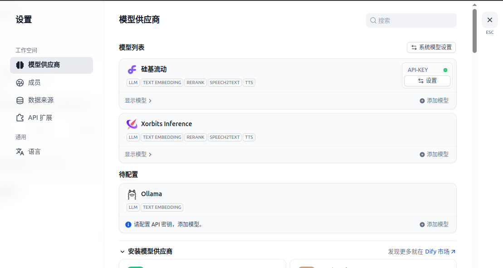
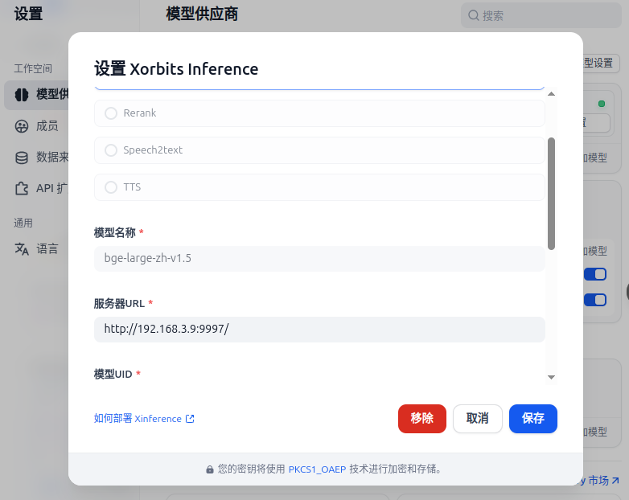

# WorkFlow

## Coze

## Dify

### 安装
- 使用docker
  - 拉取 Github 官方仓库 `https://github.com/langgenius/dify.git`
  - 进入到官方仓库的 `docker` 文件夹，启动服务 `docker compose up -d` (进入后台运行)
  - 在网页中(localhost/install)创建自己的工作流
    - host ip 可以是localhost， 也可以是局域网ip，如果是**局域网ip/install**的话，可以创建api，给其他人访问

### 配置LLM

- 
- 
- 注意！！这里xinference配置了两个模型，一个是LLM，一个是Embedding模型，两个的<URL:port>是相同的，仅模型id不同

### 案例

#### 知识库
- 要配置三个模型
  1. LLM 用于汇总信息给出回复
  2. Embeding 模型，用于对资料建索引
  3. ReRank 模型，用于对召回的资料，根据问题进行重排序

- **检索的机制**
  1. 向量检索
   - 通过将查询和文档转化为向量，计算查询与文档之间的相似度来检索
   - 优点：基于语义关系，容错能力好，对复杂语义、上下文、长尾问题有显著优势；
   - 缺点：计算量大（文档库大时检索慢）、实现复杂、索引空间占用大；
   - 适用场景：复杂的问答或对话；需要跨语言支持；
  2. 全文检索：
   - 基于倒排索引技术，利用关键词匹配对查询进行检索
   - 适用于检索包含大量文本的数据库，能够快速找到包含特定词汇的文档
   - 优点：检索速度快，实现简单，资源消耗小；
   - 缺点：缺乏语义理解，对拼写错误敏感，无法处理长尾查询（具体且不常见的问题）
   - 适用场景：电商、新闻、博客搜索；
  3. 混合检索
   - 结合向量检索和全文检索
   - 通常先使用关键词检索，筛选出一定数量的相关文档，再通过向量检索对候选文档进行精确排序
   - 优点：平衡效率与准确性；
   - 缺点：实现复杂；性能瓶颈（关键词检索的质量会影响后续向量检索的效果）
   - 适用场景：需要快速检索和高精度反馈的场景，例如电商搜索或文档管理

- **重排序的机制**

## n8n

### 安装
- `npx n8n`  比docker成功几率高
- `npm updata -g n8n`  更新n8n

## RagFlow
